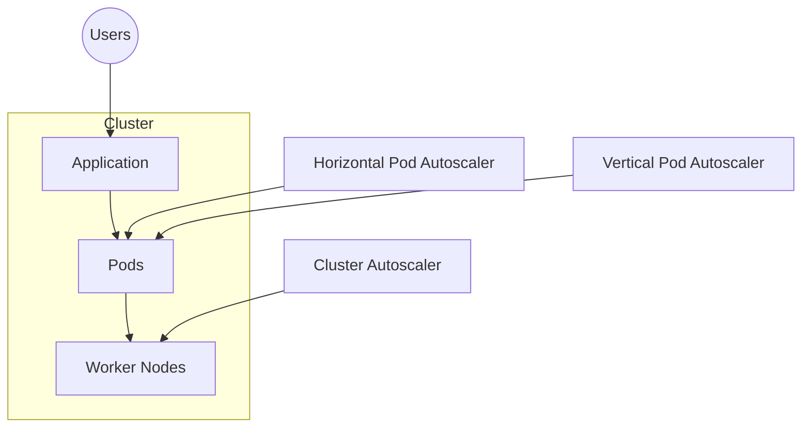
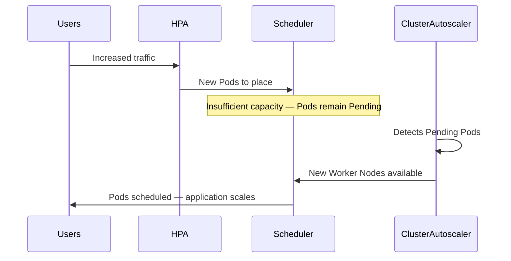

# 02 - Kubernetes Scaling Overview

Kubernetes was designed to run applications in environments where workload demand constantly changes. Instead of relying on static infrastructure, Kubernetes provides multiple autoscaling mechanisms that continuously adapt the platform according to current resource requirements.

These mechanisms operate at different layers of the cluster. Some increase the number of application instances, others adjust the resources assigned to each application, while others expand the cluster itself.

Understanding these layers is essential before exploring the individual autoscalers.

---

## The Three Layers of Scaling

Kubernetes scaling can be divided into three independent layers.



Each autoscaler has a different responsibility and solves a different problem.

---

## Cluster Scaling

Cluster scaling operates at the infrastructure level.

Instead of modifying the application itself, Kubernetes changes the amount of available compute capacity by adding or removing Worker Nodes. This responsibility belongs to the **Cluster Autoscaler (CA)**.

Whenever the Kubernetes Scheduler cannot place new Pods because the cluster has insufficient CPU or memory resources, the Cluster Autoscaler communicates with the cloud provider and provisions additional virtual machines. Likewise, when nodes remain underutilized for an extended period, they can be safely removed to reduce infrastructure costs.

> **Does the cluster have enough machines to run all scheduled Pods?**

**Typical use cases:** large traffic spikes, new Deployments requiring additional capacity, batch processing jobs, cost optimization during low utilization.

---

## Horizontal Scaling

Horizontal scaling focuses on increasing or decreasing the number of application instances. Instead of making individual Pods larger, Kubernetes creates additional replicas that share the workload — managed by the **Horizontal Pod Autoscaler (HPA)**.

```text
Before                After

Deployment            Deployment
└── 2 Pods            ├── Pod 1
                      ├── Pod 2
                      ├── Pod 3
                      ├── Pod 4
                      ├── Pod 5
                      └── Pod 6
```

Every Pod maintains approximately the same CPU and memory allocation — only the number of replicas changes.

Horizontal scaling is the preferred approach for cloud-native applications because it distributes requests across multiple independent instances, improving both availability and fault tolerance.

**Typical use cases:** web applications, REST APIs, microservices, stateless workloads.

---

## Vertical Scaling

Not every application can be replicated efficiently. Some workloads require additional CPU or memory but cannot simply run multiple instances. In these situations Kubernetes uses the **Vertical Pod Autoscaler (VPA)**.

Instead of creating more Pods, VPA adjusts the resource requests and limits assigned to existing Pods.

```text
Before              After

Pod                 Pod
CPU:    500m        CPU:    2 vCPU
Memory: 512Mi       Memory: 4Gi
```

Because changing CPU and memory often requires restarting Pods, VPA behaves differently from HPA and should be used with careful consideration.

**Typical use cases:** databases, stateful applications, legacy software, memory-intensive services.

---

## Event-Driven Scaling

Traditional autoscalers make scaling decisions using infrastructure metrics such as CPU and memory utilization. However, many modern workloads are driven by external events rather than resource consumption — handled by **KEDA (Kubernetes Event-Driven Autoscaling)**.

KEDA monitors external systems and converts those events into scaling decisions. For example, if a message queue suddenly contains 10,000 pending messages, KEDA can immediately increase the number of processing Pods even if CPU utilization remains low.

**Example event sources:** Kafka topics, RabbitMQ queues, AWS SQS, Azure Service Bus, Prometheus metrics, HTTP request rate, custom business metrics.

---

## How the Autoscalers Work Together

These autoscalers are complementary rather than competing technologies.

1. A web application experiences a sudden increase in traffic
2. CPU utilization rises above the configured HPA threshold
3. HPA increases the number of Pod replicas
4. The Scheduler attempts to place the new Pods
5. The cluster no longer has sufficient capacity
6. Cluster Autoscaler provisions additional Worker Nodes
7. The Scheduler places the pending Pods on the new nodes



> Note: the Scheduler never "calls" the Cluster Autoscaler — the CA independently watches for Pods stuck in `Pending` and reacts by provisioning nodes.

---

## Choosing the Right Autoscaler

| Requirement | Recommended Solution |
|---|---|
| More application replicas | Horizontal Pod Autoscaler |
| More CPU or memory per Pod | Vertical Pod Autoscaler |
| More Worker Nodes | Cluster Autoscaler |
| Scaling based on queues or events | KEDA |

In many production environments, multiple autoscalers operate simultaneously to provide a complete autoscaling strategy.

---

## Key Takeaways

- Kubernetes supports scaling at multiple independent layers
- Cluster Autoscaler manages infrastructure capacity (nodes)
- Horizontal Pod Autoscaler manages the number of application replicas
- Vertical Pod Autoscaler adjusts resource allocation per Pod
- KEDA enables event-driven autoscaling from external sources
- Production clusters commonly combine multiple autoscaling mechanisms
