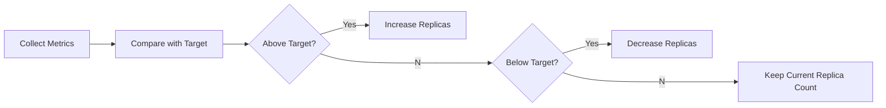

# 01 - Horizontal Pod Autoscaler (HPA)

The **Horizontal Pod Autoscaler (HPA)** is the primary autoscaling mechanism used by Kubernetes to automatically adjust the number of Pod replicas in response to changes in application demand.

Unlike the Vertical Pod Autoscaler, which modifies the resources assigned to individual Pods, the HPA keeps each Pod's resource allocation unchanged and instead increases or decreases the number of running instances.

---

## Why Horizontal Scaling?

Modern applications are typically built as stateless services. Because each instance behaves independently, increasing capacity is often as simple as creating additional replicas.

Consider a REST API running two Pods. If traffic suddenly doubles, those two Pods may become saturated:

```
          Requests                        Requests
              │                               │
              ▼                               ▼
        ┌─────────────┐               ┌─────────────┐
        │   Service   │               │   Service   │
        └─────────────┘               └─────────────┘
           │       │                │  │  │  │  │  │
           ▼       ▼                ▼  ▼  ▼  ▼  ▼  ▼
         Pod 1   Pod 2           Pod  Pod  Pod  Pod  Pod  Pod
          (before)                          (after)
```

Instead of assigning more CPU or memory to each Pod, Kubernetes creates additional replicas. The Service automatically distributes requests across all available Pods — from the client's perspective, nothing changes.

---

## What Does the HPA Scale?

The HPA does **not** create Pods directly. Instead, it modifies the desired replica count of a Kubernetes workload:

- Deployment
- StatefulSet
- ReplicaSet

Internally, HPA updates the workload's `spec.replicas` field, and the workload controller creates or removes Pods to reach the desired state.

```yaml
# Before
spec:
  replicas: 3

# After
spec:
  replicas: 8
```

This design keeps HPA focused on **decision making**, while the workload controller remains responsible for actually managing Pods.

---

## How HPA Makes Decisions

The HPA continuously evaluates one or more metrics:

- CPU utilization
- Memory utilization
- HTTP requests per second
- Queue length
- Custom application metrics
- External monitoring metrics

Every evaluation follows the same process:



This process is called the **HPA Control Loop**.

---

## Scaling Up

When the observed metric exceeds the configured target, the HPA calculates a new desired replica count.

```
Current state:
  Replicas: 3
  CPU: Pod 1 → 91%  |  Pod 2 → 88%  |  Pod 3 → 95%
  Average: ~91%  |  Target: 70%

Result:
  Desired Replicas: 6
```

The Deployment controller creates three additional Pods. As requests distribute across more instances, CPU utilization decreases toward the target.

---

## Scaling Down

The opposite occurs when workload demand decreases.

```
Current state:
  Replicas: 8
  Average CPU: 18%  |  Target: 70%

Result:
  Desired Replicas: 3 (gradual reduction)
```

Scaling down is intentionally conservative. Removing Pods too aggressively could cause applications to oscillate continuously between scaling up and scaling down. To prevent this, Kubernetes uses **stabilization windows**, covered in detail in later chapters.

---

## Desired State vs Current State

Like every Kubernetes controller, the HPA follows the reconciliation pattern — continuously comparing current state against desired state:

```
Desired Replicas: 6
Current Replicas: 4
→ Deployment controller creates 2 more Pods
```

Rather than issuing imperative commands ("create two Pods"), Kubernetes declares the desired final state and allows its controllers to converge toward it.

---

## Advantages

| Benefit | Description |
|---|---|
| Improved Availability | Responds to traffic spikes without manual intervention |
| Resource Efficiency | Resources allocated only when needed |
| Seamless Scaling | Users experience little to no disruption |
| Automation | Decisions made continuously from observed metrics |
| Cloud-Native Design | Encourages stateless, distributed, horizontally scalable apps |

---

## Limitations

HPA performs best when:

- Applications are stateless
- Requests can be distributed evenly across replicas
- New Pods can start quickly

Applications that maintain internal state or require long initialization times may not benefit significantly from horizontal scaling. In these situations, the Vertical Pod Autoscaler or another strategy may be more appropriate.

> Note: Scaling down a StatefulSet with HPA requires careful consideration — abrupt replica reduction can cause data loss if Pods hold state that hasn't been replicated.

---

## Key Takeaways

- HPA scales applications by changing the number of Pod replicas
- It modifies Kubernetes workloads rather than creating Pods directly
- Scaling decisions are based on continuously observed metrics
- The workload controller (e.g. Deployment) performs the actual Pod management
- HPA is ideal for stateless, horizontally scalable applications
