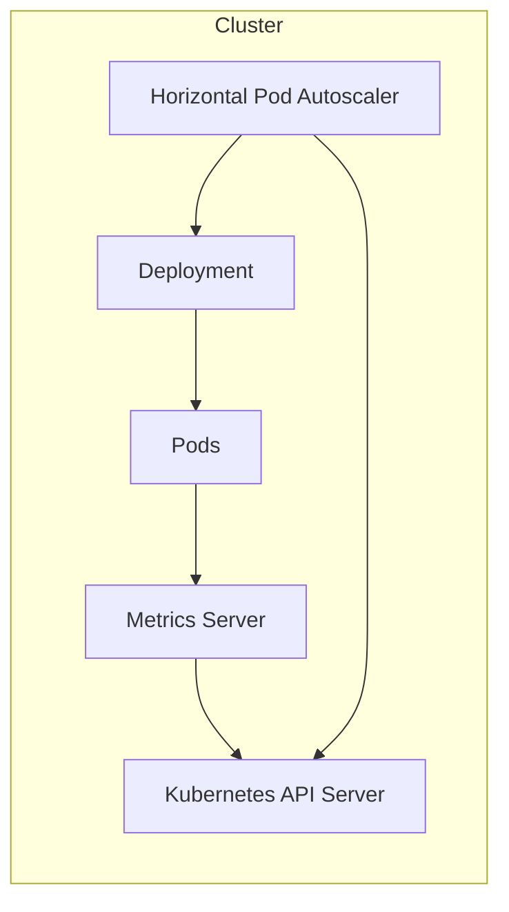
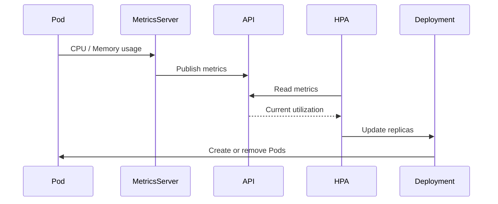
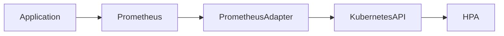

# 02 - HPA Architecture

The Horizontal Pod Autoscaler is not a standalone component that directly monitors Pods or creates replicas. Instead, it is part of a larger ecosystem of Kubernetes controllers and APIs that work together to make scaling decisions.

---

## High-Level Architecture



Every component has a specific responsibility — none of them overlap.

---

## Components

### Pods

Pods execute the application workload and continuously consume resources (CPU, memory, network, disk I/O). Only some of these metrics are available by default.

Pods never communicate directly with the HPA — their resource consumption is collected by another component.

---

### Metrics Server

The Metrics Server collects resource metrics from every node in the cluster by periodically retrieving data from each kubelet. It exposes by default:

- CPU utilization
- Memory utilization

These metrics are exposed through the Kubernetes Metrics API.

> The Metrics Server does **not** store historical data — it only provides the most recent resource usage values.

---

### Kubernetes API Server

The API Server acts as the central communication hub. Neither the HPA nor the Deployment communicate directly with the Metrics Server — every component communicates through the Kubernetes API.

```
Metrics Server → Kubernetes API ← HPA
```

This provides authentication, authorization, centralized communication, and consistent API semantics. The API Server becomes the single source of truth for the cluster.

---

### Horizontal Pod Autoscaler

The HPA is a controller that periodically evaluates workload metrics. Its responsibilities are limited to three tasks:

1. Retrieve metrics from the Kubernetes API
2. Calculate the desired number of replicas
3. Update the target workload

The HPA never creates Pods itself — it only updates the desired replica count:

```yaml
# Before
spec:
  replicas: 4

# After
spec:
  replicas: 10
```

After this update, the HPA's work is complete.

---

### Deployment Controller

Once the Deployment detects that the desired replica count has changed, it reconciles the workload — creating additional Pods or safely terminating excess ones while respecting Kubernetes lifecycle rules.

This separation of responsibilities keeps Kubernetes modular: the HPA decides, the Deployment acts.

---

## End-to-End Scaling Flow



Every scaling operation follows exactly this sequence.

---

## Why Doesn't HPA Talk Directly to Pods?

In a large cluster with 300 nodes and 12,000 Pods, direct controller-to-Pod communication would not scale. Instead, Kubernetes follows a layered architecture:

```
Pods → Metrics Server → API Server → Controllers → Deployments
```

Each component performs a single responsibility while exposing a standardized API to the next layer, keeping the system loosely coupled and extensible.

---

## Extending the Architecture

The Metrics Server only provides CPU and memory. Production workloads often need additional metrics:

- HTTP requests per second
- Queue length / Kafka consumer lag
- Active sessions
- Business transactions

Kubernetes supports this through a **Metrics Adapter**, which translates external monitoring systems into Kubernetes-native metrics:



This mechanism enables **Custom Metrics** and **External Metrics** support, covered in the following chapters.

---

## Key Architectural Principles

| Principle | Description |
|---|---|
| Separation of Responsibilities | Each component does exactly one thing |
| Declarative Operations | HPA declares desired state; controllers reconcile |
| Extensibility | Additional metrics providers integrate via the Kubernetes API without modifying the HPA |

### Component Responsibilities

| Component | Responsibility |
|---|---|
| Pods | Execute workloads |
| Metrics Server | Collect CPU and memory metrics from kubelets |
| API Server | Expose cluster state and metrics |
| HPA | Calculate desired replica count |
| Deployment | Create or remove Pods to match desired state |

---

## Key Takeaways

- The HPA does not communicate directly with Pods
- Metrics are collected by the Metrics Server from each kubelet
- All communication passes through the Kubernetes API Server
- The HPA calculates desired replicas but never creates Pods
- Deployments reconcile the desired replica count
- Custom and external metrics are supported through Metrics Adapters
