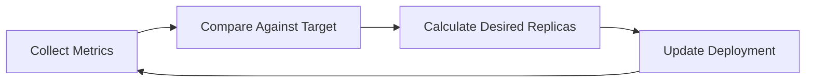
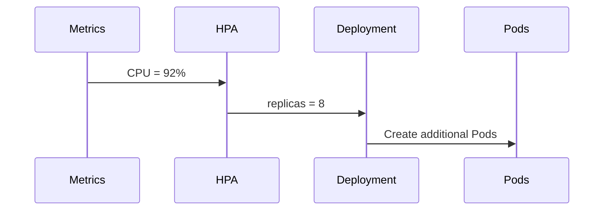
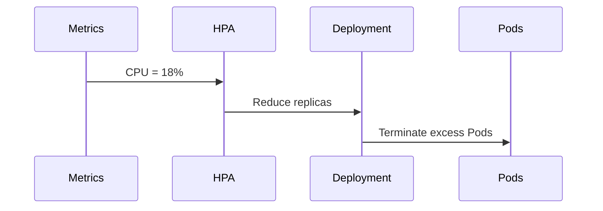

# 03 - HPA Control Loop

The Horizontal Pod Autoscaler operates as a Kubernetes controller. Like every controller in Kubernetes, it follows a **control loop** that continuously compares the current state of a workload with its desired state.

Rather than reacting to individual events, the HPA periodically evaluates the selected metrics and determines whether the application should scale. This continuous reconciliation allows Kubernetes to automatically adapt applications to changing workloads without manual intervention.

---

## What is a Control Loop?

A control loop is a repeating cycle of four steps:

1. Collect metrics
2. Compare observed values with configured targets
3. Calculate the desired number of replicas
4. Update the target workload if scaling is required



Unlike event-driven systems, the HPA continuously polls the Kubernetes Metrics API at regular intervals.

---

## Default Evaluation Interval

By default, the HPA evaluates metrics every **15 seconds**, controlled by the `kube-controller-manager` flag:

```text
--horizontal-pod-autoscaler-sync-period=15s
```

Every execution of the control loop follows the same workflow regardless of whether scaling occurs.

> Reducing the synchronization interval increases HPA responsiveness but also increases the number of requests to the Kubernetes API Server.

---

## Step 1 — Collect Metrics

The HPA retrieves metrics associated with the target workload. Depending on the configuration, these may come from different sources:

| Metric Type | Source |
|---|---|
| CPU | Metrics Server |
| Memory | Metrics Server |
| Custom Metrics | Metrics Adapter |
| External Metrics | Metrics Adapter |

The HPA queries the Kubernetes Metrics API — it never communicates directly with Pods.

---

## Step 2 — Compare Against the Target

After retrieving metrics, the HPA compares the observed value with the configured target.

```yaml
metrics:
  - type: Resource
    resource:
      name: cpu
      target:
        type: Utilization
        averageUtilization: 70
```

Current cluster state:

| Pod | CPU |
|---|---|
| Pod 1 | 82% |
| Pod 2 | 75% |
| Pod 3 | 88% |
| **Average** | **81.6%** |

Since 81.6% exceeds the 70% target, scaling becomes necessary.

---

## Step 3 — Calculate the Desired Replica Count

The HPA calculates the number of replicas required to bring the observed metric back toward the target using the following formula:

```text
desiredReplicas = ceil[ currentReplicas × (currentMetric / desiredMetric) ]
```

The `ceil` (ceiling) function ensures the result is always rounded up — Kubernetes never under-provisions replicas when scaling up.

**Example:**

```text
currentReplicas = 4
currentCPU      = 90%
desiredCPU      = 60%

desiredReplicas = ceil[ 4 × (90 / 60) ]
               = ceil[ 6.0 ]
               = 6
```

This proportional approach prevents large overcorrections and allows Kubernetes to react smoothly to workload changes.

---

## Step 4 — Update the Workload

Once the desired replica count is calculated, the HPA updates the target resource:

```yaml
# Before
spec:
  replicas: 4

# After
spec:
  replicas: 6
```

The HPA's work is now complete. The Deployment controller detects the change and reconciles the workload by creating or removing Pods.

---

## What Happens if No Scaling Is Required?

Most control loop executions do **not** result in scaling.

```
Target CPU:   70%
Observed CPU: 69%
→ No action. Wait for next cycle.
```

This prevents unnecessary scaling operations when the workload is already within the target range.

---

## Scale-Up Workflow



Scaling up is performed as quickly as possible to protect application availability.

---

## Scale-Down Workflow



Unlike scaling up, scale-down is intentionally conservative to reduce oscillations caused by temporary drops in demand. The stabilization window responsible for this behaviour is covered in a later chapter.

---

## Why a Control Loop?

| Benefit | Description |
|---|---|
| Predictability | Scaling decisions occur at regular intervals, not in response to unpredictable events |
| Stability | Small metric fluctuations don't immediately trigger scaling |
| Fault Tolerance | Temporary API or Metrics Server failures are retried automatically on the next cycle |
| Declarative Operation | The HPA continuously works toward desired state, consistent with all Kubernetes controllers |

---

## Key Takeaways

- The HPA operates as a continuous reconciliation controller
- By default, the control loop executes every **15 seconds**
- Every cycle: collect metrics → compare targets → calculate replicas → update workload
- Replica calculation uses `ceil[currentReplicas × (currentMetric / desiredMetric)]`
- Scaling up is aggressive; scaling down is intentionally conservative
- The Deployment controller — not the HPA — creates or terminates Pods
