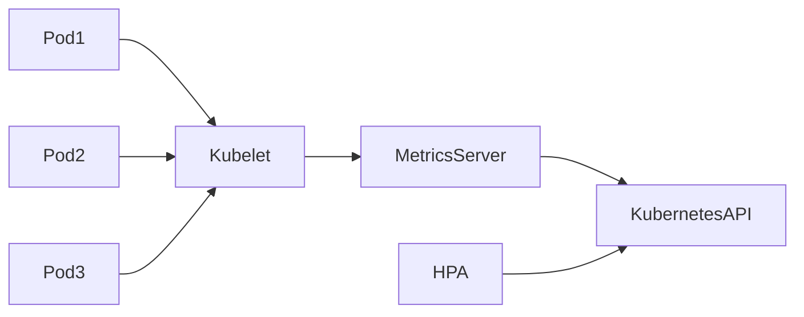
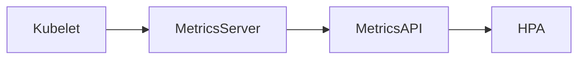

# 04 - Metrics Server

The **Metrics Server** is the default metrics provider used by Kubernetes for resource-based autoscaling. Its primary responsibility is to collect CPU and memory usage from every node in the cluster and expose those metrics through the Kubernetes Metrics API.

Without a Metrics Server, the Horizontal Pod Autoscaler cannot make scaling decisions based on CPU or memory utilization.

---

## Why is the Metrics Server Needed?

Pods continuously consume resources while executing, but they do not publish these metrics directly to the HPA. Kubernetes introduces a dedicated component responsible for collecting, aggregating, and exposing resource usage.



This architecture keeps the HPA independent from the infrastructure that collects metrics.

---

## Where Do the Metrics Come From?

The Metrics Server retrieves metrics from the **kubelet** running on every Worker Node — not directly from Pods.

```
Pod → Container Runtime → Kubelet → Metrics Server → Kubernetes API → HPA
```

The kubelet already knows how much CPU and memory every container is consuming. The Metrics Server aggregates this information and makes it available.

---

## What Metrics Are Available?

By default, the Metrics Server only exposes **resource metrics**:

| Resource | Supported |
|---|---|
| CPU | ✅ |
| Memory | ✅ |
| Network | ❌ |
| Disk I/O | ❌ |
| HTTP Requests | ❌ |
| Queue Length | ❌ |
| Kafka Lag | ❌ |

Many workloads cannot be scaled efficiently using only CPU or memory. Those scenarios require **Custom Metrics** or **External Metrics**, covered in later chapters.

---

## Resource Metrics

The Metrics Server exposes resource usage at two levels:

**Node Metrics** — resource consumption per Worker Node, useful for capacity monitoring:

```
Node A  →  CPU: 37%  |  Memory: 61%
```

**Pod Metrics** — resource consumption per Pod, consumed by the HPA:

```
frontend-7d5fb  →  CPU: 52m  |  Memory: 118Mi
```

---

## Metrics API

The Metrics Server exposes its data through the Kubernetes **Metrics API** under the `metrics.k8s.io` API group. The HPA queries this API during every execution of its control loop.

Metrics can also be accessed manually:

```bash
kubectl top nodes
```

```text
NAME       CPU    MEMORY
worker-1   19%    43%
worker-2   31%    58%
```

```bash
kubectl top pods
```

```text
NAME          CPU    MEMORY
frontend-5b6  42m    105Mi
frontend-5b7  37m    98Mi
```

---

## Metrics Collection Cycle



Every collection cycle replaces the previous measurements. Unlike Prometheus, the Metrics Server does **not** store historical data — only the latest measurements are available.

---

## Metrics Server vs Prometheus

| | Metrics Server | Prometheus |
|---|---|---|
| Weight | Lightweight | Full monitoring platform |
| Data | Current only | Historical (time-series) |
| Metric types | CPU and memory | Thousands of metric types |
| Primary use | Autoscaling (HPA/VPA) | Monitoring and alerting |
| Storage | None | Time-series database |

A common production architecture includes **both**: the Metrics Server provides native resource metrics, while Prometheus stores detailed monitoring data for dashboards and alerting.

---

## Installation

The Metrics Server is **not** included automatically in every Kubernetes distribution. Managed services (EKS, GKE, AKS) usually install it by default. For self-managed clusters:

```bash
kubectl apply \
  -f https://github.com/kubernetes-sigs/metrics-server/releases/latest/download/components.yaml
```

Verify after installation:

```bash
kubectl top nodes
```

If node metrics are displayed, the Metrics Server is functioning correctly.

---

## Common Problems

### HPA Shows `<unknown>`

```text
TARGETS
<unknown>/70%
```

The HPA cannot retrieve metrics. Possible causes:

- Metrics Server is not installed or unavailable
- Metrics API is unhealthy
- Resource requests are missing from the Pods

### `kubectl top` Returns an Error

If `kubectl top pods` fails, the HPA will also be unable to scale based on CPU or memory until the issue is resolved.

---

## Best Practices

> [!tip]
> Always verify that the Metrics Server is healthy before troubleshooting the HPA.

> [!tip]
> Every container should define CPU and memory **requests**. Without resource requests, the HPA cannot calculate CPU utilization percentages — utilization is computed as `usage / request`.

> [!note]
> The Metrics Server is designed for autoscaling, not for monitoring or long-term metrics storage. Use Prometheus for that.

---

## Key Takeaways

- The Metrics Server is the default provider of CPU and memory metrics
- It collects metrics from the kubelet on each Worker Node, not directly from Pods
- Metrics are exposed through the `metrics.k8s.io` API
- The HPA queries this API on every control loop execution
- Only the most recent measurements are stored — no historical data
- It is not a replacement for Prometheus
