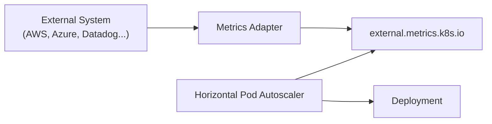

# 07 - External Metrics

Resource metrics and custom metrics solve many autoscaling scenarios, but not every workload is driven by activity inside the Kubernetes cluster. Many modern applications depend on external systems — cloud messaging services, monitoring platforms, databases, or third-party APIs. In these situations, Kubernetes needs to make scaling decisions based on information that exists **outside** the cluster.

Unlike Custom Metrics, which originate from applications running inside Kubernetes, External Metrics are collected from systems completely independent of the cluster.

---

## What Are External Metrics?

An external metric is any metric whose source is **not a Kubernetes object**:

- AWS SQS queue depth
- Azure Service Bus messages
- Google Cloud Pub/Sub backlog
- Datadog / New Relic / CloudWatch metrics
- External Prometheus instances
- Third-party APIs

---

## Why Use External Metrics?

Consider an application processing customer orders from an AWS SQS queue:

```
Customers → AWS SQS Queue → Kubernetes Workers
```

The workers may consume almost no CPU because they are waiting for messages. But:

```
Queue Length: 50,000 messages
```

Waiting until CPU utilization increases would be far too late. Kubernetes should immediately launch additional workers based on queue size — this is exactly what External Metrics enable.

---

## Architecture



The Metrics Server is **not** involved. The Metrics Adapter bridges Kubernetes and the external system:

- Authenticates with the external service
- Queries the metrics
- Converts responses into Kubernetes resources
- Exposes them through the Kubernetes API

From the HPA's perspective, the origin of the metric is irrelevant — it simply queries Kubernetes.

---

## External Metrics API

External metrics are exposed through a dedicated API group:

| API Group | Purpose |
|---|---|
| `metrics.k8s.io` | CPU and memory |
| `custom.metrics.k8s.io` | Application metrics (inside cluster) |
| `external.metrics.k8s.io` | External systems (outside cluster) |

The HPA consumes all three using exactly the same workflow.

---

## Example

An application processes messages from an Azure Service Bus queue. Each Pod should handle approximately **100 messages**.

```
Queue: 850 messages
Current replicas: 5 Pods
Target: 100 messages/Pod

→ 850 / 100 = 8.5 → ceil = 9 Pods
```

HPA configuration:

```yaml
metrics:
  - type: External
    external:
      metric:
        name: queue_messages
      target:
        type: AverageValue
        averageValue: "100"
```

Unlike CPU metrics, this value is not a utilization percentage — it represents the desired value of the external metric per replica.

---

## Common Use Cases

| System | Scaling Metric |
|---|---|
| AWS SQS | Queue length |
| RabbitMQ | Messages waiting |
| Kafka | Consumer lag |
| Azure Service Bus | Active messages |
| Google Pub/Sub | Unacknowledged messages |
| Datadog / New Relic | Custom dashboards or application metrics |
| CloudWatch | Cloud service metrics |

In all of these cases, workload demand exists **before** Kubernetes itself experiences high CPU utilization.

---

## External Metrics vs Custom Metrics

| | Custom Metrics | External Metrics |
|---|---|---|
| Origin | Inside the cluster | Outside the cluster |
| Source | Pods / Kubernetes objects | Cloud services, monitoring platforms |
| Adapter required | Yes | Yes |
| Represents | Application behavior | External system state |

> If the metric belongs to a Kubernetes workload → **Custom Metric**
> If the metric belongs to another platform or service → **External Metric**

---

## Advantages

External metrics enable Kubernetes to react **before** infrastructure metrics change:

- Faster scaling response
- Improved queue processing throughput
- Reduced request latency
- Better alignment with business events
- Full support for event-driven architectures

Many production systems rely primarily on external metrics rather than CPU utilization.

---

## Challenges

External metrics introduce additional dependencies. If the external monitoring system becomes unavailable, the adapter cannot retrieve updated metrics. Authentication failures or network issues may also prevent the HPA from making accurate scaling decisions — operational monitoring of the adapter becomes critical.

---

## Best Practices

> [!tip]
> Scale using metrics that directly represent workload demand rather than infrastructure utilization.

> [!tip]
> Keep the Metrics Adapter highly available — it is a critical component of the autoscaling pipeline.

> [!warning]
> Avoid highly volatile metrics that fluctuate every few seconds, as they may cause unstable scaling behavior.

> [!note]
> External Metrics are particularly useful for asynchronous and event-driven systems where CPU utilization is not a reliable indicator of demand.

---

## Key Takeaways

- External Metrics originate **outside** the Kubernetes cluster
- Exposed through the `external.metrics.k8s.io` API
- A Metrics Adapter translates external data into Kubernetes-consumable metrics
- Enable scaling based on queues, cloud services, monitoring platforms, and business events
- Essential for modern event-driven architectures where CPU is a poor proxy for demand
