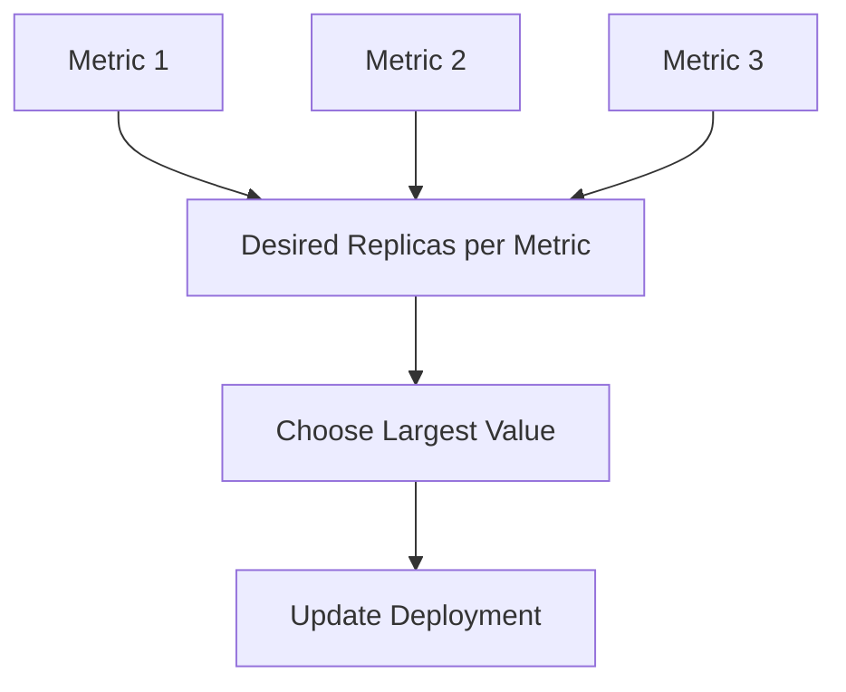

# 08 - Multiple Metrics

In real-world environments, a single metric is rarely sufficient to accurately represent workload demand. A REST API may need to scale according to CPU utilization, memory utilization, and HTTP requests per second simultaneously. A background worker may require scaling based on both queue length and CPU utilization.

Kubernetes allows a single HPA to evaluate **multiple metrics simultaneously** — calculating the desired replica count for each metric independently and then selecting the largest result. This ensures applications always scale according to the most demanding condition.

---

## Why Multiple Metrics?

Consider an API running six replicas:

| Metric | Value | Target | Signal |
|---|---|---|---|
| CPU | 42% | 70% | No action needed |
| Memory | 81% | 75% | Scale up |
| HTTP Requests | 510 req/s | 300 req/s | Scale up more |

If Kubernetes considered only CPU, the application would remain under-provisioned. Instead, the HPA evaluates every configured metric independently.

---

## How the HPA Evaluates Multiple Metrics



Each metric produces its own desired replica count. The HPA then picks the **largest value** — guaranteeing that every scaling requirement is satisfied.

---

## Example

Current replicas: **4**

| Metric | Desired Replicas |
|---|---|
| CPU | 5 |
| Memory | 7 |
| HTTP Requests | 9 |

Final decision: **9 replicas**. Only one scaling operation is performed.

### Why the Largest Value?

If Kubernetes chose the smallest value (5), the HTTP request rate would remain far above the configured target and users would experience increased latency despite CPU appearing healthy. Selecting the largest value prevents any metric from being ignored.

---

## Configuration Examples

### Multiple Resource Metrics

```yaml
metrics:
  - type: Resource
    resource:
      name: cpu
      target:
        type: Utilization
        averageUtilization: 70
  - type: Resource
    resource:
      name: memory
      target:
        type: Utilization
        averageUtilization: 75
```

### Mixed Metric Types

Resource, custom, and external metrics can all participate equally in the same scaling decision:

```yaml
metrics:
  - type: Resource
    resource:
      name: cpu
      target:
        type: Utilization
        averageUtilization: 70

  - type: Pods
    pods:
      metric:
        name: http_requests_per_second
      target:
        type: AverageValue
        averageValue: "250"

  - type: External
    external:
      metric:
        name: queue_messages
      target:
        type: AverageValue
        averageValue: "100"
```

---

## Scale-Up Example

Current replicas: **6**

| Metric | Desired Replicas |
|---|---|
| CPU | 7 |
| Memory | 6 |
| Queue Length | 12 |

HPA selects: **12 replicas**

---

## Scale-Down Behaviour

Multiple metrics also affect scale-down decisions conservatively:

| Metric | Desired Replicas |
|---|---|
| CPU | 3 |
| Memory | 4 |
| Queue Length | 6 |

Although CPU suggests 3 replicas are sufficient, queue length still requires 6. HPA keeps **6 replicas** — preventing workloads from becoming under-provisioned even when some metrics suggest scaling down.

---

## Advantages

| Benefit | Description |
|---|---|
| Better Accuracy | Different metrics describe different aspects of workload behaviour |
| Increased Reliability | Protected even when one metric fails to reflect actual demand |
| Better UX | Business metrics complement infrastructure metrics |
| Production Flexibility | A single HPA can support complex multi-signal scenarios |

---

## Potential Challenges

Metrics should complement each other rather than contradict. If CPU says "scale down" while queue length says "scale up", Kubernetes will choose the larger count — which is correct, but if conflicting metrics are poorly designed, workloads may remain permanently over-provisioned. Choosing meaningful metrics is more important than simply adding more of them.

---

## Best Practices

> [!tip]
> Combine infrastructure metrics with business metrics whenever possible.

> [!tip]
> Prefer metrics that represent different aspects of workload behaviour rather than duplicating the same signal.

> [!warning]
> Avoid combining metrics that naturally conflict unless there is a clear operational reason to do so.

> [!note]
> The HPA always selects the **largest calculated replica count** — it never averages multiple scaling recommendations.

---

## Key Takeaways

- A single HPA can evaluate multiple metrics simultaneously
- Each metric independently calculates a desired replica count
- Kubernetes always selects the **largest** calculated value
- Multiple metrics improve scaling accuracy and application reliability
- Combining resource, custom, and external metrics is standard in production environments
