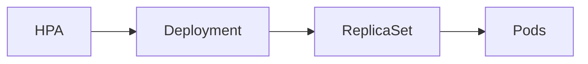

# 09 - HPA Resource Definition

Like every Kubernetes object, the Horizontal Pod Autoscaler is defined as a Kubernetes resource. It describes **what should be scaled**, **how far it can scale**, and **which metrics should trigger scaling** — but it does not perform scaling itself. It is the **blueprint** that the HPA controller continuously evaluates during its control loop.

---

## Anatomy of an HPA

```yaml
apiVersion: autoscaling/v2
kind: HorizontalPodAutoscaler

metadata:
  name: frontend-hpa

spec:
  scaleTargetRef:
    apiVersion: apps/v1
    kind: Deployment
    name: frontend

  minReplicas: 2
  maxReplicas: 10

  metrics:
    - type: Resource
      resource:
        name: cpu
        target:
          type: Utilization
          averageUtilization: 70
```

---

## apiVersion

```yaml
apiVersion: autoscaling/v2
```

**`autoscaling/v2`** is the recommended version. It supports:

- Multiple metrics
- Resource, Custom, and External metrics
- Advanced scaling behaviour (stabilization windows, policies)

Avoid `autoscaling/v1` in new deployments — it only supports CPU-based autoscaling.

---

## kind

```yaml
kind: HorizontalPodAutoscaler
```

Identifies the resource type. When this object is created, Kubernetes immediately starts monitoring the target workload according to the specification.

---

## metadata

```yaml
metadata:
  name: frontend-hpa
```

Use names that clearly identify the workload being scaled:

```
frontend-hpa   payments-hpa   orders-hpa   inventory-hpa
```

---

## scaleTargetRef

```yaml
scaleTargetRef:
  apiVersion: apps/v1
  kind: Deployment
  name: frontend
```

The most important field — tells Kubernetes **which workload to scale**. The HPA never creates Pods directly; it updates the replica count of the referenced resource.



Supported workload types: `Deployment`, `StatefulSet`, `ReplicaSet`.

The target workload must already exist before the HPA is created.

---

## minReplicas

```yaml
minReplicas: 2
```

The minimum number of replicas Kubernetes will maintain — even if demand drops to zero.

```
Traffic → 0  →  Desired replicas: 1  →  Actual replicas: 2  (minimum enforced)
```

For production systems, **2 or higher** is recommended: faster response to traffic spikes, reduced cold-start latency, and improved availability.

> [!note]
> Standard HPA has a minimum of 1 replica if `minReplicas` is omitted. Scale-to-zero (0 replicas) requires KEDA.

---

## maxReplicas

```yaml
maxReplicas: 10
```

The upper scaling limit — the HPA will never exceed this value, even if demand continues to increase.

```
Calculated replicas: 18  →  Maximum: 10  →  Final: 10
```

This protects the cluster from runaway scaling caused by faulty metrics or unexpected traffic.

---

## metrics

Defines **when and why** Kubernetes scales:

```yaml
metrics:
  - type: Resource
    resource:
      name: cpu
      target:
        type: Utilization
        averageUtilization: 70
```

### Supported Metric Types

| Type | Description |
|---|---|
| `Resource` | CPU and memory metrics |
| `Pods` | Metrics associated with individual Pods |
| `Object` | Metrics associated with another Kubernetes object |
| `External` | Metrics originating outside the cluster |

Types can be combined in a single HPA resource.

---

## behavior (Advanced)

Available in `autoscaling/v2`, allows customising scaling speed and stability:

```yaml
behavior:
  scaleUp:
    stabilizationWindowSeconds: 0
  scaleDown:
    stabilizationWindowSeconds: 300
```

Controls stabilization windows, scaling policies, percentage-based scaling, and fixed replica increments — covered in dedicated chapters.

---

## Validation

When an HPA is created, Kubernetes validates:

- Does the target Deployment exist?
- Are replica limits valid (`min ≤ max`)?
- Is the metric correctly defined?
- Does the referenced API version exist?

If validation fails, the HPA is rejected.

---

## Common Configuration Mistakes

**Missing resource requests** — without CPU requests, utilization cannot be calculated:

```yaml
# Wrong — limits only, no requests
resources:
  limits:
    cpu: 1
```

**Unrealistic replica limits** — `minReplicas: 10` / `maxReplicas: 10` completely disables autoscaling. `maxReplicas: 1000` may cause unexpected infrastructure costs.

**Wrong target resource** — `scaleTargetRef` pointing to a Service instead of a Deployment is invalid. Always verify the target supports scaling.

---

## Best Practices

> [!tip]
> Use `autoscaling/v2` for all new deployments.

> [!tip]
> Set realistic `minReplicas` and `maxReplicas` based on expected workload patterns — not arbitrary large values.

> [!tip]
> Create separate HPAs for different applications rather than trying to reuse a single configuration.

> [!warning]
> The HPA definition only specifies **how** scaling should occur. It does not guarantee the cluster has sufficient node capacity to satisfy the requested replica count — that is the Cluster Autoscaler's responsibility.

---

## Key Takeaways

- The HPA resource is the configuration blueprint evaluated by the HPA controller
- `scaleTargetRef` identifies the workload to scale
- `minReplicas` and `maxReplicas` define the allowed scaling range
- The `metrics` section determines when scaling occurs
- `autoscaling/v2` is required for multiple metrics and advanced behaviour
- Scale-to-zero requires KEDA — standard HPA minimum is 1 replica
