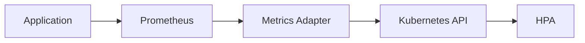
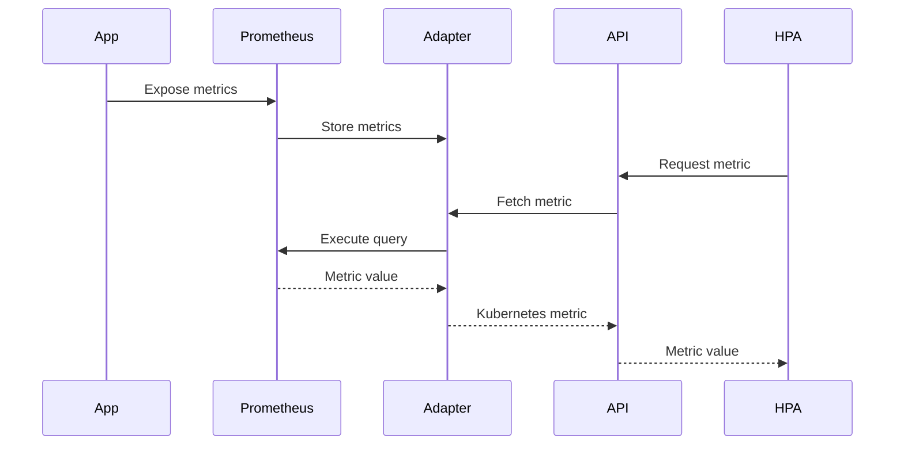
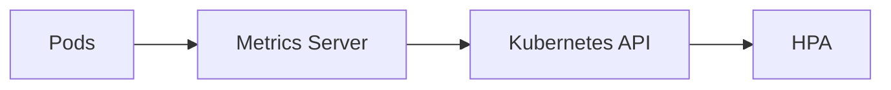

# 10 - Metrics Adapter

The HPA can scale using three categories of metrics: Resource Metrics, Custom Metrics, and External Metrics. Resource metrics are provided by the Metrics Server. However, neither **Custom Metrics** nor **External Metrics** are understood by Kubernetes natively.

The **Metrics Adapter** acts as a translator between monitoring systems and the Kubernetes API. Without it, the HPA would only be able to scale using CPU and memory.

---

## Why Do We Need a Metrics Adapter?

The HPA only knows how to query the Kubernetes API — it cannot query Prometheus, Datadog, or any external system directly. Something needs to bridge the gap:

```
Prometheus metric  →  Metrics Adapter  →  Kubernetes metric
```

That translation is the Adapter's responsibility.

---

## The Translation Layer



From the HPA's perspective, every metric appears to be a native Kubernetes resource — it has no knowledge of what monitoring system sits behind the adapter.

---

## How the Adapter Works



The HPA never communicates directly with Prometheus.

---

## What Does the Adapter Do?

**Query monitoring systems** — Prometheus, Datadog, New Relic, CloudWatch, Azure Monitor, Stackdriver, and others.

**Transform metrics** — converts monitoring platform responses into Kubernetes-native resources:

```
Prometheus:  http_requests_total
              ↓
custom.metrics.k8s.io:  http_requests_per_second
```

**Register API groups** — exposes one or more Kubernetes API groups (`custom.metrics.k8s.io`, `external.metrics.k8s.io`) that behave like any other Kubernetes API.

---

## Resource Metrics Do Not Use the Adapter

Native resource metrics follow a different path — the Metrics Server handles them directly:



Only **Custom Metrics** and **External Metrics** require an adapter.

---

## Popular Metrics Adapters

### Prometheus Adapter

The most widely used solution. Supports both Custom and External Metrics. Ideal for clusters already running Prometheus.

### KEDA Metrics Adapter

Installed automatically with KEDA. Provides metrics from event sources:

- Kafka, RabbitMQ, Redis Streams
- Azure Service Bus, AWS SQS
- And many more scalers

### Cloud Provider Adapters

Simplify integration with managed Kubernetes services:

- Azure Monitor Adapter
- Google Cloud Monitoring Adapter
- Amazon CloudWatch Adapter

---

## Configuration Overview

Although adapter configuration differs between implementations, the process is consistent:

1. Install the adapter
2. Connect it to the monitoring platform
3. Define which metrics to expose
4. Register the Kubernetes API groups
5. Configure the HPA to consume those metrics

Once configured, the HPA works exactly as it does with CPU metrics.

---

## Example

Prometheus stores:

```
orders_per_second
```

The adapter exposes it as:

```
custom.metrics.k8s.io → orders_per_second
```

HPA configuration:

```yaml
metrics:
  - type: Pods
    pods:
      metric:
        name: orders_per_second
      target:
        type: AverageValue
        averageValue: "50"
```

The HPA has no knowledge that the metric originated in Prometheus.

---

## Advantages

| Benefit | Description |
|---|---|
| Extensibility | HPA can consume virtually any metric regardless of origin |
| Decoupling | HPA remains independent of monitoring platforms — swap Prometheus for another tool without touching the HPA controller |
| Kubernetes Integration | All metrics accessible through a consistent Kubernetes API |
| Production Flexibility | Scale on business metrics — orders/minute, active users, queue length |

---

## Common Challenges

Adapters introduce an additional operational component. Potential issues:

- Authentication failures with the monitoring platform
- Incorrect PromQL queries returning unexpected values
- Unavailable monitoring system causing HPA to stop scaling
- API registration errors preventing metric discovery

Adapter health should be monitored like any other production-critical service.

---

## Best Practices

> [!tip]
> Use the official adapter for your monitoring platform whenever possible.

> [!tip]
> Keep metric names simple and descriptive — they appear in HPA configuration and `kubectl get hpa` output.

> [!tip]
> Validate metrics directly in the monitoring platform before exposing them to Kubernetes.

> [!warning]
> The Metrics Adapter is part of the autoscaling critical path. If it becomes unavailable, Custom and External Metrics will stop working — the HPA will not be able to calculate desired replica counts.

---

## Key Takeaways

- The Metrics Adapter translates between monitoring systems and the Kubernetes API
- Enables the HPA to consume Custom and External Metrics
- Resource Metrics do **not** require a Metrics Adapter — they use the Metrics Server
- The HPA only communicates with the Kubernetes API, never directly with Prometheus or other systems
- A healthy Metrics Adapter is essential for production-grade autoscaling
