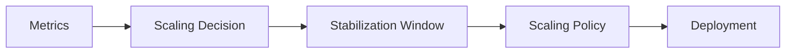

# 12 - Stabilization Window

Workloads rarely increase or decrease in a perfectly linear manner. Resource consumption often fluctuates over short periods due to temporary traffic spikes, garbage collection, cache warm-ups, or scheduled tasks. If the HPA reacted immediately to every metric change, applications would continuously scale up and down — unnecessary Pod churn, higher infrastructure costs, and reduced stability.

To prevent this, Kubernetes introduces the **Stabilization Window**.

---

## What Is a Stabilization Window?

Instead of reacting to the latest metric value alone, the HPA looks at historical scaling recommendations within a configurable time window and selects the safest one. This prevents unnecessary oscillations caused by temporary fluctuations.

---

## Why Is It Needed?

Without stabilization, a temporary CPU spike causes constant thrashing:

```
CPU spike → Scale Up → CPU drops → Scale Down → CPU spikes again → Scale Up ...
```

This pattern is called **oscillation** or **flapping**.

---

## How It Works

During a stabilization window, Kubernetes accumulates scaling recommendations:

```
10:00 → Desired Replicas = 8
10:01 → Desired Replicas = 6
10:02 → Desired Replicas = 9
10:03 → Desired Replicas = 7
```

With a 5-minute window, Kubernetes evaluates all recommendations in that period before making a decision — reducing the impact of temporary metric fluctuations.

---

## Scale-Up Stabilization

Scale-up prioritizes availability. Insufficient capacity harms users, so Kubernetes scales up immediately by default:

```yaml
scaleUp:
  stabilizationWindowSeconds: 0
```

**Example:**

```
Current: 4 replicas
CPU:     95%
Desired: 8 replicas

→ Immediately updated to 8 (window = 0s)
```

---

## Scale-Down Stabilization

Scale-down follows a very different philosophy. Reducing capacity too early may force Kubernetes to recreate Pods moments later. The default:

```yaml
scaleDown:
  stabilizationWindowSeconds: 300
```

**Example:**

```
10:00 → Desired = 10
10:01 → Desired = 8
10:02 → Desired = 6   ← latest recommendation
10:03 → Desired = 9
```

Although the latest recommendation is 6, Kubernetes remembers the workload needed 10 replicas just minutes ago. It keeps the higher value until the stabilization window expires.

**Without stabilization:** replicas track every sample (10 → 8 → 6 → 9)
**With stabilization:** replicas hold at the safe maximum (10 → 10 → 10 → 10) — the count only starts to decrease once the 10-replica recommendation ages out of the 5-minute window, and even then it drops only to the highest recommendation still inside the window

---

## Configuration

```yaml
behavior:
  scaleUp:
    stabilizationWindowSeconds: 0

  scaleDown:
    stabilizationWindowSeconds: 300
```

Custom values are supported:

```yaml
behavior:
  scaleDown:
    stabilizationWindowSeconds: 600   # wait 10 minutes before scaling down
```

---

## Choosing the Right Value

| | Short Window | Long Window |
|---|---|---|
| Suitable for | Dev environments, fast-starting apps | Production, user-facing APIs |
| Advantages | Faster cost optimization | Improved stability, fewer restarts |
| Disadvantages | Higher oscillation risk | Resources held longer than needed |

Match the window to your application's typical traffic patterns rather than using arbitrary values.

---

## Relationship with Scaling Policies

Scaling Policies and the Stabilization Window work together but control different things:



- **Scaling Policy** — how many replicas may change per scaling event
- **Stabilization Window** — when Kubernetes is allowed to apply those changes

The HPA first decides **whether** scaling is needed, then checks whether the window permits it, then applies the policy to determine how many replicas to add or remove.

---

## Best Practices

> [!tip]
> Keep scale-up stabilization at or near zero to maintain application responsiveness.

> [!tip]
> Configure a longer scale-down window (300–600s) for production workloads to absorb traffic fluctuations.

> [!tip]
> Match the stabilization window to your application's traffic patterns — a batch job behaves very differently from a real-time API.

> [!warning]
> A very short scale-down window may cause Pods to be removed and recreated repeatedly during fluctuating workloads.

> [!note]
> The default scale-down window of **300 seconds** is appropriate for many production environments and is often left unchanged.

---

## Key Takeaways

- The Stabilization Window prevents unnecessary scaling from temporary metric fluctuations
- Scale-up is immediate by default (`stabilizationWindowSeconds: 0`)
- Scale-down is delayed by default (`stabilizationWindowSeconds: 300`)
- Kubernetes evaluates previous recommendations within the window before reducing capacity
- Works alongside Scaling Policies: the window controls **when**, policies control **how much**
