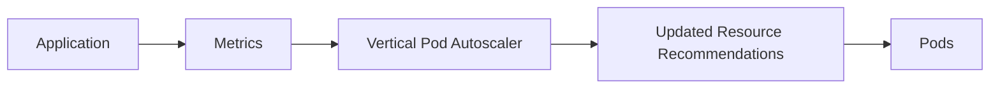

# 01 - Vertical Pod Autoscaler (VPA)

The **Vertical Pod Autoscaler (VPA)** automatically adjusts the CPU and memory resources assigned to Pods. Unlike the HPA, which changes the number of replicas, the VPA modifies the resource requests and limits of individual Pods to ensure every application receives the resources it actually needs.

---

## Why Does Kubernetes Need a VPA?

Resource requests at deployment time are typically based on estimates, not real production data. Two problems are equally common:

**Under-provisioning:**

```yaml
# Requested
resources:
  requests:
    cpu: 250m
    memory: 256Mi

# Actual usage after weeks of operation
# CPU: 900m  |  Memory: 1.5 GiB
```

Consequences: CPU throttling, OOM kills, Pod evictions, reduced performance.

**Over-provisioning:**

```yaml
# Requested
resources:
  requests:
    cpu: 4
    memory: 8Gi

# Actual usage
# CPU: 300m  |  Memory: 400Mi
```

Consequences: cluster resources reserved but never used, inflated infrastructure costs.

The VPA solves both problems automatically.

---

## Horizontal vs Vertical Scaling

| | HPA | VPA |
|---|---|---|
| What changes | Number of Pods | CPU and memory per Pod |
| Best for | Stateless, horizontally scalable apps | Resource optimisation, stateful apps |
| Action | Creates/removes replicas | Resizes existing Pods |
| Improves | Throughput | Resource allocation efficiency |

```
HPA: 1 Pod → 5 Pods  (same resources per Pod)
VPA: 1 Pod stays 1 Pod  (CPU: 500m → 2 CPU, Memory: 512Mi → 2Gi)
```

---

## How the VPA Works



Unlike the HPA, which reacts to current utilization, the VPA analyses **historical resource consumption** to identify long-term usage patterns rather than responding to temporary spikes.

The VPA continuously answers two questions:

**Under-provisioned?**
```
Requested CPU: 500m  |  Actual: 1.3 CPU  →  Increase CPU request
```

**Over-provisioned?**
```
Requested CPU: 4     |  Actual: 350m     →  Reduce CPU request
```

---

## Why Does VPA Require Pod Recreation?

Kubernetes treats Pods as **immutable instances**. Changing resource requests requires Pod recreation so that:

- The scheduler can make a new placement decision
- Resource guarantees remain correct
- QoS classes remain consistent

> [!note]
> Kubernetes 1.27 introduced **in-place Pod resource resize** (`InPlacePodVerticalScaling`) as an alpha feature, allowing CPU and memory to be updated without restarting the Pod. It reached beta (enabled by default) in Kubernetes 1.33, and VPA 1.4+ can use it via the `InPlaceOrRecreate` update mode — check your cluster and VPA versions before relying on it.

---

## Typical Use Cases

VPA is particularly useful for workloads with resource requirements that are difficult to estimate or change over time:

- Java applications (JVM memory tuning)
- Machine Learning workloads
- Databases
- Data processing jobs
- Legacy enterprise software
- Memory-intensive applications

These applications often benefit more from additional resources than from additional replicas.

---

## When to Use VPA vs HPA

**Choose VPA when:**
- The application cannot easily scale horizontally
- Resource consumption changes significantly over time
- Accurate CPU/memory requests are hard to determine upfront
- Optimising cluster utilisation is a priority

**Choose HPA when:**
- The application is stateless and horizontally scalable
- Requests can be distributed across multiple replicas
- Low latency is critical (new Pods respond immediately)

Most web APIs and microservices favour HPA. Databases, ML workloads, and legacy software often favour VPA.

---

## Key Benefits

- Automatically adjusts resource requests based on observed usage
- Reduces manual resource tuning
- Prevents over-provisioning and infrastructure waste
- Helps prevent OOM kills and CPU throttling
- Improves overall cluster resource utilisation

---

## Key Takeaways

- VPA adjusts CPU and memory per Pod instead of changing replica count
- It analyses historical usage rather than reacting to current utilization
- Resource updates typically require Pod recreation (in-place resize is beta since Kubernetes 1.33; VPA 1.4+ supports it via `InPlaceOrRecreate`)
- Ideal for workloads that cannot scale horizontally
- Complements HPA — they solve different problems
