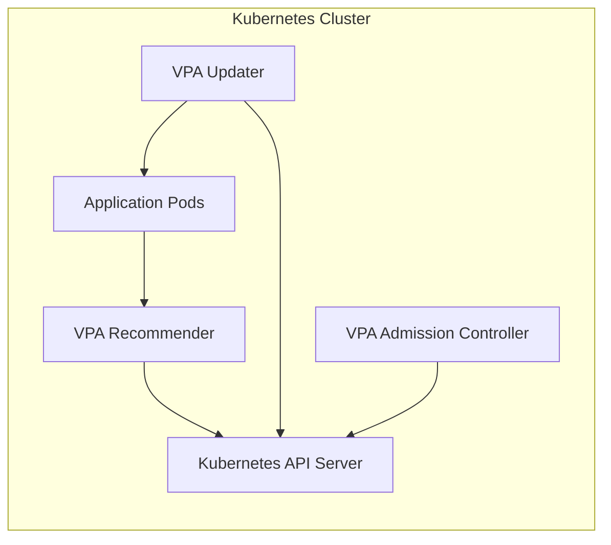
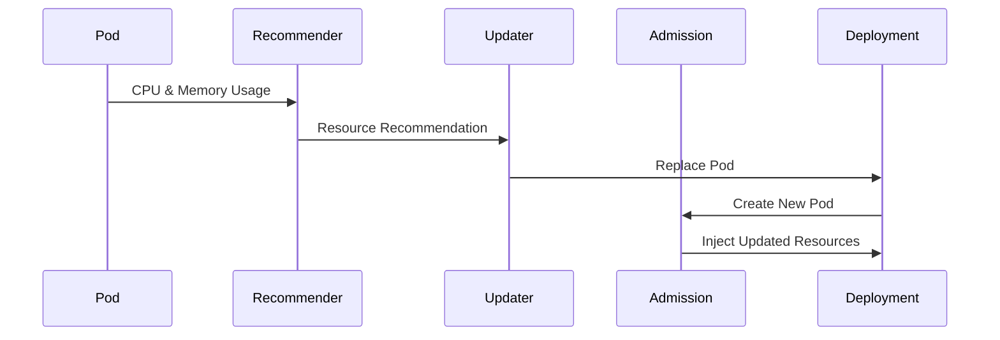

# 02 - VPA Architecture

Unlike the HPA, which relies on a single controller, the VPA is composed of **three independent components**. This modular architecture separates resource analysis from workload updates, making the VPA flexible and extensible.

---

## High-Level Architecture



---

## The Three Components

```
Resource Usage → Recommender → Recommendations → Updater → Pod Recreation → Admission Controller → Updated Resources
```

| Component | Responsibility |
|---|---|
| Recommender | Analyse historical resource usage and produce recommendations |
| Updater | Decide when Pods should be replaced with updated resources |
| Admission Controller | Inject updated resource requests into newly created Pods |

---

## Recommender

The **Recommender** is the intelligence behind the VPA. It continuously observes how applications consume resources over time and calculates the optimal CPU and memory requests — not by reacting to the current workload, but by identifying long-term usage patterns.

Questions it answers continuously:
- Is this application consistently using more CPU than requested?
- Is memory allocation much larger than necessary?
- Are there recurring usage patterns?

**Example:**

```
Current requests:   CPU: 500m  |  Memory: 512Mi
Recommendation:     CPU: 900m  |  Memory: 1Gi
```

No Pods are modified at this stage — the Recommender only produces recommendations.

---

## Updater

The **Updater** applies those recommendations. It periodically compares current resources against recommended resources. If the difference is significant, it coordinates Pod replacement:

```
Old Pod → Terminate → Deployment creates New Pod → Admission Controller injects updated resources
```

The Updater does not create Pods directly. Like every Kubernetes controller, it operates through the existing workload controller (e.g. Deployment).

---

## Admission Controller

Whenever Kubernetes creates a new Pod, the **Admission Controller** intercepts the creation request and injects the latest VPA recommendations — automatically and transparently.

**Example:**

```yaml
# Original Deployment manifest (unchanged)
resources:
  requests:
    cpu: 500m
    memory: 512Mi

# Latest VPA recommendation
# cpu: 900m, memory: 1Gi

# Resulting Pod (injected by Admission Controller)
resources:
  requests:
    cpu: 900m
    memory: 1Gi
```

The Deployment manifest itself is never modified.

---

## Complete Resource Optimization Workflow



Recommendations are never applied directly to running Pods — new Pods are always created with the updated resource requests.

---

## Why Three Components?

Separating responsibilities allows each component to evolve independently:

- The recommendation algorithm can improve without changing Pod creation logic
- Pod replacement logic can change without affecting how recommendations are calculated
- Components can be disabled individually (e.g. run Recommender-only for advisory mode)

> Each controller performs a single responsibility — a core Kubernetes architectural principle.

---

## HPA vs VPA Architecture

| | HPA | VPA |
|---|---|---|
| Controllers | 1 | 3 (Recommender, Updater, Admission Controller) |
| Scaling action | Creates more replicas | Adjusts resource requests |
| Reaction style | Immediate (current utilization) | Historical analysis (long-term patterns) |
| Pod recreation | Not required | Usually required |
| Goal | Application throughput | Resource allocation efficiency |

---

## Key Takeaways

- The VPA consists of three independent components: Recommender, Updater, and Admission Controller
- The **Recommender** analyses historical usage — it never modifies Pods
- The **Updater** orchestrates Pod replacement when recommendations differ significantly from current requests
- The **Admission Controller** transparently injects updated resources into new Pods at creation time
- The Deployment manifest is never modified — changes happen at the Pod level
- VPA prioritises long-term accuracy over immediate reaction
