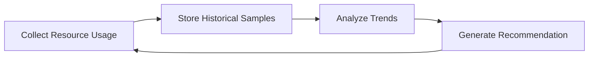

# 03 - VPA Recommender

The **Recommender** is the core intelligence of the Vertical Pod Autoscaler. It continuously analyses how applications consume CPU and memory, then calculates the optimal resource requests for future Pods.

Unlike the HPA — which reacts to current metrics every 15 seconds — the Recommender makes decisions based on **historical resource usage**. Its goal is not speed, it is accuracy.

---

## The Role of the Recommender

> How much CPU and memory does this application actually need?

For every managed Pod, the Recommender analyses:

- CPU and memory usage over time
- Historical trends and lifecycle events
- Current resource requests and limits
- OOM events

It then computes a recommendation that better reflects the application's actual requirements.

---

## Why Historical Data Matters

An application performing garbage collection every few minutes produces CPU spikes that look like demand but aren't:

```
CPU %
95 │        ▲        ▲
   │        │        │
   │   ▲    │        │
   │   │    │        │
   │___│____│________│_______  Time
```

If the VPA reacted immediately to these spikes, it would recommend far more CPU than the application requires. By evaluating consumption over an extended period, the Recommender distinguishes between temporary spikes and sustained demand — producing far more stable recommendations.

---

## Continuous Analysis



Every new measurement refines the recommendation. The VPA becomes more accurate as it observes the application over time.

---

## Recommendation Types

The Recommender computes several recommendation ranges, not a single value:

| Recommendation | Purpose |
|---|---|
| **Lower Bound** | Minimum safe allocation |
| **Target** | Recommended allocation (used for Pod updates) |
| **Upper Bound** | Maximum reasonable allocation |

**Example:**

```
CPU:    Lower: 400m  |  Target: 800m  |  Upper: 1200m
Memory: Lower: 512Mi |  Target: 1Gi   |  Upper: 1.5Gi
```

---

## CPU Recommendations

CPU recommendations reflect sustained utilization over time, not peaks:

```
Requested: 500m

Observed over several days: 650m, 700m, 720m, 690m, 680m

Recommendation: ~700m
```

---

## Memory Recommendations

Memory behaves differently from CPU — applications often allocate memory that stays reserved for long periods:

```
Observed: 950Mi, 960Mi, 940Mi, 955Mi

Recommendation: 1Gi
```

Memory recommendations tend to be more conservative than CPU because insufficient memory causes **OOM kills**, which are more disruptive than CPU throttling.

---

## Learning from OOM Events

The Recommender also learns from Pod lifecycle events. If a Pod repeatedly terminates due to insufficient memory:

```
Memory Limit: 512Mi → OOMKilled → OOMKilled → OOMKilled
```

The Recommender recognises this pattern and increases its future memory recommendation. Conversely, if a Pod consistently uses only a small fraction of allocated resources, the recommendation may decrease.

---

## Viewing Recommendations

```bash
kubectl describe vpa <vpa-name>
```

```text
Recommendation:
  Container:
    Name: frontend
    Target:
      CPU:    850m
      Memory: 1Gi
```

Recommendations are visible even when the VPA is running in recommendation-only mode — useful for reviewing before enabling automatic updates.

---

## Recommendations Are Non-Disruptive

The Recommender never modifies running Pods. Its responsibility ends after calculating recommendations:

```
Resource Usage → Recommendation → (stop)
```

Applying those recommendations is the responsibility of the **Updater**. This separation keeps the recommendation engine completely independent from workload management.

---

## Why Recommendations Change Over Time

As workloads evolve, so do resource requirements:

```
Version 1 CPU: 300m
After new feature release CPU: 850m
```

The Recommender gradually adjusts to reflect new behaviour, allowing the VPA to evolve alongside the application.

---

## Best Practices

> [!tip]
> Allow the Recommender sufficient time to collect historical data before evaluating its output — recommendations improve significantly over the first few days.

> [!tip]
> Review recommendations after major application releases — significant changes often indicate that resource behaviour has evolved.

> [!warning]
> Do not expect accurate recommendations immediately after deploying a new application. Initial recommendations may be conservative or imprecise.

> [!note]
> The Recommender only produces recommendations — it does not update Pods, modify Deployments, or interact with workloads in any way.

---

## Key Takeaways

- The Recommender is the analytical component of the VPA — it produces recommendations, nothing more
- It analyses historical CPU and memory usage, not just current utilization
- Recommendations include Lower Bound, Target, and Upper Bound values
- CPU and memory are evaluated differently — memory recommendations are more conservative due to OOM risk
- OOM events directly influence future memory recommendations
- Accuracy improves over time as more historical data is collected
