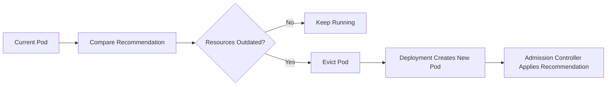
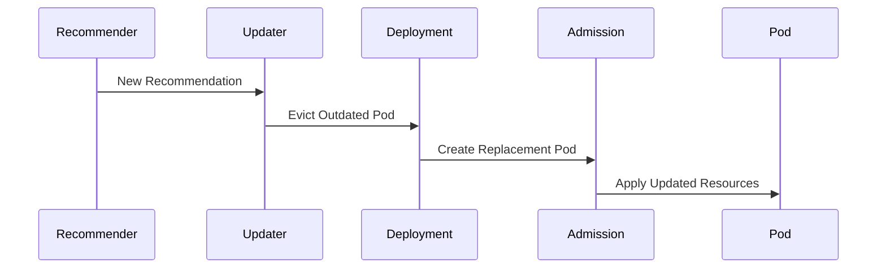

# 04 - VPA Updater

The **Updater** transforms the Recommender's resource recommendations into actual cluster changes. While the Recommender only analyses workloads, the Updater actively determines **when** Pods should be recreated so that new resource requests can take effect — it is the bridge between recommendation and execution.

---

## Why Is an Updater Needed?

When the Recommender calculates a new resource request, simply updating the running Pod would invalidate the Scheduler's original placement decision — Pods are scheduled based on their resource requests. Instead, Kubernetes creates a **new Pod** with the updated resources, and the Updater coordinates this process.

---

## High-Level Workflow



The Updater never creates Pods itself — it initiates the replacement process and the rest follows automatically.

---

## Pod Eviction

Rather than deleting Pods directly, the Updater requests their **eviction**:

```
Running Pod → Eviction Request → Deployment → Replacement Pod (with new resources)
```

Eviction integrates with Kubernetes availability mechanisms:
- **Pod Disruption Budgets (PDBs)** — respected before evicting
- Graceful termination — application receives SIGTERM and shutdown window
- Rolling updates — replacements happen gradually

---

## Interaction with Pod Disruption Budgets

```yaml
minAvailable: 3
```

With 4 replicas and 3 required to be available, the Updater can evict at most 1 Pod at a time. It must wait for the replacement to become Ready before evicting another.

```
Healthy Pods: 3  |  Minimum Required: 3  →  No eviction until 4th Pod is Ready
```

This ensures VPA updates never reduce application availability.

---

## Rolling Resource Updates

The Updater replaces Pods one at a time, not all at once:

```
Pod A (500m) → evicted → New Pod A (1 CPU)
Pod B (500m) → evicted → New Pod B (1 CPU)
Pod C (500m) → evicted → New Pod C (1 CPU)
```

The original Deployment definition is never modified. Only newly created Pods receive updated resource requests.

---

## Complete Replacement Sequence



---

## When Does the Updater Replace Pods?

The Updater ignores small recommendation changes — not every update justifies a Pod restart:

```
Current: 500m  →  Recommendation: 510m  →  No eviction (trivial change)
Current: 500m  →  Recommendation: 1200m →  Eviction triggered (significant change)
```

This prevents unnecessary Pod restarts for minor fluctuations.

---

## Updating Stateful Workloads

For databases, message brokers, and distributed storage systems, Pod recreation may require leader election, replication sync, or recovery procedures. For this reason, VPA is commonly deployed in **recommendation mode** for stateful applications — operators review recommendations and apply them manually during maintenance windows.

---

## Common Misconceptions

**"The Updater changes running Pods"** — It does not. Running Pods remain immutable; they are replaced, not modified.

**"The Updater modifies Deployments"** — It does not. The Deployment manifest remains unchanged; only newly created Pods receive updated requests.

**"Every recommendation causes a restart"** — Not necessarily. Minor changes are ignored; only significant differences trigger replacement.

---

## Best Practices

> [!tip]
> Deploy applications with at least 2 replicas whenever possible — this allows Pod replacement without affecting availability.

> [!tip]
> Configure Pod Disruption Budgets to prevent excessive simultaneous evictions during VPA updates.

> [!tip]
> Review recommendation changes before enabling automatic updates for production workloads.

> [!warning]
> Resource updates require Pod recreation. Applications that cannot tolerate restarts should use VPA in **Off** or **Initial** mode initially.

> [!note]
> The Updater does not calculate recommendations — it only decides when existing Pods should be replaced based on the Recommender's output.

---

## Key Takeaways

- The Updater applies VPA recommendations by replacing Pods, not modifying them in place
- Pod eviction (not deletion) is used to respect availability guarantees and PDBs
- Pod Disruption Budgets control how many Pods can be replaced simultaneously
- Small recommendation changes do not trigger Pod recreation
- The Deployment manifest is never modified — only new Pods receive updated resource requests
- Stateful workloads often require manual review before Updater can safely act
