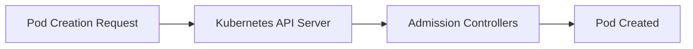
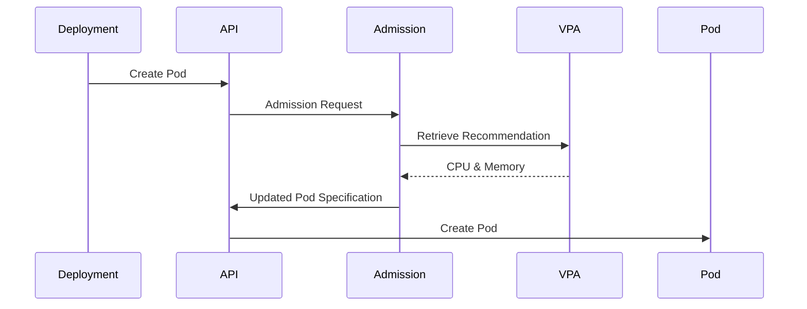
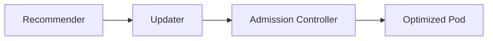

# 05 - VPA Admission Controller

The **Admission Controller** is the final component of the Vertical Pod Autoscaler. While the Recommender analyzes workloads and the Updater decides when Pods should be replaced, the Admission Controller ensures that **new Pods are created with the recommended CPU and memory requests**.

Without this component, newly created Pods would continue using the original resource configuration defined in the Deployment.

---

## The Admission Phase

Whenever Kubernetes creates a Pod, the request passes through several stages — including the **Admission Phase** — before the Pod is persisted:



The VPA Admission Controller intercepts the request during this phase. If a VPA recommendation exists, it modifies the Pod specification before Kubernetes stores it.

---

## The Admission Workflow



The Pod is born with the correct resource requests — no manual intervention required.

---

## Resource Injection

```yaml
# Original Deployment (unchanged)
resources:
  requests:
    cpu: 500m
    memory: 512Mi

# VPA Recommendation
# cpu: 900m  |  memory: 1Gi

# Resulting Pod (injected by Admission Controller)
resources:
  requests:
    cpu: 900m
    memory: 1Gi
```

The Deployment YAML is never modified — only the Pod being created is affected.

---

## Mutating Admission Webhook

The VPA Admission Controller is implemented as a **Mutating Admission Webhook** — a standard Kubernetes extension mechanism used to modify objects before they are stored in etcd:

```
Deployment → Create Pod → Mutating Admission Webhook → Updated Pod → etcd
```

Other examples of the same mechanism:
- Istio / Linkerd sidecar injection
- Security policy mutation
- Service mesh configuration

---

## Why Doesn't It Modify Deployments?

The VPA does not update Deployment manifests — by design:

```
Deployment (cpu: 500m, unchanged)
    ↓
Create Pod
    ↓
Admission Controller
    ↓
Pod receives cpu: 900m
```

This keeps the original workload definition separate from runtime optimization. Infrastructure-as-Code repositories remain untouched, and the VPA does not conflict with GitOps workflows.

---

## Interaction with the Scheduler

The Admission Controller executes **before** scheduling:

```
Deployment → Admission Controller → Updated Requests → Scheduler → Worker Node
```

If scheduling occurred first, Kubernetes would make placement decisions using outdated resource requests — potentially scheduling the Pod onto a node that cannot actually accommodate the real resource needs.

---

## If the Admission Controller Is Unavailable

Depending on the webhook's `failurePolicy`:

- **`Ignore`** — Pods are created with original resource requests (no injection)
- **`Fail`** — Pod creation is rejected until the webhook recovers

For this reason, the Admission Controller is a critical production component and should be monitored like any other control-plane service.

---

## Benefits of Admission-Time Mutation

| Benefit | Why it matters |
|---|---|
| Immutable Pods | Running Pods remain unchanged |
| No manifest changes | IaC repos and GitOps pipelines are unaffected |
| Transparent operation | Applications require no modification |
| Consistent scheduling | Scheduler always uses correct resource values |

---

## Relationship with the Other Components



| Component | Responsibility |
|---|---|
| Recommender | Calculate resource recommendations |
| Updater | Decide when Pods should be replaced |
| Admission Controller | Inject recommendations into new Pods at creation time |

---

## Best Practices

> [!tip]
> Treat the Admission Controller as a critical control-plane component — monitor its availability and include it in your cluster health checks.

> [!tip]
> When verifying applied recommendations, inspect running **Pods** — not the Deployment YAML, which intentionally remains unchanged.

> [!warning]
> If the Admission Controller is unavailable, new Pods may be created without optimized resource requests, depending on the webhook's `failurePolicy`.

> [!note]
> The Admission Controller only affects newly created Pods. Existing Pods are never modified.

---

## Key Takeaways

- The Admission Controller injects VPA recommendations at Pod creation time
- Implemented as a **Mutating Admission Webhook** — a standard Kubernetes extension mechanism
- Deployment manifests are never modified — only new Pods receive updated resource requests
- Resource injection happens before scheduling, ensuring correct placement decisions
- `failurePolicy` determines whether Pod creation fails or proceeds without injection when the webhook is unavailable
- Together with Recommender and Updater, it completes the VPA optimization pipeline
