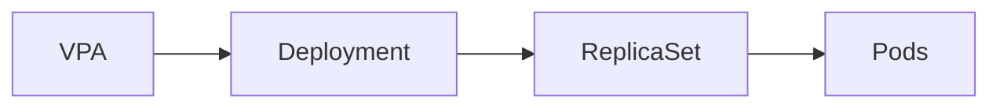

# 07 - VPA Custom Resource

The Vertical Pod Autoscaler is configured through a **Custom Resource Definition (CRD)** — a dedicated Kubernetes resource named `VerticalPodAutoscaler` that tells the VPA which workload to monitor, how to apply recommendations, and which resources to manage.

---

## A Basic VPA Resource

```yaml
apiVersion: autoscaling.k8s.io/v1
kind: VerticalPodAutoscaler

metadata:
  name: frontend-vpa

spec:
  targetRef:
    apiVersion: apps/v1
    kind: Deployment
    name: frontend

  updatePolicy:
    updateMode: Auto
```

This minimal configuration is enough for the VPA to begin monitoring the Deployment.

---

## Resource Structure

```
VerticalPodAutoscaler
├── metadata
├── spec
│   ├── targetRef
│   ├── updatePolicy
│   └── resourcePolicy
└── status
```

---

## apiVersion

```yaml
apiVersion: autoscaling.k8s.io/v1
```

Unlike the HPA, which is part of Kubernetes itself, the VPA is an additional component with its own API group — `autoscaling.k8s.io`.

---

## targetRef

Identifies the workload managed by the VPA:

```yaml
targetRef:
  apiVersion: apps/v1
  kind: Deployment
  name: frontend
```

Supported targets: `Deployment`, `StatefulSet`, `ReplicaSet`, and other scalable workload controllers. The VPA never manages Pods directly — it observes the workload controller.



---

## updatePolicy

Defines how recommendations should be applied:

```yaml
updatePolicy:
  updateMode: Auto
```

| Mode | Description |
|---|---|
| `Off` | Recommendations only — no automatic changes |
| `Initial` | Apply only at Pod creation |
| `Auto` | Automatically replace Pods when beneficial |
| `Recreate` | Always recreate Pods to apply recommendations |

---

## resourcePolicy

Controls which resources and containers the VPA may modify:

```yaml
resourcePolicy:
  containerPolicies:
    - containerName: "*"
      controlledResources:
        - cpu
        - memory
      minAllowed:
        cpu: 250m
        memory: 256Mi
      maxAllowed:
        cpu: "4"
        memory: 8Gi
```

### Controlling Individual Resources

```yaml
controlledResources:
  - memory   # VPA manages only memory; CPU requests remain unchanged
```

Useful when combining VPA with HPA (let HPA manage CPU-based scaling, VPA manage memory).

### Per-Container Policies

Multi-container Pods can have different policies per container:

```yaml
containerPolicies:
  - containerName: application
    controlledResources:
      - cpu
      - memory
  - containerName: metrics-exporter
    minAllowed:
      cpu: 10m
      memory: 32Mi
    maxAllowed:
      cpu: 100m
      memory: 128Mi
```

This prevents sidecars or infrastructure containers from receiving unnecessary resource adjustments.

### Resource Limits (minAllowed / maxAllowed)

Prevent unrealistic recommendations:

```
Recommender calculates: CPU 8 cores  → capped at maxAllowed 4 cores
Recommender calculates: Memory 128Mi → raised to minAllowed 256Mi
```

---

## status

The VPA continuously updates its status with the latest calculated recommendations (managed automatically — never edit manually):

```yaml
status:
  recommendation:
    containerRecommendations:
      - containerName: frontend
        target:
          cpu: 900m
          memory: 1Gi
        lowerBound:
          cpu: 400m
          memory: 512Mi
        upperBound:
          cpu: 1200m
          memory: 2Gi
        uncappedTarget:
          cpu: 1500m
          memory: 3Gi
```

| Field | Description |
|---|---|
| `target` | Recommended allocation — applied when updating Pods |
| `lowerBound` | Minimum safe allocation |
| `upperBound` | Maximum reasonable allocation |
| `uncappedTarget` | Raw recommendation before `minAllowed`/`maxAllowed` bounds are applied |

`uncappedTarget` is useful for detecting when resource boundaries are actively constraining the Recommender's output.

---

## Inspecting the VPA

```bash
kubectl get vpa                      # list all VPAs
kubectl describe vpa frontend-vpa    # detailed view with recommendations
```

---

## Complete Production Example

```yaml
apiVersion: autoscaling.k8s.io/v1
kind: VerticalPodAutoscaler

metadata:
  name: frontend-vpa

spec:
  targetRef:
    apiVersion: apps/v1
    kind: Deployment
    name: frontend

  updatePolicy:
    updateMode: Auto

  resourcePolicy:
    containerPolicies:
      - containerName: "*"
        controlledResources:
          - cpu
          - memory
        minAllowed:
          cpu: 250m
          memory: 256Mi
        maxAllowed:
          cpu: "4"
          memory: 8Gi
```

---

## Pod Recreation

Applying new resource requests generally requires the affected Pod to be recreated — the VPA cannot resize a running Pod in place. When `updateMode` is set to `Auto` or `Recreate`, the Updater will evict Pods so they are replaced with updated resource requests.

> [!note]
> In-place Pod resource updates (`InPlacePodVerticalScaling`) entered beta in Kubernetes 1.31. This feature may reduce or eliminate the need for Pod recreation in future VPA versions.

---

## Best Practices

> [!tip]
> Always define sensible `minAllowed` and `maxAllowed` values to prevent unrealistic recommendations from being applied.

> [!tip]
> Use container-specific policies when Pods contain sidecars or auxiliary containers — avoid applying VPA to containers where you don't want automatic resource changes.

> [!tip]
> Regularly inspect the `status` section to understand how application resource requirements evolve over time.

> [!warning]
> When combining VPA with HPA, avoid having both manage CPU — use `controlledResources: [memory]` on VPA and let HPA handle CPU-based scaling.

> [!note]
> The CRD defines the desired strategy. The Recommender, Updater, and Admission Controller are responsible for implementing it.

---

## Key Takeaways

- VPA is configured through a `VerticalPodAutoscaler` Custom Resource (`autoscaling.k8s.io/v1`)
- `targetRef` identifies the workload; `updatePolicy` controls when recommendations are applied
- `resourcePolicy` controls which resources and containers the VPA may modify
- `minAllowed` and `maxAllowed` prevent unrealistic recommendations
- Per-container policies enable fine-grained control in multi-container Pods
- The `status` section exposes the Recommender's latest recommendations (Lower Bound, Target, Upper Bound)
