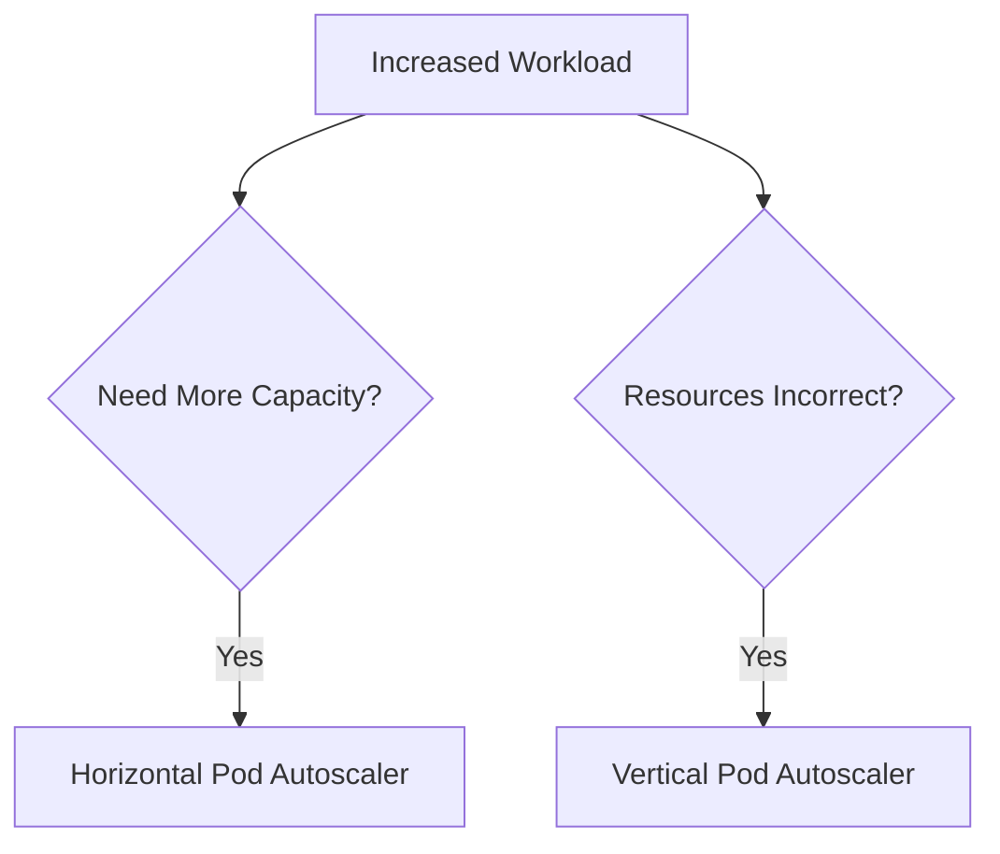
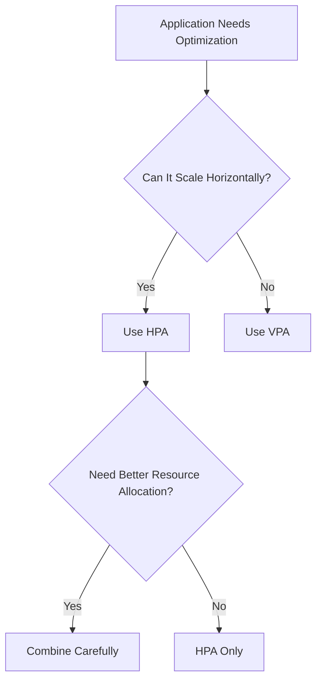

# 10 - Comparing HPA and VPA

The Horizontal Pod Autoscaler (HPA) and the Vertical Pod Autoscaler (VPA) are often presented as competing technologies. In reality, they solve **different problems**.

The HPA increases application capacity by creating additional Pods. The VPA improves resource allocation by adjusting the CPU and memory assigned to each Pod. Understanding this distinction is essential when designing an autoscaling strategy.

---

## The Fundamental Difference

The simplest way to distinguish them is to ask: **What changes when scaling occurs?**

With the HPA — the number of Pods changes:

```
2 Pods  →  6 Pods
```

With the VPA — the number of Pods stays the same; only the resources assigned to each Pod change:

```
CPU: 500m, Memory: 512Mi  →  CPU: 2, Memory: 2Gi
```

---

## High-Level Comparison

| Horizontal Pod Autoscaler | Vertical Pod Autoscaler |
|---|---|
| Changes replica count | Changes CPU and memory requests |
| Best for stateless applications | Best for resource optimization |
| Responds quickly to workload changes | Learns from historical usage |
| Creates additional Pods | Recreates Pods with updated resources |
| Improves throughput | Improves efficiency |

---

## Scaling Philosophy

The HPA answers: **Do we need more application instances?**

The VPA answers: **Does each application instance have enough resources?**



---

## Example Scenario

Consider an e-commerce API running 2 Pods, each with `500m CPU` and `512Mi Memory`. Traffic suddenly triples.

The HPA responds by creating more replicas — each still with the same resource requests:

```
2 Pods  →  6 Pods  (each: 500m CPU, 512Mi Memory)
```

Now imagine a new version introduces additional in-memory caching. Traffic remains unchanged, but each Pod now requires `900m CPU` and `2Gi Memory`. Creating additional replicas will not solve the memory problem. Instead, the VPA recommends increasing the resources assigned to each Pod.

---

## Decision Matrix

| Question | HPA | VPA |
|---|:---:|:---:|
| Does the application need more replicas? | ✅ | ❌ |
| Are Pods under-sized? | ❌ | ✅ |
| Are Pods over-sized? | ❌ | ✅ |
| Is CPU utilization increasing because of more users? | ✅ | ❌ |
| Are resource requests poorly configured? | ❌ | ✅ |

---

## Typical Workloads

### Horizontal Pod Autoscaler

Ideal for REST APIs, web applications, microservices, stateless workers, and API gateways — applications that distribute requests across multiple replicas.

### Vertical Pod Autoscaler

Ideal for databases, JVM applications, machine learning workloads, analytics engines, and legacy enterprise software — workloads that benefit more from larger resource allocations than additional replicas.

---

## Resource Efficiency

**Application A** — 4 Pods each requesting 2 CPU cores but using only `300m`. The application is significantly over-provisioned. The VPA recommends reducing CPU requests.

**Application B** — 2 Pods running at `95% CPU`. The Pods already have appropriate resource requests; the problem is insufficient capacity. The HPA creates additional replicas.

---

## Availability

The HPA improves availability by distributing workload across multiple Pods. If one Pod fails, the remaining replicas continue serving traffic.

The VPA does not increase redundancy — it improves the sizing of existing Pods. If a workload runs only a single replica, the VPA alone cannot improve availability.

---

## Startup Time

Applications with fast startup times are excellent candidates for the HPA — new replicas become ready quickly and begin serving traffic.

Applications with slow startup times often benefit more from the VPA, because increasing resources on existing Pods may be more effective than waiting for additional replicas to initialise.

---

## Can They Work Together?

Yes — but they should optimize different aspects of the workload. A common production strategy:

```
HPA  →  Replica Count
VPA  →  Memory Requests
```

This avoids conflicting scaling decisions. Running both controllers against CPU utilization can produce feedback loops where each controller undermines the other's decisions.

---

## Choosing the Right Autoscaler



---

## Summary Comparison

| Feature | HPA | VPA |
|---|---|---|
| Scaling Target | Replica count | CPU and memory requests |
| Primary Goal | Increase capacity | Optimize resources |
| Typical Action | Create more Pods | Replace Pods with updated resources |
| Best Workloads | Stateless | Stateful or resource-intensive |
| Scaling Speed | Fast | Gradual |
| Requires Pod Recreation | No | Usually yes |
| Improves Availability | Yes | Indirectly |
| Improves Resource Efficiency | Indirectly | Yes |

---

## Best Practices

> [!tip]
> Use the HPA for applications that naturally scale by adding replicas.

> [!tip]
> Use the VPA when resource requests are difficult to estimate or change significantly over time.

> [!tip]
> If combining HPA and VPA, ensure they optimize different dimensions of the workload.

> [!warning]
> Do not assume the VPA is a replacement for the HPA. They solve different operational problems.

> [!note]
> Many production Kubernetes clusters use both autoscalers together as part of a broader autoscaling strategy.

---

## Key Takeaways

- The HPA increases the number of Pods; the VPA adjusts CPU and memory requests
- The HPA focuses on application capacity; the VPA focuses on resource efficiency
- The two autoscalers complement each other rather than compete
- Combining them requires careful metric selection to avoid feedback loops
- Choosing the correct autoscaler depends on application architecture and workload characteristics
