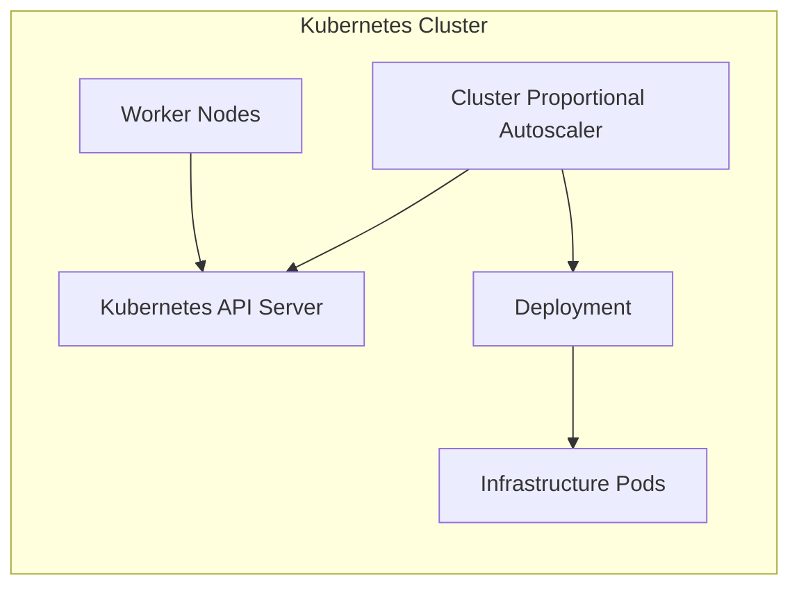
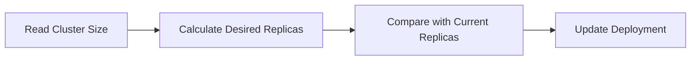
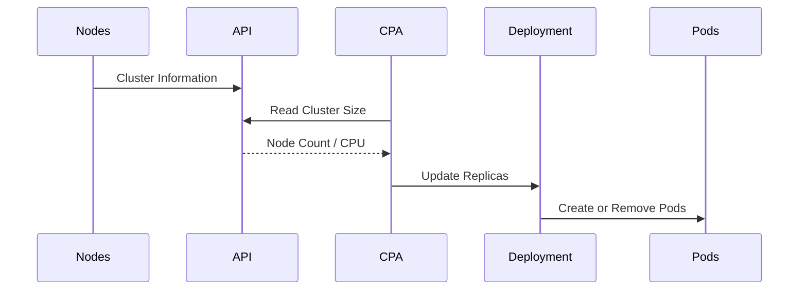

# 02 - CPA Architecture

Compared to the Horizontal Pod Autoscaler (HPA) and the Vertical Pod Autoscaler (VPA), the Cluster Proportional Autoscaler (CPA) has a remarkably simple architecture. It does not require a Metrics Server, Prometheus, a Metrics Adapter, or historical resource analysis. Instead, it periodically inspects the size of the Kubernetes cluster and calculates the appropriate number of replicas for a target workload.

---

## High-Level Architecture



Unlike the HPA, there are no metrics providers involved. The Kubernetes API already contains all the information the CPA requires.

---

## Main Components

| Component | Responsibility |
|---|---|
| Kubernetes API | Exposes cluster information |
| Worker Nodes | Determine cluster size |
| Cluster Proportional Autoscaler | Calculates desired replicas |
| Deployment | Creates or removes Pods |

---

## Kubernetes API

The CPA periodically queries the Kubernetes API for cluster information:

- Number of Worker Nodes
- Allocatable CPU
- Allocatable memory
- Overall cluster capacity

Unlike the HPA, no workload metrics are collected — only cluster-level data.

---

## Worker Nodes

Worker Nodes are the primary scaling input. Whenever the cluster expands or contracts, the CPA recalculates the desired number of replicas accordingly.

---

## CPA Control Loop

The CPA controller continuously executes a simple control loop:



The process repeats at regular intervals. If no cluster changes are detected, no scaling action occurs.

---

## Deployment Updates

Like the HPA, the CPA never creates Pods directly — it updates the Deployment's replica count:

```yaml
# Before
spec:
  replicas: 2

# After
spec:
  replicas: 5
```

The Deployment controller then creates the additional Pods required to reach the desired state.

---

## Complete Workflow



---

## Why Is the Architecture Simpler?

The HPA must answer complex questions about CPU utilization, request rates, and historical metrics. The CPA answers only one question:

> **How large is the cluster?**

There is no need for Metrics Server, Prometheus, custom metrics, external metrics, or recommendation engines. This dramatically simplifies its design.

---

## Relationship with the Cluster Autoscaler

The CPA is often deployed alongside the Cluster Autoscaler:

```
Cluster Autoscaler adds Worker Nodes
  ↓
CPA detects larger cluster
  ↓
Infrastructure services scale
```

As the cluster expands, supporting services automatically receive additional replicas — creating a self-adjusting infrastructure.

---

## Example

Initial cluster with 6 Worker Nodes, CPA configured at 1 replica per 2 nodes:

```
6 Nodes  →  3 CoreDNS Replicas  (ceil(6 / 2) = 3)
```

Cluster expands to 10 Worker Nodes:

```
10 Nodes  →  5 CoreDNS Replicas  (ceil(10 / 2) = 5)
```

No application metrics are involved.

---

## Architectural Comparison

| Feature | HPA | VPA | CPA |
|---|---|---|---|
| Metrics Server | ✅ Required | ✅ Required | ❌ Not needed |
| Prometheus | Optional | Optional | ❌ Not needed |
| Metrics Adapter | Optional | ❌ | ❌ Not needed |
| Kubernetes API | ✅ | ✅ | ✅ |
| Deployment Updates | ✅ | ✅ | ✅ |

> [!note]
> The VPA Recommender reads resource usage through the `metrics.k8s.io` API, which requires Metrics Server. Without it, the Recommender cannot generate CPU or memory recommendations.

---

## Best Practices

> [!tip]
> Use the CPA only for infrastructure components whose workload naturally increases as the cluster grows.

> [!tip]
> Keep the CPA configuration simple. Complex scaling formulas are rarely necessary.

> [!warning]
> Do not use the CPA for user-facing applications. Those workloads should typically use the Horizontal Pod Autoscaler.

> [!note]
> The CPA relies entirely on Kubernetes cluster information. No external monitoring systems are required.

---

## Key Takeaways

- The CPA architecture is significantly simpler than both the HPA and VPA
- The Kubernetes API provides all information required for scaling decisions
- Worker Nodes determine the desired number of replicas
- The CPA updates Deployments rather than creating Pods directly
- Infrastructure services automatically scale as cluster capacity changes
- The CPA is commonly paired with the Cluster Autoscaler for fully automated infrastructure scaling
