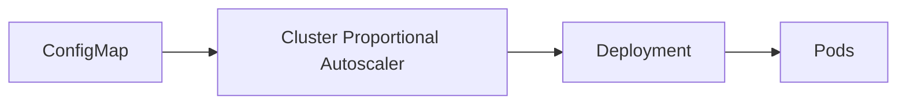

# 05 - CPA Configuration

The behavior of the Cluster Proportional Autoscaler (CPA) is controlled through a **ConfigMap**. Unlike the HPA, which is configured using a dedicated Kubernetes resource, the CPA reads its scaling rules directly from a ConfigMap that defines:

- Which scaling algorithm to use
- How replicas are calculated
- Minimum and maximum replica counts
- Whether scaling is based on Worker Nodes or CPU cores

---

## Configuration Architecture



Whenever the CPA evaluates the cluster, it applies the rules defined inside the ConfigMap before updating the Deployment.

---

## Linear Configuration

```yaml
apiVersion: v1
kind: ConfigMap
metadata:
  name: dns-autoscaler
  namespace: kube-system
data:
  linear: |-
    {
      "coresPerReplica": 16,
      "nodesPerReplica": 4,
      "min": 2,
      "max": 10
    }
```

The `linear` key activates the Linear algorithm. All parameters are expressed as a JSON object.

---

## Ladder Configuration

The Ladder algorithm uses a different JSON structure — arrays of `[threshold, replicas]` pairs:

```yaml
apiVersion: v1
kind: ConfigMap
metadata:
  name: dns-autoscaler
  namespace: kube-system
data:
  ladder: |-
    {
      "nodesToReplicas":
      [
        [1,  1],
        [10, 2],
        [25, 3],
        [50, 5],
        [100, 8]
      ]
    }
```

Each pair defines a threshold: once the cluster reaches or exceeds `N` nodes, the CPA sets the corresponding replica count. To scale by CPU cores instead, use `coresToReplicas`:

```yaml
ladder: |-
  {
    "coresToReplicas":
    [
      [1,   1],
      [64,  3],
      [256, 5],
      [512, 8]
    ]
  }
```

> [!note]
> Only one algorithm (`linear` or `ladder`) should be active at a time. The CPA reads whichever key is present in the ConfigMap and ignores the other.

---

## Selecting the Scaling Algorithm

Change the active algorithm by changing the key in `data`:

```yaml
data:
  linear: |-   # Linear is active
    { ... }
```

```yaml
data:
  ladder: |-   # Ladder is active
    { ... }
```

Changing the ConfigMap changes the autoscaler's behavior without modifying the Deployment itself.

---

## nodesPerReplica

```json
"nodesPerReplica": 4
```

Specifies how many Worker Nodes correspond to one replica. With 12 nodes: `ceil(12 / 4) = 3 replicas`.

Larger values → slower scaling. Smaller values → more aggressive scaling.

---

## coresPerReplica

```json
"coresPerReplica": 16
```

Scales based on total allocatable CPU cores instead of node count. With 64 cores: `ceil(64 / 16) = 4 replicas`.

CPU-based scaling is preferable when Worker Nodes have different hardware specifications.

---

## Minimum Replicas

```json
"min": 2
```

Regardless of the scaling calculation, the CPA will never deploy fewer than the configured minimum. Prevents critical infrastructure services from becoming unavailable in very small clusters.

---

## Maximum Replicas

```json
"max": 10
```

The CPA will never exceed the configured maximum, regardless of cluster size. Prevents excessive scaling in very large clusters.

---

## Updating the Configuration

```
Edit ConfigMap → Apply Changes → CPA reads updated config → Future decisions use new rules
```

Configuration changes take effect at the next CPA evaluation cycle — no container rebuild or Deployment restart required.

---

## Example: CoreDNS Linear Configuration

```yaml
data:
  linear: |-
    {
      "nodesPerReplica": 5,
      "min": 2,
      "max": 12
    }
```

| Worker Nodes | Calculation | CoreDNS Replicas |
|---|---|---:|
| 5 | ceil(5/5) = 1 → min | 2 |
| 10 | ceil(10/5) = 2 | 2 |
| 15 | ceil(15/5) = 3 | 3 |
| 25 | ceil(25/5) = 5 | 5 |
| 40 | ceil(40/5) = 8 | 8 |
| 70 | ceil(70/5) = 14 → max | 12 |

---

## Choosing Configuration Values

Appropriate scaling parameters depend on the workload:

- **Small development cluster** — `nodesPerReplica: 2` (more replicas, higher availability)
- **Large production cluster** — `nodesPerReplica: 6` (fewer replicas, cost efficiency)

Configuration should be validated through production monitoring rather than relying solely on theoretical calculations.

---

## Best Practices

> [!tip]
> Always define sensible `min` and `max` replica counts for critical infrastructure services.

> [!tip]
> Choose scaling factors based on production observations rather than estimates.

> [!tip]
> Use `coresPerReplica` when Worker Nodes have significantly different hardware capacities.

> [!warning]
> Avoid overly aggressive scaling factors — they may create unnecessary replicas and waste cluster resources.

> [!note]
> Configuration changes affect future scaling decisions only. Existing replicas remain unchanged until the next CPA evaluation.

---

## Key Takeaways

- The CPA is configured through a Kubernetes ConfigMap containing a JSON object
- The `linear` key activates Linear scaling; the `ladder` key activates Ladder scaling
- Linear scaling uses `nodesPerReplica` and/or `coresPerReplica` parameters
- Ladder scaling uses `nodesToReplicas` and/or `coresToReplicas` as arrays of `[threshold, replicas]` pairs
- `min` and `max` prevent unrealistic scaling at either end of cluster size
- ConfigMap changes take effect without rebuilding or restarting the CPA
