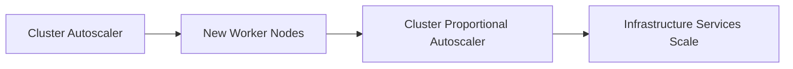

# 06 - CPA Best Practices

The Cluster Proportional Autoscaler (CPA) is a relatively simple component, but choosing the correct scaling strategy is essential for maintaining a healthy Kubernetes control plane. Unlike application autoscaling, infrastructure services must remain stable, predictable, and continuously available.

---

## Scale Infrastructure, Not Applications

The CPA was designed to scale **cluster infrastructure services**:

- CoreDNS
- DNS Cache
- Metrics Collectors
- Admission Webhooks
- Logging Aggregators
- Internal Controllers

These services experience increasing workloads as the cluster grows. User-facing applications should generally use the **Horizontal Pod Autoscaler (HPA)**.

---

## Choose the Correct Scaling Algorithm

| Algorithm | Best For |
|---|---|
| Linear | Gradual and proportional growth |
| Ladder | Stable workloads with predefined capacity levels |

There is no universally correct choice. Select the algorithm that best reflects the expected growth pattern of the workload.

---

## Define Minimum Replicas

Infrastructure services should always maintain a minimum number of replicas:

```json
"min": 2
```

Even very small clusters benefit from redundancy. A single Pod failure in a single-replica CoreDNS deployment affects DNS resolution for the entire cluster.

---

## Configure Maximum Replicas

Large clusters should define an upper scaling boundary:

```json
"max": 10
```

Without a maximum, very large clusters may allocate more infrastructure Pods than necessary. Maximum replica counts help balance availability, resource consumption, and operational costs.

---

## Match Scaling to Cluster Growth

Before selecting scaling parameters, understand how the cluster typically evolves. A development cluster ranging from 3–8 nodes requires a very different configuration than a production cluster ranging from 100–300 nodes. Configurations should reflect realistic operational environments rather than theoretical maximums.

---

## Prefer CPU-Based Scaling for Heterogeneous Clusters

Clusters with nodes of different hardware specifications should use `coresPerReplica` rather than `nodesPerReplica`. Scaling purely by node count assumes every node provides identical capacity — which may significantly under or over-provision infrastructure services in mixed-instance environments.

---

## Keep Configurations Simple

One advantage of the CPA is its predictability. Avoid overly complicated scaling rules. A straightforward `"nodesPerReplica": 5` is easier to understand and maintain than highly optimized formulas with many special cases. Operational simplicity leads to more reliable infrastructure.

---

## Monitor Infrastructure Services

Although the CPA scales automatically, infrastructure workloads should still be monitored. Useful metrics:

- Replica count
- DNS request latency
- Metrics collection latency
- CPU and memory utilization
- Request throughput

Scaling should be validated against actual workload behavior — not only against the scaling formula.

---

## Validate Cluster Expansion

Whenever the cluster grows significantly, verify that infrastructure services scale as expected:

```
Cluster Autoscaler adds nodes
  ↓
CPA recalculates replicas
  ↓
CoreDNS scales
  ↓
DNS latency remains stable
```

Infrastructure scaling should be considered part of every cluster expansion exercise.

---

## Test Scaling in Non-Production Environments

Before modifying CPA parameters in production: increase cluster size, observe replica calculations, verify Deployment updates, and measure infrastructure performance. Testing avoids unexpected behavior during real cluster growth.

---

## Coordinate with the Cluster Autoscaler

The CPA and Cluster Autoscaler complement one another:



Together they ensure that both cluster capacity and supporting services grow in parallel.

---

## Avoid Frequent Configuration Changes

Infrastructure services generally exhibit predictable behavior. Once scaling parameters have been validated, configuration changes should be infrequent. Frequent adjustments make long-term capacity planning more difficult and may introduce unnecessary operational complexity.

---

## Production Checklist

Before deploying the CPA, verify:

- [ ] Infrastructure workloads have been identified
- [ ] Appropriate scaling algorithm selected
- [ ] Minimum replica count configured
- [ ] Maximum replica count configured
- [ ] Scaling factor validated against cluster size expectations
- [ ] Monitoring dashboards available
- [ ] Cluster expansion tested in a non-production environment
- [ ] Cluster Autoscaler functioning correctly

---

## Best Practices Summary

| Recommendation | Reason |
|---|---|
| Scale infrastructure services only | CPA is not intended for application workloads |
| Choose the correct algorithm | Match workload growth characteristics |
| Configure minimum replicas | Maintain availability |
| Configure maximum replicas | Prevent excessive scaling |
| Prefer CPU-based scaling for heterogeneous clusters | Better reflects actual capacity |
| Keep configurations simple | Easier to maintain and troubleshoot |
| Validate scaling after cluster expansion | Confirm infrastructure remains healthy |
| Monitor supporting services continuously | Verify scaling assumptions |

---

## Key Takeaways

- The CPA is designed for Kubernetes infrastructure services rather than user applications
- Linear and Ladder algorithms should be selected according to workload characteristics
- Minimum and maximum replica counts are essential for production deployments
- CPU-based scaling is often preferable in heterogeneous clusters
- The CPA should be monitored and tested just like any other production component
- Coordinating the CPA with the Cluster Autoscaler creates a self-scaling Kubernetes infrastructure
