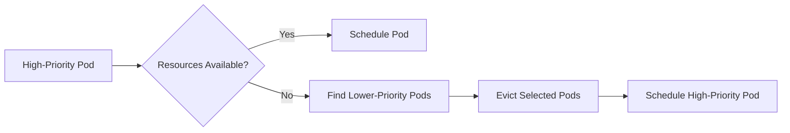

# 01 - Pod Priority and Preemption Overview

In every Kubernetes cluster, resources such as CPU and memory are finite. When sufficient resources are available, the Scheduler simply places Pods onto Worker Nodes.

But what happens when the cluster becomes full and a new critical application needs to start? Rather than leaving a critical Pod in the **Pending** state indefinitely, Kubernetes can reclaim resources by removing less important Pods. This mechanism is known as **Pod Priority and Preemption**.

---

## Why Is Priority Needed?

Imagine a production cluster running monitoring services, internal reporting jobs, customer-facing APIs, and batch processing workloads. An emergency deployment introduces a critical payment service — but the cluster is at 100% capacity.

Without priorities, the Scheduler has no way to distinguish between a payment service and a nightly reporting job. Both Pods are treated equally, which may delay critical workloads even though less important Pods could safely be interrupted.

---

## What Is Pod Priority?

Every Pod may be assigned a **priority value**. Higher values indicate more important workloads:

| Application | Priority |
|---|---:|
| Batch Job | 1,000 |
| Monitoring | 5,000 |
| Web API | 10,000 |
| Payment Service | 100,000 |

When multiple Pods compete for limited resources, Kubernetes schedules the highest-priority Pods first.

---

## Scheduling Order

The Scheduler always prefers higher-priority workloads. Even if a Batch Job entered the pending queue before a Payment Service, the Payment Service is scheduled first.

> [!note]
> Priority influences scheduling order — it does not reserve resources.

---

## What Is Preemption?

Priority alone cannot solve every scheduling problem. If the cluster has no remaining capacity, even a high-priority Pod cannot be scheduled through priority alone.

Rather than leaving the Pod pending indefinitely, Kubernetes evaluates whether lower-priority Pods can be removed:



Preemption occurs only when normal scheduling is impossible.

---

## When Does Preemption Occur?

```
1. Find Suitable Node
2. No Suitable Node Found
3. Search for Lower-Priority Pods
4. Evict Candidates
5. Retry Scheduling
```

If no suitable candidates exist for eviction, the Pod remains **Pending** until resources become available organically.

---

## Priority Does Not Guarantee Scheduling

A common misconception:

> "A high-priority Pod will always run."

Not necessarily. If every running Pod has equal or higher priority, no eligible Pods can be preempted. The new Pod remains pending until resources are freed. Priority improves scheduling preference — it does not create additional cluster capacity.

---

## Real-World Example

Worker Node with 8 CPU, fully utilized:

| Pod | Priority | CPU |
|---|---:|---:|
| Batch Job | 1,000 | 4 |
| Reporting | 2,000 | 4 |

A new Payment API arrives requiring 4 CPU with priority 100,000. The Scheduler performs preemption:

```
Batch Job evicted  →  Payment API scheduled
```

Critical business services continue operating while less important work is postponed and rescheduled when capacity becomes available.

---

## Why Not Always Preempt?

Frequent preemption would create unstable workloads — a low-priority Pod repeatedly evicted and restarted wastes compute resources and reduces overall cluster efficiency. For this reason, Kubernetes performs preemption **only when absolutely necessary**. It is a last-resort scheduling mechanism.

---

## Typical Use Cases

**High priority** — control-plane components, ingress controllers, DNS services, monitoring systems, payment services, authentication systems.

**Low priority** — batch jobs, background processing, nightly reports, data export tasks.

---

## Relationship with Autoscaling

Pod Priority complements Kubernetes autoscaling. If a high-priority Pod has no resources and the Cluster Autoscaler is provisioning a new node (which may take several minutes), preemption provides an immediate solution by reclaiming existing resources. Once the new node becomes available, evicted lower-priority workloads may be rescheduled.

---

## Key Characteristics

**Pod Priority:**
- Influences scheduling order
- Does not reserve resources
- Works before Pods are scheduled

**Preemption:**
- Removes lower-priority Pods to free resources
- Occurs only when no other scheduling option exists
- Is a last-resort mechanism

---

## Key Takeaways

- Pod Priority assigns importance to workloads through numeric values
- Higher-priority Pods are scheduled before lower-priority Pods
- Preemption removes lower-priority Pods when no capacity is available
- Priority does not guarantee scheduling if all running Pods have equal or higher priority
- Preemption is a last-resort mechanism designed to protect critical applications
- Priority and autoscaling complement each other to improve overall cluster resilience
