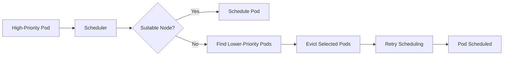

# 03 - The Preemption Process

Preemption is the mechanism Kubernetes uses when a **high-priority Pod cannot be scheduled because the cluster lacks sufficient resources**. Instead of leaving the Pod in the **Pending** state indefinitely, the Scheduler searches for lower-priority Pods that can be removed to free enough CPU and memory.

Preemption is a **resource recovery mechanism**, not a scaling mechanism.

---

## When Does Preemption Happen?

Preemption only occurs after normal scheduling has failed:

```
New Pod
  ↓
Find Suitable Node
  ↓
Node found?  →  Yes  →  Schedule Pod
  ↓
  No
  ↓
Evaluate Preemption
```

If a node already has sufficient free resources, preemption never occurs.

---

## High-Level Workflow



Preemption is only considered after all normal scheduling options have been exhausted.

---

## Selecting Candidate Nodes

The Scheduler first identifies nodes where scheduling would become possible if one or more lower-priority Pods were removed. Nodes that could never satisfy the resource request — even after full eviction — are ignored entirely.

---

## Selecting Victim Pods

Once a candidate node has been identified, Kubernetes determines which Pods should be preempted.

> **Only Pods with lower priority are eligible.**

Example with a Payment API (priority 100,000) needing resources:

| Pod | Priority | Eligible victim? |
|---|---:|:---:|
| Monitoring | 50,000 | ✅ |
| Batch Job | 1,000 | ✅ |
| Payment API | 100,000 | ❌ |

---

## Choosing the Smallest Disruption

The Scheduler attempts to minimize disruption — evicting only what is strictly necessary. If evicting one Batch Pod frees enough resources, Kubernetes will not also evict the Monitoring Pod.

---

## Respecting Pod Disruption Budgets

PodDisruptionBudget support during preemption is **best-effort**. The Scheduler prefers victims whose PDBs would not be violated (e.g., it avoids evicting a Pod when `minAvailable: 2` with only 2 replicas running), but if no such victims can free enough resources, **preemption still proceeds and the PDB is violated**. A PDB delays and discourages preemption — it does not guarantee protection against it.

---

## Graceful Termination

Victim Pods are not terminated immediately. The normal Kubernetes termination sequence still applies:

```
Eviction → SIGTERM → Grace Period → Container Stops → Resources Released
```

This gives applications an opportunity to complete in-flight requests, save state, and close connections cleanly.

---

## Scheduling Retry

Once resources have been released, the Scheduler retries the original request. From the user's perspective, the Pod simply transitions from **Pending** to **Running**.

---

## When Preemption Cannot Help

**No lower-priority Pods** — Every running Pod has equal or higher priority. No victims exist.

**Insufficient resources** — Even after removing all eligible Pods, the available resources still do not meet the Pod's request.

In these cases, the Pod remains Pending until capacity becomes available organically.

---

## Example Timeline

```
Cluster Full
  ↓
Critical API deployed  →  Scheduler fails to place it
  ↓
Batch Job selected as victim  →  Batch Job evicted
  ↓
Critical API scheduled
  ↓
Cluster Autoscaler provisions new node
  ↓
Batch Job rescheduled on new node
```

This demonstrates how preemption and autoscaling complement each other — preemption provides an immediate solution while the Cluster Autoscaler restores full cluster capacity.

---

## Preemption vs Eviction

| Preemption | Eviction |
|---|---|
| Scheduler decision | Pod removal mechanism |
| Triggered by scheduling failure | Can occur for many reasons (OOM, PDB drain, etc.) |
| Frees resources for a specific Pod | Removes Pods gracefully |
| Requires priority comparison | Does not require priorities |

Preemption decides **which Pods should leave**. Eviction performs the actual removal.

---

## Best Practices

> [!tip]
> Assign high priorities only to workloads that are genuinely business-critical.

> [!tip]
> Configure Pod Disruption Budgets to protect highly available applications from excessive preemption.

> [!tip]
> Monitor preemption events. Frequent preemption often indicates insufficient cluster capacity rather than an incorrect priority configuration.

> [!warning]
> Preemption is an emergency scheduling mechanism — not a substitute for proper capacity planning or the Cluster Autoscaler.

> [!note]
> The Scheduler always attempts normal scheduling before considering preemption.

---

## Key Takeaways

- Preemption occurs only after normal scheduling fails
- Kubernetes selects lower-priority Pods as potential victims
- The Scheduler minimizes disruption by evicting only the Pods required to free sufficient resources
- Pod Disruption Budgets are considered on a best-effort basis — preemption can still violate them if no other victims exist
- Victim Pods receive graceful termination — they are not immediately killed
- Preemption and the Cluster Autoscaler complement each other to maintain workload availability
- Preemption is a last-resort mechanism, not a routine scheduling strategy
