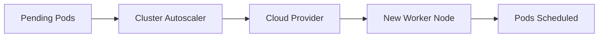
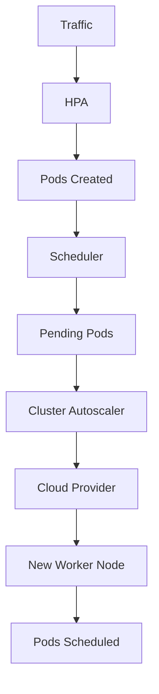

# 01 - Cluster Autoscaler Overview

The **Cluster Autoscaler (CA)** is a Kubernetes component that automatically adjusts the number of **Worker Nodes** in a cluster according to workload demand. While the HPA scales applications by changing the number of Pods, the Cluster Autoscaler scales the **underlying infrastructure** by adding or removing Worker Nodes.

---

## Why Does Kubernetes Need a Cluster Autoscaler?

When the HPA creates additional Pods in response to increased traffic, the Scheduler attempts to place them. If every Worker Node is already fully utilized:

```
Traffic Increases → HPA creates 20 new Pods → Scheduler finds no available CPU → Pods Pending
```

The HPA has completed its task successfully. The problem is no longer application scaling — it is **cluster capacity**. The Cluster Autoscaler solves this by provisioning additional Worker Nodes.

---

## What Does the Cluster Autoscaler Scale?

Unlike the HPA or VPA, the Cluster Autoscaler never modifies applications. It changes the size of the Kubernetes cluster itself — the applications running inside remain unchanged.

---

## How the Cluster Autoscaler Works

The Cluster Autoscaler continuously monitors the Scheduler. Whenever Pods cannot be scheduled due to insufficient resources, it evaluates whether adding new Worker Nodes would solve the problem:



This process is completely automatic.

---

## Scale-Up Example

A cluster with 3 fully utilized nodes. The HPA creates 8 new Pods — all land in Pending. The Cluster Autoscaler determines that one additional node can accommodate the pending workload:

```
3 Nodes  →  4 Nodes
```

Once the new node joins the cluster, the Scheduler immediately places the waiting Pods.

---

## Scale-Down Example

Traffic decreases overnight. Several nodes become almost empty. Before removing a node, Kubernetes safely relocates its workloads to other nodes:

```
6 Nodes  →  3 Nodes
```

Unused infrastructure is deleted, reducing operational costs.

---

## Relationship with Other Autoscalers

Each autoscaler operates at a different layer of the platform:

| Component | What It Scales |
|---|---|
| Horizontal Pod Autoscaler | Number of Pods |
| Vertical Pod Autoscaler | CPU and memory requests |
| Cluster Proportional Autoscaler | Infrastructure service replicas |
| Cluster Autoscaler | Worker Nodes |

These components complement one another rather than compete.

---

## Complete Autoscaling Pipeline



The Cluster Autoscaler only becomes involved **after** the Scheduler determines that Pods cannot be placed.

---

## Supported Environments

The Cluster Autoscaler is designed for cloud environments where infrastructure can be provisioned automatically:

- Amazon EKS
- Azure Kubernetes Service (AKS)
- Google Kubernetes Engine (GKE)
- OpenShift
- Oracle Kubernetes Engine (OKE)

It integrates with the underlying cloud provider to create or remove virtual machines on demand.

---

## Key Takeaways

- The Cluster Autoscaler scales **Worker Nodes**, not Pods
- It reacts to **unschedulable Pods** rather than application metrics
- New nodes are provisioned only when additional capacity is required
- Unused nodes can be removed automatically to reduce costs
- Together with the HPA, it provides complete application and infrastructure autoscaling
