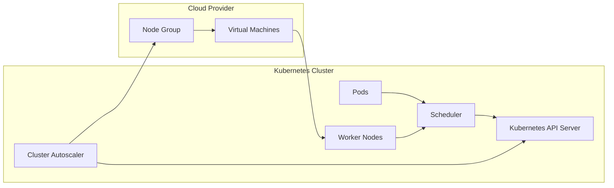
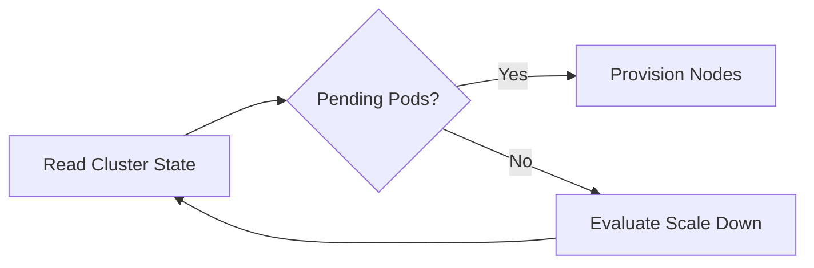
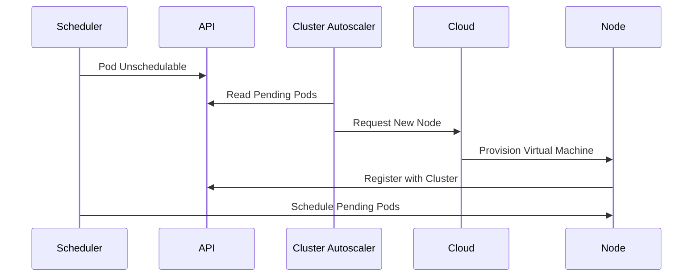
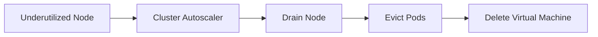

# 02 - Cluster Autoscaler Architecture

The Cluster Autoscaler is responsible for managing the size of the Kubernetes cluster. Unlike the HPA, which monitors application metrics, the Cluster Autoscaler observes the **scheduling state** of the cluster. Its primary responsibility is to answer a single question:

> **Can every Pod be scheduled with the current cluster capacity?**

If the answer is **no**, the Cluster Autoscaler evaluates whether adding new Worker Nodes would resolve the problem.

---

## High-Level Architecture

The Cluster Autoscaler acts as a bridge between Kubernetes and the underlying cloud infrastructure:



Unlike the HPA or VPA, the Cluster Autoscaler communicates directly with the cloud provider responsible for provisioning compute resources.

---

## Main Components

| Component | Responsibility |
|---|---|
| Scheduler | Detects unschedulable Pods |
| Kubernetes API Server | Exposes cluster state |
| Cluster Autoscaler | Decides whether to add or remove nodes |
| Cloud Provider | Creates or deletes virtual machines |
| Worker Nodes | Provide compute capacity |

---

## Kubernetes Scheduler

The Scheduler attempts to assign every Pod to a Worker Node. If no suitable node exists, the Scheduler marks the Pod as **Unschedulable** — this becomes the trigger for the Cluster Autoscaler.

---

## Kubernetes API Server

The Cluster Autoscaler continuously queries the Kubernetes API for:
- Pending and unschedulable Pods
- Node utilization and available capacity
- Node labels, taints, and tolerations

The API Server acts as the Cluster Autoscaler's source of truth.

---

## Cluster Autoscaler Control Loop



Unlike the HPA, no CPU or memory metrics are required — scheduling decisions alone determine whether scaling is necessary.

---

## Cloud Provider Integration

The Cluster Autoscaler does not create virtual machines directly — it delegates to the cloud provider:

- **AWS** — EC2 Auto Scaling Groups
- **Azure** — Virtual Machine Scale Sets
- **GCP** — Managed Instance Groups

```
Cluster Autoscaler → Cloud API → Create VM → Join Kubernetes Cluster
```

This abstraction allows the same Cluster Autoscaler to work across multiple cloud platforms.

---

## Worker Node Join Process

Once a new virtual machine is provisioned:

1. Kubernetes components start on the VM
2. The node registers with the API Server
3. The Scheduler detects the new capacity
4. Pending Pods are scheduled automatically

From the application's perspective, the scaling process is transparent.

---

## Complete Scale-Up Workflow



---

## Scale-Down Architecture



Before removing a node, Kubernetes safely migrates workloads to other Worker Nodes. Only empty or sufficiently underutilized nodes become candidates for removal.

---

## Relationship with the Scheduler

| Scheduler | Cluster Autoscaler |
|---|---|
| Places Pods onto nodes | Adds or removes Worker Nodes |
| Makes placement decisions | Creates cluster capacity |
| Never provisions infrastructure | Never schedules Pods |

Together they ensure workloads can always be placed when sufficient infrastructure exists.

---

## Design Principles

- Reacts only to genuine scheduling failures
- Never provisions unnecessary infrastructure
- Delegates VM management to cloud-provider APIs
- Integrates seamlessly with existing Kubernetes scheduling logic

This modular architecture allows Kubernetes to remain cloud-agnostic while supporting multiple infrastructure providers.

---

## Best Practices

> [!tip]
> Treat the Cluster Autoscaler as part of the Kubernetes control plane and monitor its health continuously.

> [!tip]
> Ensure the cloud provider integration has permission to create and remove Worker Nodes.

> [!tip]
> Keep node groups well defined so the Cluster Autoscaler can make predictable provisioning decisions.

> [!warning]
> A healthy Cluster Autoscaler cannot provision nodes if cloud provider quotas or infrastructure limits have been reached.

> [!note]
> The Cluster Autoscaler never schedules Pods — it only provides the infrastructure required for the Scheduler to succeed.

---

## Key Takeaways

- The Cluster Autoscaler bridges Kubernetes and the underlying cloud infrastructure
- It monitors unschedulable Pods through the Kubernetes API — no application metrics needed
- Cloud providers are responsible for creating and deleting virtual machines
- Worker Nodes automatically register with the cluster after provisioning
- The Scheduler and Cluster Autoscaler work together but have completely separate responsibilities
