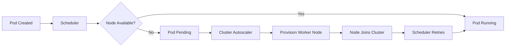
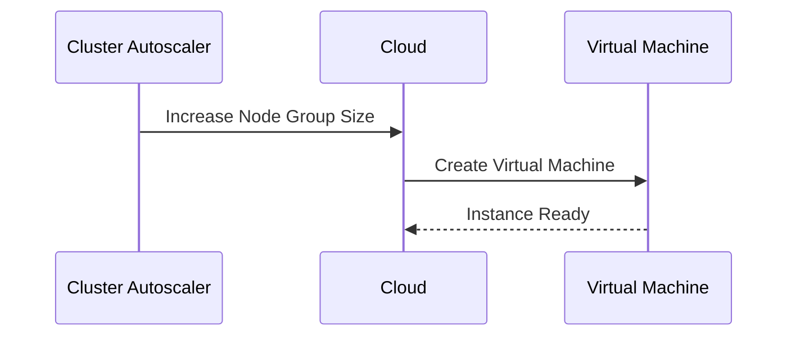
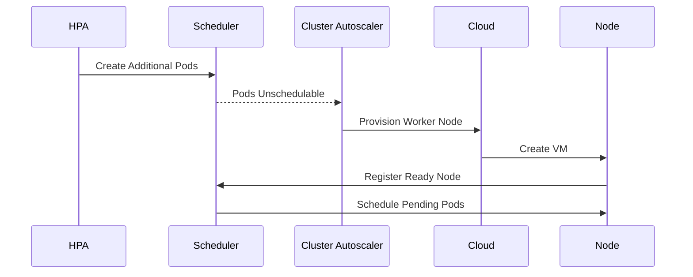

# 03 - Cluster Autoscaler Scale-Up Process

The primary responsibility of the Cluster Autoscaler is to **increase cluster capacity when Kubernetes can no longer schedule Pods**. Unlike the HPA, the Cluster Autoscaler reacts **only after Pods become unschedulable** — it does not monitor application traffic or CPU utilization. It observes the outcome of the Kubernetes scheduling process.

---

## When Does Scale-Up Start?

Scale-up begins only after the Scheduler has failed to place one or more Pods:

```
Deployment  →  20 Replicas  →  Scheduler  →  15 Running + 5 Pending
```

The Scheduler has determined that no existing Worker Node has sufficient resources. These **Pending Pods** become the trigger for the Cluster Autoscaler.

---

## Detecting Unschedulable Pods

When scheduling fails, Kubernetes marks Pods as **Unschedulable**. Typical reasons:

- Insufficient CPU or memory
- GPU unavailable
- Node selector mismatch
- Affinity or anti-affinity constraints

Only Pods that are genuinely unschedulable are considered by the Cluster Autoscaler.

---

## High-Level Workflow



The Scheduler performs scheduling twice: before new infrastructure exists, and after the new Worker Node joins the cluster.

---

## Step 1 — Pod Becomes Pending

The HPA creates additional Pods. Every existing node is fully utilized. The Scheduler attempts placement and fails — Pods enter **Pending** state. At this stage, the Cluster Autoscaler has not yet taken any action.

---

## Step 2 — Cluster Autoscaler Evaluation

The Cluster Autoscaler periodically evaluates all Pending Pods. For each Pod it asks:

> **Would adding a new Worker Node allow this Pod to be scheduled?**

If **yes** — provisioning begins. If **no** — no scaling occurs (adding infrastructure would not solve the problem).

---

## Step 3 — Selecting a Node Group

Large clusters often contain multiple node groups:

```
General Purpose  |  Memory Optimized  |  GPU
```

The Cluster Autoscaler determines which node group is capable of running the Pending Pod. A GPU workload routes to the GPU node group; a memory-intensive Pod routes to the memory-optimized group.

---

## Step 4 — Requesting Infrastructure



Kubernetes waits while the cloud provider provisions the virtual machine.

---

## Step 5 — Node Registration

After the VM starts:

```
Virtual Machine → kubelet starts → Kubernetes components initialize → Node registers → Ready
```

Only after the node reaches the **Ready** state can workloads be scheduled onto it.

---

## Step 6 — Scheduler Retry

The Scheduler automatically detects the newly available capacity and reschedules previously Pending Pods — no manual intervention required.

---

## Complete Scale-Up Timeline



---

## Why Doesn't Scale-Up Happen Immediately?

Provisioning infrastructure takes time: cloud API requests, OS startup, kubelet initialization, network configuration, and cluster registration. Typical provisioning times range from **30 seconds to several minutes**, depending on the cloud provider. Applications should tolerate short periods where Pods remain Pending.

---

## Scale-Up Is Demand Driven

The Cluster Autoscaler never adds nodes proactively. A cluster at 50% utilization receives no action — even if future traffic growth is expected. This conservative behavior minimizes infrastructure costs.

---

## Situations Where Scale-Up Does Not Occur

Adding nodes does not solve every scheduling problem:
- Invalid node selectors or impossible affinity rules
- Insufficient cloud provider quotas
- Node group maximum size already reached

In these cases, additional Worker Nodes would not allow the Pod to run, so no scale-up occurs.

---

## Best Practices

> [!tip]
> Ensure Pod resource requests accurately reflect actual application requirements. Overestimated requests may trigger unnecessary node provisioning.

> [!tip]
> Design applications to tolerate short delays while new Worker Nodes are being provisioned.

> [!tip]
> Configure multiple node groups when workloads require different hardware profiles, such as GPU or high-memory nodes.

> [!warning]
> Scale-up depends on cloud provider availability. Infrastructure quotas or exhausted node group limits can prevent new Worker Nodes from being created.

> [!note]
> The Cluster Autoscaler reacts only to Pods that the Scheduler has determined are genuinely unschedulable.

---

## Key Takeaways

- Scale-up begins when Pods remain Pending because no suitable Worker Node exists
- The Scheduler identifies unschedulable Pods; the Cluster Autoscaler provisions new infrastructure
- The Cluster Autoscaler selects the most appropriate node group before requesting capacity
- New Worker Nodes automatically register with Kubernetes and become available for scheduling
- Infrastructure provisioning introduces a delay before Pending Pods begin running
- The Cluster Autoscaler scales only when additional nodes will genuinely solve the scheduling problem
