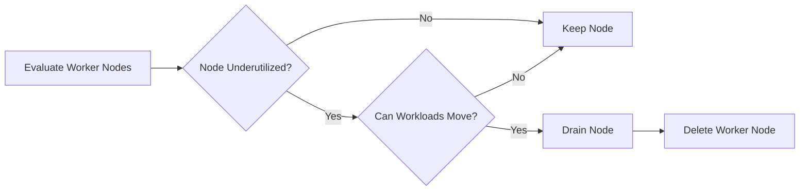
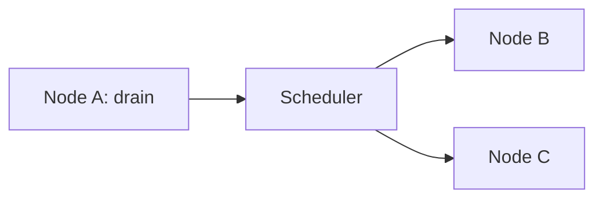
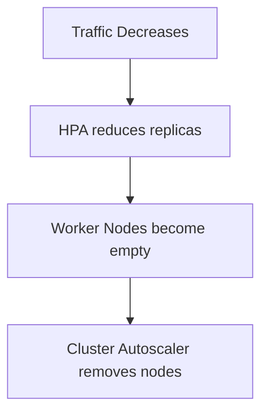

# 04 - Cluster Autoscaler Scale-Down Process

Adding Worker Nodes is only half of the Cluster Autoscaler's responsibility. When application demand decreases, the Cluster Autoscaler also identifies **underutilized Worker Nodes** and removes them. Unlike Scale-Up, which is usually triggered by Pending Pods, Scale-Down requires careful analysis to ensure that workloads can be relocated safely.

> **Reduce infrastructure costs without affecting application availability.**

---

## Why Scale Down?

A cluster that expanded to 10 nodes during a traffic spike may only need 4 nodes once demand returns to normal. Leaving the remaining six nodes running wastes infrastructure resources and increases costs.

---

## High-Level Workflow



Unlike Scale-Up, Scale-Down focuses on **moving workloads** rather than creating capacity.

---

## Step 1 — Identify Underutilized Nodes

The Cluster Autoscaler continuously evaluates Worker Nodes. Low utilization alone is **not** enough — the Cluster Autoscaler must also determine whether the workloads can be relocated.

---

## Step 2 — Simulate Pod Rescheduling

Before removing a node, the Cluster Autoscaler simulates whether every Pod on that node can be scheduled elsewhere:

```
Node A (Pods 1 and 2)  →  Can Pod 1 move to Node B?  →  Can Pod 2 move to Node C?
```

If every Pod can be relocated, the node becomes a Scale-Down candidate. If even one Pod cannot be moved, the node remains in the cluster.

---

## Step 3 — Cordon the Node

Once a node is selected, Kubernetes marks it as **unschedulable** (cordoned). No new Pods are placed on the node while Scale-Down is in progress. Existing Pods continue running.

---

## Step 4 — Drain the Node

During a drain operation, Pods are gracefully evicted and ReplicaSets recreate them on other Worker Nodes:



Workloads continue running throughout the process.

---

## Step 5 — Delete the Node

Once every Pod has been relocated and the node is empty, the Cluster Autoscaler requests the cloud provider to remove the corresponding virtual machine.

---

## Which Nodes Cannot Be Removed?

Not every Worker Node is eligible for Scale-Down:

- Nodes hosting Pods that cannot be relocated
- Nodes protected by Pod Disruption Budgets
- Nodes running system-critical workloads
- Nodes with local storage that would be lost if the node is deleted

Kubernetes keeps these nodes even if utilization is low.

---

## Interaction with Pod Disruption Budgets

If removing a Pod would violate a PDB (e.g., `minAvailable: 2` with only 2 replicas running), the Cluster Autoscaler postpones Scale-Down until relocation becomes possible. Availability always takes priority over infrastructure optimization.

---

## Interaction with the HPA

Scale-Down often follows application scaling:



The HPA reduces application demand; the Cluster Autoscaler removes the infrastructure that is no longer required.

---

## Why Doesn't Scale-Down Happen Immediately?

Immediately deleting nodes after every traffic drop would create unnecessary infrastructure churn. The Cluster Autoscaler waits for a stabilization period to ensure that reduced demand is sustained rather than temporary.

---

## Common Reasons Scale-Down Fails

- Pods cannot be rescheduled onto other nodes
- Pod Disruption Budgets prevent eviction
- Local storage would be lost
- Node is still required due to scheduling constraints (affinity, node selectors)
- System Pods cannot be relocated

In these situations, maintaining application availability is more important than reducing infrastructure costs.

---

## Best Practices

> [!tip]
> Deploy workloads with multiple replicas whenever possible — this makes Pod relocation during Scale-Down significantly easier.

> [!tip]
> Configure realistic Pod resource requests to improve packing efficiency and increase the likelihood of successful node removal.

> [!tip]
> Review Pod Disruption Budgets to ensure they balance application availability with infrastructure optimization.

> [!warning]
> Aggressive Scale-Down policies may increase infrastructure churn and cause unnecessary node provisioning during subsequent traffic spikes.

> [!note]
> The Cluster Autoscaler removes only Worker Nodes whose workloads can be relocated safely without violating Kubernetes scheduling rules.

---

## Key Takeaways

- Scale-Down removes unnecessary Worker Nodes after demand decreases
- Nodes are evaluated for utilization and workload mobility before removal
- Kubernetes cordons and drains nodes gracefully before deleting them
- Pod Disruption Budgets and scheduling constraints influence whether a node can be removed
- Scale-Down complements the HPA by removing infrastructure after application replicas are reduced
- Application availability always takes precedence over infrastructure cost optimization
