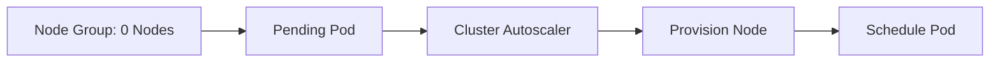
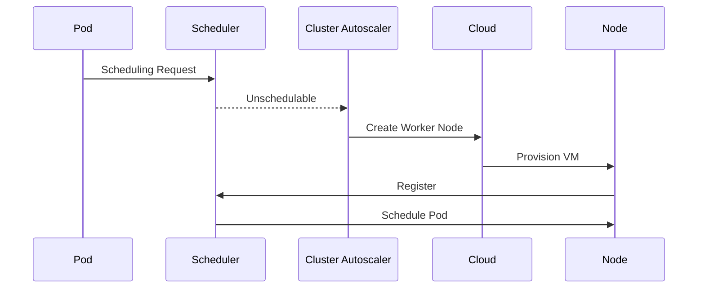

# 05 - Scale From Zero

One of the most powerful capabilities of the Cluster Autoscaler is **Scale From Zero**. With Scale From Zero, an entire **Node Group** can contain **zero running nodes** — infrastructure is created only when a workload actually requires it.

---

## Why Is Scale From Zero Needed?

Consider a machine learning workload that requires GPU instances and runs only a few hours each week. Keeping GPU nodes running continuously would be expensive. With Scale From Zero:

```
GPU Node Group: 0 nodes (idle, no cost)
  ↓
Pending GPU Pod arrives
  ↓
Cluster Autoscaler creates GPU node
  ↓
Pod scheduled and running
  ↓
Workload finishes → node removed → no cost
```

The cluster pays for GPU infrastructure only when it is actually needed.

---

## Traditional Scaling vs Scale From Zero

**Traditional** — Node group maintains at least 1 idle node at all times:
```
1 idle GPU node  →  no Pods running  →  still paying
```

**Scale From Zero** — Node group at 0 nodes when idle:
```
0 nodes  →  no Pods running  →  no cost
```

---

## High-Level Workflow



Kubernetes provisions an entirely new Worker Node before the Pod can start.

---

## How Does Kubernetes Know Which Node to Create?

> **If there are no nodes, how does the Cluster Autoscaler know which node type is required?**

The answer lies in the Pod's scheduling constraints:

```yaml
nodeSelector:
  accelerator: gpu
```

The Cluster Autoscaler compares these constraints against available Node Groups and selects the matching one — even before any node in that group exists.

---

## Example

Cluster with three Node Groups:

```
General Purpose: 4 nodes
Memory Optimized: 2 nodes
GPU: 0 nodes
```

A machine learning Job is deployed with `nodeSelector: accelerator: gpu`. The Scheduler cannot place the Pod. The Cluster Autoscaler evaluates available Node Groups, identifies the GPU group, and creates a new GPU node. The Pod is scheduled as soon as the node joins the cluster.

---

## Scale-Up Timeline



This process is identical to normal Scale-Up — except the Node Group initially contains **zero nodes**.

---

## Advantages

**Cost optimization** — Infrastructure is created only when required; idle nodes are removed automatically.

**Specialized hardware** — GPU, ARM, and high-memory nodes exist only while workloads are executing.

**Multiple workload types** — Each Node Group (General, Memory, GPU, ARM, Spot) can independently scale to zero.

**Better resource utilization** — Organizations pay only for resources actively serving workloads.

---

## Typical Use Cases

Scale From Zero is most valuable for workloads that execute intermittently:
- Machine learning and GPU jobs
- Batch processing
- CI/CD runners
- Rendering farms
- High-memory analytics
- Development and staging environments

---

## Startup Delay

Scale From Zero introduces an important trade-off. Provisioning a Worker Node requires time:

```
Pending Pod → Create VM → Boot OS → Start kubelet → Join Cluster → Schedule Pod
```

This process typically takes **several minutes**. Latency-sensitive workloads should account for this delay.

---

## Scheduling Constraints

For Scale From Zero to function correctly, the Cluster Autoscaler must understand the Pod's scheduling requirements. Common mechanisms:

- Node Selectors
- Node Affinity
- Taints and Tolerations

These constraints allow Kubernetes to select the correct Node Group even when no nodes currently exist in it.

---

## Common Misconceptions

**"Kubernetes creates random nodes"** — No. The Cluster Autoscaler always provisions nodes from predefined Node Groups that match the Pod's scheduling constraints.

**"Scale From Zero works for every workload"** — Not necessarily. Applications requiring immediate startup may not tolerate the infrastructure provisioning delay.

**"The Scheduler creates nodes"** — No. The Scheduler only reports that the Pod is unschedulable. The Cluster Autoscaler performs provisioning.

---

## Best Practices

> [!tip]
> Use Scale From Zero for expensive or infrequently used infrastructure such as GPU, ARM, or high-memory node pools.

> [!tip]
> Configure clear scheduling constraints (node selectors, taints, affinity) so the Cluster Autoscaler can identify the correct Node Group.

> [!tip]
> Consider infrastructure startup time when designing event-driven or latency-sensitive workloads.

> [!warning]
> Scale From Zero reduces infrastructure costs but increases application startup latency — new Worker Nodes must be provisioned before Pods can run.

> [!note]
> Scale From Zero operates at the Node Group level. Individual Worker Nodes are created only when Kubernetes determines that additional infrastructure is required.

---

## Key Takeaways

- Scale From Zero allows Node Groups to contain zero running Worker Nodes
- Infrastructure is provisioned only when workloads require it
- Significantly reduces costs for specialized or infrequently used hardware
- Pod scheduling constraints determine which Node Group should be created
- Introduces startup latency because infrastructure must be provisioned before Pods can be scheduled
- One of the most valuable cost-optimization features provided by the Cluster Autoscaler
