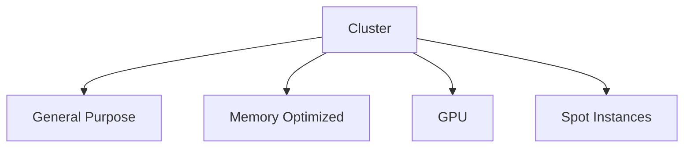

# 06 - Node Groups

The Cluster Autoscaler does not provision individual Worker Nodes directly — it manages **Node Groups**. A Node Group is a collection of Worker Nodes that share the same configuration: virtual machine type, CPU and memory capacity, labels, taints, and scaling limits.

When additional infrastructure is required, the Cluster Autoscaler increases the size of a Node Group rather than creating arbitrary Worker Nodes.

---

## Why Node Groups?

Not every workload has the same infrastructure requirements:

```
Web API         →  General Purpose Nodes
Machine Learning  →  GPU Nodes
Database        →  Memory Optimized Nodes
Batch Processing  →  Spot Instances
```

Node Groups allow Kubernetes to provision the appropriate infrastructure for each workload type.

---

## High-Level Architecture

A Kubernetes cluster can contain multiple Node Groups, each scaling independently:



The Cluster Autoscaler decides which group should grow according to the scheduling requirements of Pending Pods.

---

## Multiple Node Groups

| Node Group | Purpose |
|---|---|
| General Purpose | Standard applications |
| Memory Optimized | Databases and caches |
| Compute Optimized | CPU-intensive workloads |
| GPU | AI and machine learning |
| Spot | Cost-optimized workloads |

---

## Selecting the Correct Node Group

A Pod requiring a GPU with `nodeSelector: accelerator: gpu` cannot be placed by the Scheduler. The Cluster Autoscaler evaluates all Node Groups:

```
General Purpose  ✗
Memory Optimized ✗
GPU              ✓  →  Expand this group
```

Only after the new Worker Node joins the cluster can the Scheduler place the Pod.

---

## Node Labels

Node Groups assign labels to every Worker Node:

```yaml
labels:
  accelerator: gpu
```

Pods use these labels during scheduling:

```yaml
nodeSelector:
  accelerator: gpu
```

Labels allow Kubernetes to match workloads with the appropriate infrastructure.

---

## Taints and Tolerations

Some Node Groups should accept only specific workloads:

```yaml
taints:
  - key: gpu
    value: "true"
    effect: NoSchedule
```

Only Pods defining the matching toleration may be scheduled onto these nodes:

```yaml
tolerations:
  - key: gpu
    operator: Equal
    value: "true"
    effect: NoSchedule
```

This prevents expensive infrastructure from hosting unrelated applications.

---

## Independent Scaling

Each Node Group maintains its own size independently. A GPU Job arriving on a cluster with a 0-node GPU group scales only that group — the General Purpose and Memory Optimized groups remain unchanged.

---

## Scaling Limits

Each Node Group defines minimum and maximum sizes:

```
Minimum: 0 Nodes
Maximum: 20 Nodes
```

The Cluster Autoscaler never exceeds these boundaries, protecting against uncontrolled infrastructure growth.

---

## Cloud Provider Implementations

| Cloud Provider | Node Group Implementation |
|---|---|
| Amazon EKS | Managed Node Groups / Auto Scaling Groups |
| Azure AKS | Virtual Machine Scale Sets |
| Google GKE | Managed Instance Groups |
| OpenShift | MachineSets |
| Oracle OKE | Node Pools |

The Cluster Autoscaler abstracts these provider-specific implementations behind a common Kubernetes interface.

---

## Best Practices

**Separate infrastructure by purpose** — Create distinct Node Groups for applications, machine learning, databases, and batch workloads. This improves scheduling efficiency and reduces costs.

**Use Scale From Zero** — Expensive Node Groups (GPU, high-memory) should start with `minimum: 0`. Infrastructure is created only when required.

**Keep Node Groups consistent** — Worker Nodes within the same group should have identical hardware characteristics. Mixed instance types complicate scheduling decisions and reduce predictability.

**Apply labels that describe hardware, not applications** — Labels like `accelerator=gpu` or `workload=general` keep scheduling policies reusable across multiple workloads.

---

> [!tip]
> Create separate Node Groups for workloads with different hardware requirements.

> [!tip]
> Use labels and taints to ensure Pods are scheduled onto the correct infrastructure.

> [!tip]
> Configure sensible minimum and maximum sizes for every Node Group.

> [!warning]
> Avoid placing unrelated workloads in specialized Node Groups such as GPU or high-memory pools — this leads to poor utilization and unnecessary costs.

> [!note]
> The Cluster Autoscaler scales Node Groups rather than individual Worker Nodes. Every scale-up or scale-down operation affects a specific node pool.

---

## Key Takeaways

- Node Groups are the fundamental scaling unit of the Cluster Autoscaler
- Each Node Group contains Worker Nodes with identical characteristics
- Multiple Node Groups allow Kubernetes to support heterogeneous infrastructure
- Labels, taints, and scheduling constraints determine which Node Group should host a workload
- Scale From Zero is configured at the Node Group level
- Well-designed Node Groups improve scheduling efficiency, scalability, and infrastructure cost optimization
