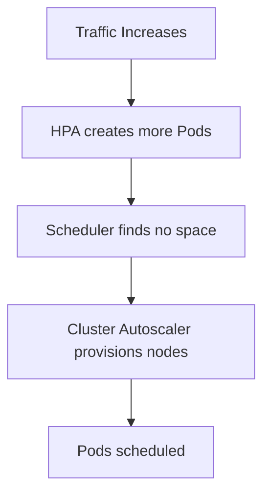

# 09 - Cluster Autoscaler Best Practices

When properly configured, the Cluster Autoscaler provides automatic infrastructure elasticity while minimizing operational costs. However, poorly designed node pools, inaccurate resource requests, or unrealistic scaling expectations can significantly reduce its effectiveness.

---

## Define Realistic Resource Requests

The Cluster Autoscaler makes decisions based on **resource requests**, not actual resource consumption. A Pod requesting `cpu: 4` but consuming `500m` causes the Scheduler to unnecessarily reserve 4 cores, potentially triggering new node provisioning. Overestimated requests result in unnecessary Worker Nodes, increased costs, and poor cluster utilization.

---

## Organize Workloads into Node Groups

Avoid placing every workload on a single Node Group. Separate infrastructure according to workload requirements:

```
General Purpose   →  Web Applications
Memory Optimized  →  Databases
GPU               →  Machine Learning
Spot              →  Batch Processing
```

Specialized Node Groups improve scheduling efficiency while reducing infrastructure costs.

---

## Configure Sensible Scaling Limits

Every Node Group should define appropriate minimum and maximum sizes. Minimum sizes guarantee baseline capacity; maximum sizes prevent uncontrolled infrastructure growth. Limits should reflect both workload requirements and cloud provider quotas.

---

## Use Scale From Zero Selectively

Scale From Zero is an excellent cost optimization feature, but not appropriate for every workload.

**Good candidates:** GPU workloads, CI/CD runners, batch processing, development environments.

**Poor candidates:** Latency-sensitive APIs, interactive applications, services requiring immediate startup.

Always balance cost savings against infrastructure startup time.

---

## Design Multiple Availability Zones

Production Node Groups should span multiple Availability Zones whenever possible. This improves resilience and reduces the impact of infrastructure failures in a single zone.

Two common patterns:

- **One node group per AZ** — required for workloads with zonal volumes (e.g. EBS), since a Pod's volume pins it to a specific zone. Combine with the `--balance-similar-node-groups` flag so the Cluster Autoscaler keeps the per-zone groups at similar sizes.
- **One multi-AZ node group** — simpler, appropriate for stateless workloads without zonal constraints.

---

## Keep Node Groups Homogeneous

Every Worker Node within the same Node Group should share identical characteristics: CPU architecture, memory size, storage configuration, and operating system. Mixed hardware complicates scheduling decisions and reduces predictability. If different hardware profiles are required, create separate Node Groups.

---

## Monitor Unschedulable Pods

Pending Pods are the primary trigger for Scale-Up. Monitor proactively:

```bash
kubectl get pods --field-selector=status.phase=Pending
kubectl describe pod <pod-name>
```

Focus on Pending Pods, Unschedulable events, scheduling failures, and node utilization. Early detection of scheduling issues prevents unnecessary application downtime.

---

## Review Cloud Provider Quotas

The Cluster Autoscaler depends entirely on the cloud provider's ability to provision infrastructure. Virtual machine quotas, CPU quotas, and regional capacity limits can all cause scale-up to fail. Monitor these limits regularly — otherwise Scale-Up requests may silently fail even though the Cluster Autoscaler is functioning correctly.

---

## Combine with the HPA



The HPA scales applications. The Cluster Autoscaler provides the infrastructure required to run those applications.

---

## Configure Pod Disruption Budgets

Scale-Down requires Pods to be relocated safely. Applications should define PDBs to ensure infrastructure optimization does not compromise availability:

```yaml
minAvailable: 2
```

---

## Keep Scheduling Policies Simple

Complex combinations of Node Affinity, Pod Affinity, Anti-Affinity, Taints, Tolerations, and Topology Constraints make autoscaling behavior more difficult to predict. Whenever possible, scheduling policies should remain simple and well documented.

---

## Test Scaling Regularly

Autoscaling should not be tested only during production incidents:

1. Deploy a workload that exceeds cluster capacity
2. Verify Pending Pods appear
3. Confirm Scale-Up completes
4. Verify Pods are scheduled
5. Reduce workload
6. Confirm Scale-Down occurs

Routine testing increases confidence in the autoscaling configuration.

---

## Production Checklist

Before deploying the Cluster Autoscaler in production, verify:

- [ ] Node Groups are clearly defined
- [ ] Resource requests are realistic
- [ ] Scale From Zero is configured where appropriate
- [ ] Cloud provider quotas are sufficient
- [ ] Pod Disruption Budgets are configured
- [ ] Monitoring dashboards are available
- [ ] Multiple Availability Zones are used
- [ ] Scale-Up and Scale-Down have been tested
- [ ] Infrastructure permissions allow automatic node creation and deletion

---

## Best Practices Summary

| Recommendation | Reason |
|---|---|
| Define realistic resource requests | Improve scheduling accuracy |
| Separate workloads into Node Groups | Optimize infrastructure utilization |
| Configure min and max node counts | Prevent over- and under-scaling |
| Use Scale From Zero selectively | Reduce costs without impacting critical workloads |
| Keep Node Groups homogeneous | Simplify scheduling decisions |
| Monitor Pending Pods | Detect capacity shortages early |
| Review cloud quotas regularly | Prevent failed Scale-Up operations |
| Test autoscaling periodically | Validate production readiness |

---

## Key Takeaways

- Accurate resource requests are essential for effective autoscaling
- Well-designed Node Groups improve both scheduling efficiency and infrastructure utilization
- Scale From Zero is a powerful optimization technique but introduces startup latency
- Monitoring Pending Pods and cloud quotas helps identify infrastructure bottlenecks
- The Cluster Autoscaler works best when combined with the Horizontal Pod Autoscaler
- Regular testing and simple scheduling policies improve the reliability of production Kubernetes clusters
