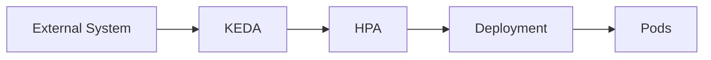

# 01 - KEDA Overview

**Kubernetes Event-Driven Autoscaling (KEDA)** extends Kubernetes autoscaling beyond CPU and memory metrics. While the HPA primarily reacts to resource utilization, KEDA allows workloads to scale according to **external events** — messages in a queue, Kafka consumer lag, database connections, HTTP requests, Prometheus metrics, or cloud messaging services.

---

## Why Was KEDA Created?

The HPA works well for applications whose workload correlates with CPU or memory. However, many modern cloud-native applications spend most of their time waiting for external events.

Consider a message consumer with a RabbitMQ queue containing 100,000 messages. CPU utilization may still be very low because only one Pod is currently processing. The HPA sees `15% CPU` and decides no scaling is required — meanwhile, message processing falls behind.

KEDA solves this by scaling according to **queue length** rather than CPU utilization.

---

## Event-Driven Scaling

```
External Event → KEDA → HPA → Pods
```

Examples of events: new messages arriving, increasing Kafka lag, scheduled execution times, cloud service metrics, custom monitoring data.

---

## What Does KEDA Scale?

KEDA scales the same workloads as the HPA (Deployments, StatefulSets, Jobs via ScaledJob). The difference lies in **how scaling decisions are made** — instead of CPU, KEDA evaluates external queue depth, consumer lag, or any other configured metric.

---

## How KEDA Works

KEDA continuously monitors external systems. When a trigger reaches its configured threshold, KEDA exposes the corresponding metric to Kubernetes. The HPA then performs the actual scaling:



> [!note]
> KEDA does **not** replace the Horizontal Pod Autoscaler — it extends its capabilities by providing external metrics that the HPA could not natively consume.

---

## Example: RabbitMQ Queue

Queue empty → 0 Pods. Producer sends 5,000 messages:

```
Queue: 5,000 messages  →  KEDA  →  HPA  →  20 Pods
```

Queue becomes empty:

```
Queue: 0 messages  →  0 Pods
```

Unlike the standard HPA, KEDA supports **scaling all the way to zero**.

---

## Typical Event Sources

| Event Source | Example Metric |
|---|---|
| RabbitMQ | Queue length |
| Kafka | Consumer lag |
| Redis | List length |
| Prometheus | Custom metrics |
| Azure Service Bus | Active messages |
| AWS SQS | Queue depth |
| PostgreSQL | Query count |
| Cron | Scheduled execution |
| HTTP (via the KEDA HTTP Add-on) | Incoming request rate |

Every event source is implemented as a **Scaler**.

---

## Why Not Use the HPA Alone?

A Kafka consumer sitting idle has very low CPU — the HPA sees no reason to scale even if consumer lag reaches 100,000 messages. KEDA monitors Kafka lag directly and immediately increases the number of consumers before CPU even begins to rise.

---

## Scale to Zero

One of KEDA's most valuable features:

```
Queue: 0 messages  →  Pods: 0  (no cost)
Queue: 100 messages  →  Pods scale up immediately
```

The standard HPA requires `minReplicas: 1`. KEDA supports `minReplicas: 0`, significantly reducing infrastructure costs for event-driven applications during idle periods.

---

## Relationship with the HPA

```
External Metrics → KEDA → Creates/manages HPA → HPA scales Pods
```

From Kubernetes' perspective, scaling between 1 and N replicas is still performed by the HPA — KEDA provides the metrics required to make better scaling decisions. The one exception is the 0 ↔ 1 transition: since the HPA cannot scale below one replica, the KEDA Operator performs it directly.

---

## Typical Use Cases

KEDA is particularly well suited for: message consumers, event processors, serverless applications, scheduled jobs, background workers, asynchronous APIs, and cloud messaging services. These workloads often have little relationship between CPU usage and actual demand.

---

## Key Takeaways

- KEDA extends Kubernetes autoscaling beyond CPU and memory metrics
- It enables applications to scale according to external events
- KEDA integrates with the HPA rather than replacing it
- Scale to Zero is one of its most valuable capabilities — Pods can be reduced to 0 during idle periods
- KEDA is ideal for message-driven and event-driven workloads
