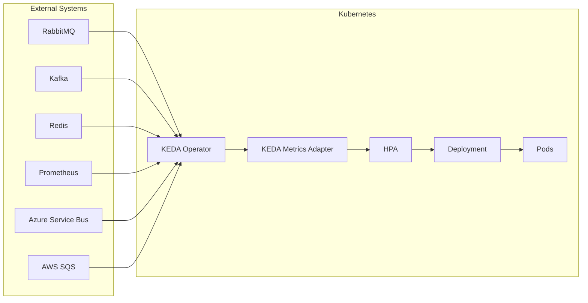
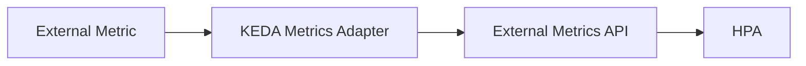
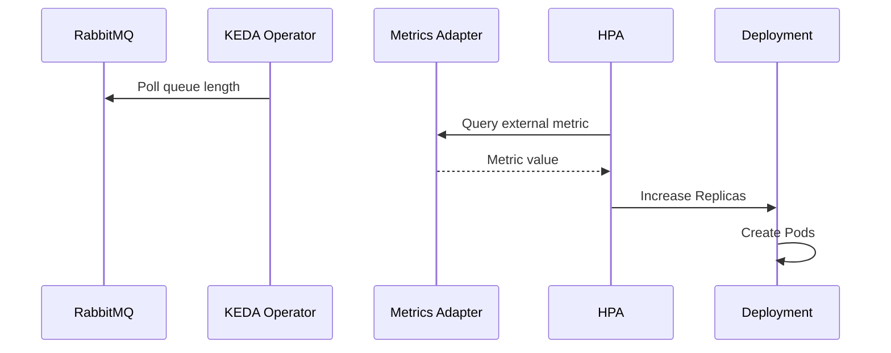

# 02 - KEDA Architecture

KEDA is implemented as a Kubernetes extension that continuously monitors external systems and translates business events into metrics that Kubernetes can understand. Unlike the HPA, which obtains metrics from the Metrics Server, KEDA introduces its own components responsible for collecting external events and exposing them to Kubernetes. Its architecture is intentionally modular, allowing support for dozens of different event sources without modifying Kubernetes itself.

---

## High-Level Architecture



KEDA sits between external event sources and the Horizontal Pod Autoscaler.

---

## Main Components

| Component | Responsibility |
|---|---|
| KEDA Operator | Monitors ScaledObjects and external systems; scales workloads between 0 and 1 |
| Metrics Adapter | Exposes external metrics to Kubernetes |
| Admission Webhooks | Validate KEDA resources and prevent conflicting configurations (KEDA 2.10+) |
| Horizontal Pod Autoscaler | Performs scaling between 1 and N |
| Target Workload | Deployment, StatefulSet, or Job |

---

## KEDA Operator

The **Operator** is the core of KEDA. It continuously watches Kubernetes resources (`ScaledObjects`, `ScaledJobs`, `TriggerAuthentication`) and communicates with external systems to determine whether scaling is required. It is also responsible for creating and maintaining the Horizontal Pod Autoscaler for each configured workload.

---

## Metrics Adapter

Kubernetes expects autoscaling metrics to be available through its metrics APIs. The KEDA Metrics Adapter bridges this gap:



From the HPA's perspective, KEDA behaves like any other metrics provider — the HPA **queries** the External Metrics API on its own control-loop cycle; KEDA never pushes values into it.

---

## Admission Webhooks

Since KEDA 2.10, a third component validates KEDA resources at creation time. It rejects misconfigurations before they reach the cluster — for example, two ScaledObjects targeting the same workload, which would create conflicting HPAs.

---

## Horizontal Pod Autoscaler

KEDA does not scale workloads directly:

```
KEDA creates/manages HPA → HPA updates replicas → Deployment creates Pods
```

This design allows KEDA to integrate naturally with existing Kubernetes autoscaling mechanisms and maintain compatibility with Kubernetes APIs.

---

## Complete Workflow



The HPA performs the scaling. KEDA supplies better metrics.

---

## The Role of Scalers

A **Scaler** is a component responsible for communicating with a specific external system. Every supported event source is implemented as an independent Scaler:

| Scaler | External System |
|---|---|
| RabbitMQ Scaler | RabbitMQ |
| Kafka Scaler | Apache Kafka |
| Redis Scaler | Redis |
| Cron Scaler | Scheduled Events |
| Prometheus Scaler | Prometheus |
| Azure Service Bus Scaler | Azure Service Bus |
| AWS SQS Scaler | Amazon SQS |

This modular design makes KEDA highly extensible.

---

## Relationship with the Metrics Server

| Metrics Server | KEDA |
|---|---|
| CPU and memory metrics | External and business events |
| Resource Metrics API | External Metrics API |
| Used by HPA | Used by HPA |

Both may exist in the same cluster simultaneously. Many production environments run Metrics Server, Prometheus, and KEDA together.

---

## Why Doesn't KEDA Scale Pods Directly?

Delegating to the HPA provides native Kubernetes integration, reuse of existing scaling logic, consistent behavior, and compatibility with Kubernetes APIs. KEDA extends Kubernetes rather than replacing its built-in autoscaling mechanisms.

---

## Design Principles

- Extend Kubernetes rather than replace it
- Reuse the Horizontal Pod Autoscaler
- Keep external integrations modular through independent Scalers
- Expose metrics using standard Kubernetes APIs

---

## Best Practices

> [!tip]
> Deploy KEDA as a shared platform component rather than bundling it with individual applications.

> [!tip]
> Monitor the KEDA Operator and Metrics Adapter just as you would any other control-plane component.

> [!tip]
> Keep external event sources highly available — KEDA depends on them to make scaling decisions.

> [!warning]
> KEDA cannot scale workloads if it cannot communicate with the configured external system or expose metrics to the HPA.

> [!note]
> KEDA performs event detection. The Horizontal Pod Autoscaler remains responsible for modifying the number of replicas.

---

## Key Takeaways

- KEDA extends Kubernetes by introducing event-driven autoscaling
- The KEDA Operator monitors external systems and Kubernetes custom resources
- The Metrics Adapter exposes external metrics through Kubernetes APIs
- The Horizontal Pod Autoscaler performs the actual scaling operations
- Scalers provide modular integrations with dozens of external systems
- KEDA's architecture builds upon existing Kubernetes autoscaling rather than replacing it
