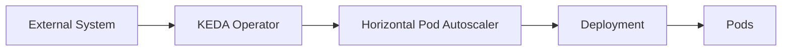

# 03 - How KEDA Works

KEDA follows a clear, repeatable workflow to scale Kubernetes workloads based on external events.

Understanding this workflow helps explain why KEDA behaves differently from a standard Horizontal Pod Autoscaler.

---

# Overview of the Workflow

At a high level, KEDA works as follows:



Each component has a specific responsibility.

---

# Step 1 — Polling the External System

KEDA does not receive push notifications from external systems.

Instead, the KEDA Operator **polls** the configured external source at a fixed interval.

```text
Every pollingInterval Seconds

↓

Read Metric From External System
```

This interval is defined in the ScaledObject:

```yaml
pollingInterval: 30
```

By default, KEDA checks every 30 seconds.

---

# Step 2 — Evaluating the Threshold

After reading the metric, KEDA compares the value against the configured threshold.

Example: a RabbitMQ queue with threshold 50.

```text
Queue Depth: 75

Threshold: 50

↓

Scale Up
```

```text
Queue Depth: 10

Threshold: 50

↓

Scale Down (or maintain)
```

The threshold is defined inside the trigger configuration.

---

# Step 3 — Updating the HPA

KEDA does not directly change the number of Pods.

Instead, it updates the **Horizontal Pod Autoscaler** with the new desired metric value.

```text
KEDA Operator

↓

Updates HPA Target Metric

↓

HPA Recalculates Desired Replicas
```

The HPA then performs the actual scaling operation on the Deployment.

---

# Step 4 — Scaling the Workload

The HPA adjusts the number of Pods in the target Deployment.

```text
HPA

↓

Updates Deployment replicas field

↓

Kubernetes schedules new Pods (or terminates existing ones)
```

KEDA respects the `minReplicaCount` and `maxReplicaCount` boundaries defined in the ScaledObject.

---

# Scale to Zero

One of KEDA's most important capabilities is scaling a workload to zero replicas.

A standard HPA cannot scale below one replica.

With KEDA:

```text
Queue Empty

↓

minReplicaCount: 0

↓

Deployment scaled to 0 Pods
```

When a new event arrives, KEDA scales the workload back up before messages are processed.

---

# Scale from Zero

When a workload is at zero replicas and a new event is detected:

```text
New Message in Queue

↓

KEDA detects metric above threshold

↓

Scales Deployment from 0 → 1 (or more)
```

> [!note]
> There is a brief delay when scaling from zero, as Kubernetes must schedule and start new Pods before they can process work.

---

# Cooldown Period

After a workload scales down, KEDA does not immediately return to zero if the queue empties momentarily.

The `cooldownPeriod` adds a waiting period:

```text
Queue Empty

↓

Wait cooldownPeriod Seconds

↓

Scale Down
```

Example:

```yaml
cooldownPeriod: 300
```

This prevents unnecessary scaling caused by temporary inactivity.

---

# Integration with Cluster Autoscaler

KEDA and the Cluster Autoscaler work together when demand exceeds available node capacity.

```text
KEDA scales Deployment up

↓

New Pods enter Pending state (no available nodes)

↓

Cluster Autoscaler detects Pending Pods

↓

Provisions new nodes

↓

Pods are scheduled and run
```

> [!tip]
> KEDA handles Pod-level scaling. The Cluster Autoscaler handles node-level scaling. Both can operate together without conflict.

---

# Metrics Adapter Role

The KEDA Metrics Adapter exposes external metrics to the Kubernetes External Metrics API.

```text
HPA queries Kubernetes External Metrics API

↓

KEDA Metrics Adapter provides value

↓

HPA uses value in replica calculation
```

This is what enables the HPA to make decisions based on queue depth, Kafka lag, or any other external metric — not just CPU and memory.

---

# Key Takeaways

- KEDA polls external systems at a configurable interval — it does not receive push notifications.
- When a threshold is exceeded, KEDA updates the HPA with the new metric value.
- The HPA performs the actual replica calculation and updates the Deployment.
- KEDA supports scale to zero, which standard HPA does not.
- The cooldown period prevents rapid scale-down after temporary inactivity.
- KEDA integrates naturally with the Cluster Autoscaler for node-level scaling.
