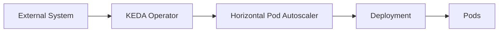

# 03 - How KEDA Works

KEDA follows a clear, repeatable workflow to scale Kubernetes workloads based on external events.

Understanding this workflow helps explain why KEDA behaves differently from a standard Horizontal Pod Autoscaler.

---

## Overview of the Workflow

At a high level, KEDA works as follows:



Each component has a specific responsibility.

---

## Step 1 — Polling the External System

KEDA does not receive push notifications from external systems.

Instead, the KEDA Operator **polls** the configured external source at a fixed interval.

```text
Every pollingInterval Seconds
↓
Read Metric From External System
```

This interval is defined in the ScaledObject:

```yaml
pollingInterval: 30
```

By default, KEDA checks every 30 seconds.

---

## Step 2 — Evaluating the Metric

After reading the metric, KEDA exposes it to the HPA. The configured threshold is **not** an on/off switch — it is a **target value per replica**, used in the standard HPA calculation.

Example: a RabbitMQ trigger with `queueLength: 50` (target of 50 messages per Pod):

```text
Queue Depth: 300  →  desired replicas = ceil(300 / 50) = 6
Queue Depth: 75   →  desired replicas = ceil(75 / 50)  = 2
Queue Depth: 10   →  desired replicas = ceil(10 / 50)  = 1
```

A separate parameter — `activationThreshold`, default `0` — controls only the **0 → 1** transition: while the workload is at zero replicas, it is activated as soon as the metric exceeds this value.

The threshold is defined inside the trigger configuration.

---

## Step 3 — Serving the Metric to the HPA

KEDA does not directly change the number of Pods, and it does not push values into the HPA either.

Instead, the **KEDA Metrics Adapter** serves the metric through the Kubernetes External Metrics API, and the HPA **queries** it on its own control-loop cycle (every 15 seconds by default):

```text
HPA queries External Metrics API
↓
KEDA Metrics Adapter returns current value
↓
HPA Recalculates Desired Replicas
```

The HPA then performs the actual scaling operation on the Deployment.

---

## Step 4 — Scaling the Workload

The HPA adjusts the number of Pods in the target Deployment.

```text
HPA
↓
Updates Deployment replicas field
↓
Kubernetes schedules new Pods (or terminates existing ones)
```

KEDA respects the `minReplicaCount` and `maxReplicaCount` boundaries defined in the ScaledObject.

---

## Scale to Zero

One of KEDA's most important capabilities is scaling a workload to zero replicas.

A standard HPA cannot scale below one replica — which is why this final transition is performed **directly by the KEDA Operator**, not by the HPA. The Operator handles 0 ↔ 1; the HPA handles 1 ↔ N.

With KEDA:

```text
Queue Empty
↓
minReplicaCount: 0
↓
Deployment scaled to 0 Pods
```

When a new event arrives, KEDA scales the workload back up before messages are processed.

---

## Scale from Zero

When a workload is at zero replicas and a new event is detected:

```text
New Message in Queue
↓
KEDA Operator detects metric above activationThreshold
↓
Operator scales Deployment 0 → 1
↓
HPA takes over and scales 1 → N if needed
```

> [!note]
> There is a brief delay when scaling from zero, as Kubernetes must schedule and start new Pods before they can process work.

---

## Cooldown Period

The `cooldownPeriod` applies **only to the final scale-to-zero step** (1 → 0). When all triggers become inactive, KEDA waits before deactivating the workload:

```text
Queue Empty
↓
Wait cooldownPeriod Seconds
↓
Scale 1 → 0
```

Example:

```yaml
cooldownPeriod: 300
```

This prevents unnecessary deactivation caused by temporary inactivity.

> [!note]
> Intermediate scale-down (N → 1) is **not** governed by the cooldownPeriod — it follows the stabilization window and policies of the HPA that KEDA generates, configurable through `advanced.horizontalPodAutoscalerConfig` in the ScaledObject.

---

## Integration with Cluster Autoscaler

KEDA and the Cluster Autoscaler work together when demand exceeds available node capacity.

```text
KEDA scales Deployment up
↓
New Pods enter Pending state (no available nodes)
↓
Cluster Autoscaler detects Pending Pods
↓
Provisions new nodes
↓
Pods are scheduled and run
```

> [!tip]
> KEDA handles Pod-level scaling. The Cluster Autoscaler handles node-level scaling. Both can operate together without conflict.

---

## Metrics Adapter Role

The KEDA Metrics Adapter exposes external metrics to the Kubernetes External Metrics API.

```text
HPA queries Kubernetes External Metrics API
↓
KEDA Metrics Adapter provides value
↓
HPA uses value in replica calculation
```

This is what enables the HPA to make decisions based on queue depth, Kafka lag, or any other external metric — not just CPU and memory.

---

## Key Takeaways

- KEDA polls external systems at a configurable interval — it does not receive push notifications.
- KEDA serves external metrics; the HPA queries them and uses the threshold as a **target value per replica**.
- The HPA performs the replica calculation between 1 and N; the KEDA Operator performs the 0 ↔ 1 transitions.
- KEDA supports scale to zero, which standard HPA does not.
- The cooldown period delays only the final 1 → 0 step; intermediate scale-down follows the HPA's stabilization rules.
- KEDA integrates naturally with the Cluster Autoscaler for node-level scaling.
