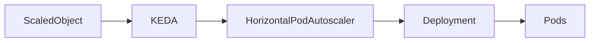
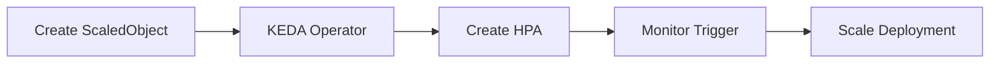

# 04 - ScaledObject

The **ScaledObject** is the primary resource used by KEDA.

It tells KEDA:

- which workload should be scaled;
- which external event source should be monitored;
- when scaling should occur;
- how many replicas are allowed.

Every event-driven application managed by KEDA typically begins with a ScaledObject.

Without a ScaledObject, KEDA has no knowledge of the workload or the external system that should trigger scaling.

---

## What Is a ScaledObject?

A ScaledObject is a Kubernetes **Custom Resource Definition (CRD)**.

Unlike standard Kubernetes resources such as Deployments or Services, it is installed when KEDA is deployed.

Conceptually:

```text
ScaledObject

↓

Target Workload

↓

External Trigger

↓

Scaling Rules
```

The ScaledObject connects an application with one or more external event sources.

---

## High-Level Architecture



The ScaledObject defines the desired behavior.

KEDA converts that definition into a Horizontal Pod Autoscaler.

---

## Basic Structure

A ScaledObject contains four main sections.

```yaml
apiVersion: keda.sh/v1alpha1

kind: ScaledObject

metadata:

  name: worker-scaler

spec:

  scaleTargetRef:

  pollingInterval:

  cooldownPeriod:

  triggers:
```

Although many optional fields exist, these are the most important.

---

## scaleTargetRef

The **scaleTargetRef** identifies the Kubernetes workload that KEDA should scale.

Example:

```yaml
scaleTargetRef:

  name: order-worker
```

Conceptually:

```text
ScaledObject

↓

Deployment

↓

order-worker
```

Whenever KEDA decides to scale, this Deployment is updated.

---

## pollingInterval

KEDA periodically checks the configured event source.

Example:

```yaml
pollingInterval: 30
```

Meaning:

```text
Every

30 Seconds

↓

Read External Metric
```

Short polling intervals produce faster scaling but increase communication with external systems.

---

## cooldownPeriod

When all triggers become inactive, KEDA waits before scaling the workload **to zero**.

Example:

```yaml
cooldownPeriod: 300
```

Meaning:

```text
Queue Empty

↓

Wait

5 Minutes

↓

Scale 1 → 0
```

> [!note]
> The `cooldownPeriod` applies **only to the final scale-to-zero step** (1 → 0), performed by the KEDA Operator. Scale-down between N and 1 is handled by the generated HPA and follows its stabilization window, configurable via `advanced.horizontalPodAutoscalerConfig`.

Cooldown periods reduce unnecessary deactivation caused by temporary inactivity.

---

## minReplicaCount

KEDA allows workloads to start from zero replicas.

Example:

```yaml
minReplicaCount: 0
```

Current state:

```text
Queue

Empty

↓

Pods

0
```

This is one of KEDA's most important advantages over a standard HPA.

---

## maxReplicaCount

KEDA also limits maximum scaling.

Example:

```yaml
maxReplicaCount: 50
```

Suppose workload demand increases dramatically.

```
Desired Replicas

120
```

Final result:

```
50 Replicas
```

Maximum limits protect the cluster from excessive scaling.

---

## Advanced Fields

Three optional fields are worth knowing in production:

```yaml
spec:

  fallback:
    failureThreshold: 3
    replicas: 5

  idleReplicaCount: 0

  advanced:
    horizontalPodAutoscalerConfig:
      behavior:
        scaleDown:
          stabilizationWindowSeconds: 300
```

- **`fallback`** — if KEDA fails to read the external system `failureThreshold` consecutive times, the workload is set to a known-safe replica count instead of being left frozen at its last value.
- **`idleReplicaCount`** — replica count while every trigger is inactive (currently only `0` is supported).
- **`advanced.horizontalPodAutoscalerConfig`** — full control over the HPA that KEDA generates, using the same `behavior` syntax (stabilization windows, scaling policies) as a native HPA.

---

## Triggers

Triggers define **what KEDA should monitor**.

Example:

```yaml
triggers:

- type: rabbitmq
```

Common trigger types include:

- RabbitMQ
- Kafka
- Redis
- Prometheus
- Cron
- PostgreSQL
- Azure Service Bus
- AWS SQS

Every ScaledObject contains at least one trigger.

---

## Complete Example

The following example scales a Deployment according to the number of RabbitMQ messages.

```yaml
apiVersion: keda.sh/v1alpha1

kind: ScaledObject

metadata:

  name: order-worker

spec:

  scaleTargetRef:

    name: order-worker

  pollingInterval: 30

  cooldownPeriod: 300

  minReplicaCount: 0

  maxReplicaCount: 20

  triggers:

  - type: rabbitmq

    metadata:

      queueName: orders

      queueLength: "50"
```

This configuration expresses:

- monitor the `orders` queue;
- check every 30 seconds;
- scale from zero;
- allow up to 20 replicas;
- target approximately **50 messages per replica** — e.g. 600 messages → `ceil(600 / 50)` = 12 Pods.

---

## Lifecycle

The lifecycle of a ScaledObject is straightforward.



The Operator continuously reconciles the ScaledObject with the actual cluster state.

---

## Multiple Triggers

A single ScaledObject may monitor multiple event sources.

Example:

```yaml
triggers:

- type: rabbitmq

- type: prometheus

- type: cron
```

Conceptually:

```text
RabbitMQ

↓

Prometheus

↓

Cron

↓

KEDA

↓

Deployment
```

This allows workloads to react to several business conditions simultaneously.

---

## Updating a ScaledObject

Scaling behavior can be modified without changing the application.

Typical workflow:

```text
Edit ScaledObject

↓

Apply Changes

↓

KEDA Detects Update

↓

Scaling Behavior Changes
```

No application restart is required.

---

## Relationship with the HPA

A common misconception is that the ScaledObject replaces the Horizontal Pod Autoscaler.

In reality:

```text
ScaledObject

↓

KEDA

↓

Creates HPA

↓

HPA Controls Replicas
```

The HPA remains the Kubernetes component responsible for changing the number of Pods.

---

## Best Practices

> [!tip]
> Keep each ScaledObject focused on a single application or workload. This simplifies troubleshooting and operational management.

---

> [!tip]
> Configure realistic minimum and maximum replica counts based on expected workload characteristics.

---

> [!tip]
> Choose polling and cooldown values that balance responsiveness with stability.

---

> [!warning]
> Excessively low polling intervals may place unnecessary load on external systems and increase scaling activity.

---

> [!note]
> A ScaledObject defines **what** should trigger scaling. The Horizontal Pod Autoscaler still performs the actual replica calculations.

---

## Key Takeaways

- The ScaledObject is KEDA's primary configuration resource.
- It links a Kubernetes workload with one or more external event sources.
- It defines polling intervals, cooldown periods, replica limits, and scaling triggers.
- KEDA automatically creates and manages the corresponding Horizontal Pod Autoscaler.
- Multiple triggers can be defined within a single ScaledObject.
- The ScaledObject is the foundation of every KEDA deployment.
