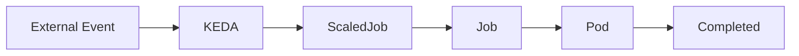
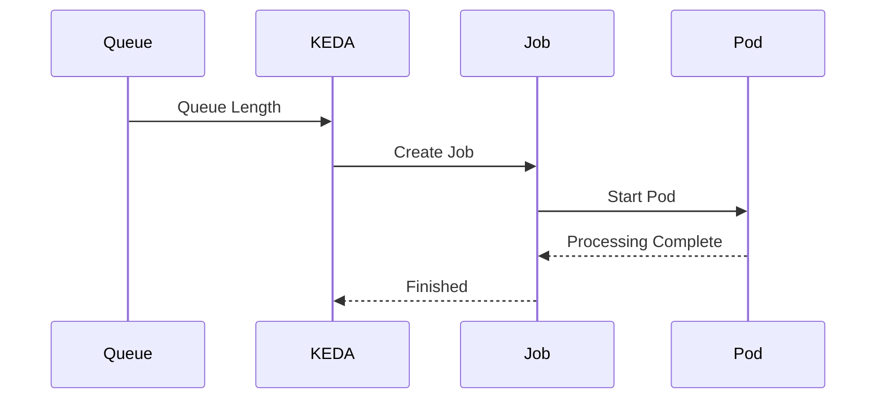

# 05 - ScaledJob

While the **ScaledObject** scales long-running workloads such as Deployments and StatefulSets, the **ScaledJob** is designed for a different purpose.

A ScaledJob creates **new Kubernetes Jobs** whenever external events occur.

This makes it ideal for workloads that:

- process a task;
- complete their work;
- terminate automatically.

Examples include:

- batch processing;
- image rendering;
- report generation;
- video transcoding;
- data import;
- asynchronous background tasks.

---

# Why Does KEDA Need ScaledJobs?

Consider a Deployment.

```text
Deployment

↓

Pods

↓

Run Forever
```

Even if the Pods are idle, they continue existing until Kubernetes scales them down.

Now consider a background task.

```
Receive Message

↓

Process File

↓

Exit
```

Keeping long-running Pods alive provides little benefit.

Instead, Kubernetes should create a Job, allow it to finish, and automatically remove it.

This is precisely the problem solved by ScaledJobs.

---

# Deployment vs Job

A Deployment is intended for continuously running applications.

```text
Deployment

↓

Replica Count

↓

Pods Always Running
```

A Job has a different lifecycle.

```text
Job

↓

Create Pod

↓

Complete Work

↓

Exit
```

ScaledJobs automate the creation of Jobs whenever external work becomes available.

---

# High-Level Architecture



Unlike a ScaledObject, which adjusts the number of replicas, a ScaledJob creates entirely new Kubernetes Jobs.

---

# Basic Structure

A ScaledJob is another Kubernetes Custom Resource.

Simplified example:

```yaml
apiVersion: keda.sh/v1alpha1

kind: ScaledJob

metadata:

  name: image-processing
```

Its structure resembles a ScaledObject but targets Jobs instead of Deployments.

---

# jobTargetRef

The **jobTargetRef** defines the Job template that KEDA will create.

Example:

```yaml
jobTargetRef:

  template:

    spec:

      containers:

      - name: worker
```

Conceptually:

```text
ScaledJob

↓

Job Template

↓

New Kubernetes Job
```

Every scaling event creates one or more Jobs using this template.

---

# Polling External Events

Like ScaledObjects, ScaledJobs periodically monitor external systems.

Example:

```yaml
pollingInterval: 30
```

Every 30 seconds:

```text
Read Queue

↓

Evaluate Trigger

↓

Create Jobs
```

---

# Example

Imagine a RabbitMQ queue.

```
Messages

500
```

Configuration:

```yaml
maxReplicaCount: 10
```

KEDA creates:

```text
10 Kubernetes Jobs
```

Each Job processes one or more messages independently.

When a Job finishes:

```text
Completed

↓

Removed
```

No long-running Pods remain.

---

# Complete Workflow



Each event creates new Jobs instead of increasing Deployment replicas.

---

# Parallel Processing

Suppose a queue contains:

```
1,000 Messages
```

KEDA may create multiple Jobs simultaneously.

```text
Queue

↓

Job 1

Job 2

Job 3

Job 4

↓

Parallel Processing
```

This allows background work to be completed much faster.

---

# Automatic Cleanup

Once a Job finishes:

```text
Running

↓

Completed

↓

Removed
```

No idle Pods remain in the cluster.

This differs significantly from Deployments, where Pods continue running until scaled down.

---

# Typical Use Cases

ScaledJobs are particularly useful for:

- Image processing
- Video transcoding
- File conversion
- PDF generation
- Data imports
- ETL pipelines
- Batch analytics
- Email processing
- Backup tasks

These workloads naturally execute as independent units of work.

---

# ScaledObject vs ScaledJob

Although both are KEDA resources, they solve different problems.

| ScaledObject | ScaledJob |
|--------------|-----------|
| Scales Deployments | Creates Jobs |
| Long-running applications | Batch processing |
| Pods remain running | Pods terminate after completion |
| Replica count changes | Job count changes |
| Ideal for APIs and workers | Ideal for one-time tasks |

Choosing the correct resource depends on the workload lifecycle.

---

# Advantages

## Native Batch Processing

Jobs are first-class Kubernetes resources.

KEDA simply automates their creation.

---

## Automatic Cleanup

Completed Jobs terminate naturally.

No idle workers consume cluster resources.

---

## Massive Parallelism

Large workloads can be processed using hundreds of independent Jobs.

---

## Cost Optimization

Infrastructure is used only while work exists.

Idle compute resources can be reclaimed immediately after processing completes.

---

# Best Practices

> [!tip]
> Use ScaledJobs for finite tasks that naturally complete, such as file processing, ETL pipelines, or batch imports.

---

> [!tip]
> Keep Job execution independent so that multiple Jobs can run safely in parallel.

---

> [!tip]
> Configure sensible limits on the maximum number of concurrent Jobs to prevent overwhelming downstream systems.

---

> [!warning]
> ScaledJobs are not intended for continuously running services. Long-lived applications should generally use Deployments with ScaledObjects instead.

---

> [!note]
> A ScaledJob creates Kubernetes Jobs rather than modifying the replica count of an existing Deployment.

---

# Key Takeaways

- ScaledJobs are designed for event-driven batch processing.
- Each scaling event creates one or more Kubernetes Jobs.
- Jobs execute independently and terminate automatically after completing their work.
- ScaledJobs are ideal for finite tasks rather than continuously running services.
- They complement ScaledObjects by extending KEDA's event-driven scaling model to Kubernetes Jobs.
- Choosing between ScaledObject and ScaledJob depends primarily on the lifecycle of the workload.
