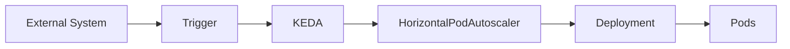
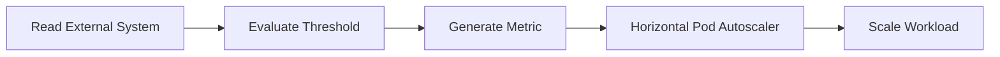

# 06 - KEDA Triggers

A **Trigger** is the mechanism that tells KEDA **when to scale a workload**.

Every ScaledObject or ScaledJob contains one or more triggers.

A trigger connects Kubernetes to an external system and continuously evaluates whether the workload should be scaled.

Without a trigger, KEDA has no information about external demand.

---

## What Is a Trigger?

Conceptually, a trigger answers one simple question:

> **Has something happened that requires more (or fewer) Pods?**

Examples include:

- a message arrives in RabbitMQ;
- Kafka consumer lag increases;
- Redis queue grows;
- a Prometheus query exceeds a threshold;
- a scheduled time is reached;
- an Azure Service Bus queue fills.

Whenever the trigger condition is met, KEDA begins the scaling process.

---

## High-Level Architecture



The trigger acts as the bridge between an external event source and Kubernetes.

---

## Trigger Lifecycle

Every trigger follows the same workflow.



Although each trigger communicates with a different external system, their behavior is remarkably consistent.

---

## Trigger Components

Every trigger contains three basic elements.

```yaml
triggers:
- type:
  metadata:
  authenticationRef:
```

These fields define:

- **what** to monitor;
- **how** to connect;
- **when** scaling should occur.

---

## Trigger Type

The **type** specifies which external system KEDA should monitor.

Example:

```yaml
type: rabbitmq
```

or

```yaml
type: kafka
```

or

```yaml
type: prometheus
```

Each trigger type corresponds to a built-in KEDA Scaler.

---

## Metadata

Metadata defines the trigger configuration.

Example:

```yaml
metadata:
  queueName: orders
  queueLength: "50"
```

This tells KEDA:

- which queue to monitor;
- which threshold should trigger scaling.

Different trigger types expose different metadata fields.

---

## Authentication

Many external systems require authentication.

Example:

```yaml
authenticationRef:
  name: rabbitmq-auth
```

Authentication is typically configured separately using a **TriggerAuthentication** resource.

This separation improves security and allows credentials to be reused across multiple ScaledObjects.

---

## Example Trigger

A simplified RabbitMQ trigger might look like this.

```yaml
triggers:
- type: rabbitmq
  metadata:
    queueName: orders
    queueLength: "50"
```

Conceptually:

```text
RabbitMQ
↓
Orders Queue
↓
50 Messages
↓
Scale
```

As the queue grows beyond 50 messages per Pod, KEDA increases the number of Pods.

---

## Multiple Triggers

A workload may monitor several event sources simultaneously.

Example:

```yaml
triggers:
- type: rabbitmq
- type: prometheus
- type: cron
```

Conceptually:

```text
RabbitMQ
↓
Prometheus
↓
Cron
↓
KEDA
↓
Deployment
```

This allows a single application to respond to multiple business events.

---

## Trigger Evaluation

Each trigger periodically evaluates its external system. The configured threshold is a **target value per replica** — the HPA uses it in the standard replica calculation:

```text
Queue: 25 messages,  threshold 50  →  ceil(25 / 50)  = 1 replica
Queue: 125 messages, threshold 50  →  ceil(125 / 50) = 3 replicas
Queue: 600 messages, threshold 50  →  ceil(600 / 50) = 12 replicas
```

A separate `activationThreshold` (default `0`) controls whether the workload is active at all: with zero replicas, the workload only starts once the metric exceeds it.

---

## Popular Trigger Categories

KEDA supports more than sixty trigger types.

They can be grouped into several categories.

| Category | Examples |
|-----------|----------|
| Message Queues | RabbitMQ, Kafka, AWS SQS, Azure Service Bus |
| Databases | PostgreSQL, MySQL, MongoDB |
| Monitoring | Prometheus, Grafana Mimir |
| Cloud Services | Azure, AWS, Google Cloud |
| Storage | Redis Lists, Redis Streams |
| Schedulers | Cron |
| Networking | HTTP (via the separate KEDA HTTP Add-on) |
| Custom | External Push Scalers |

This broad ecosystem is one of KEDA's greatest strengths.

---

## Polling Behavior

Triggers are evaluated at regular intervals.

Example:

```yaml
pollingInterval: 30
```

Every thirty seconds:

```text
Read Trigger
↓
Evaluate
↓
Update Metric
```

Polling intervals should balance responsiveness with the overhead imposed on external systems.

---

## Trigger Independence

Each trigger operates independently.

Suppose a ScaledObject defines:

```text
RabbitMQ
↓
Queue Length
--------------------
Prometheus
↓
HTTP Requests
```

Each trigger evaluates its own condition and becomes a **separate external metric** on the HPA that KEDA generates. The HPA then applies its standard multi-metric rule: the **largest** calculated replica count wins.

For scale to zero, the logic is inverted: a workload is only deactivated when **every** trigger is inactive — a single active trigger keeps it running.

---

## Why Triggers Matter

Traditional autoscaling answers:

> **How busy is the application?**

KEDA triggers answer:

> **How much work is waiting to be processed?**

This distinction is fundamental.

For many asynchronous systems, the amount of pending work is a much better indicator of scaling requirements than CPU utilization.

---

## Best Practices

> [!tip]
> Choose trigger types that directly represent business demand rather than indirect infrastructure metrics.

> [!tip]
> Keep trigger thresholds simple and validate them using production observations.

> [!tip]
> Separate authentication from trigger definitions by using TriggerAuthentication resources.

> [!warning]
> Very low trigger thresholds may cause unnecessary scaling events, while thresholds that are too high may delay workload processing.

> [!note]
> Every KEDA ScaledObject requires at least one trigger. Without a trigger, KEDA has no external event source to monitor.

---

## Key Takeaways

- Triggers define when KEDA should scale a workload.
- Every trigger connects Kubernetes to an external event source.
- Trigger definitions include the event source type, configuration metadata, and optional authentication.
- Multiple triggers can be attached to the same ScaledObject.
- KEDA supports more than sixty built-in trigger types covering messaging systems, databases, monitoring platforms, cloud services, and scheduled events.
- Choosing the correct trigger is one of the most important design decisions when building an event-driven autoscaling solution.
