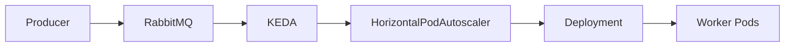

# 07 - RabbitMQ Trigger

The **RabbitMQ Trigger** is one of the most widely used KEDA scalers.

It automatically adjusts the number of application Pods according to the number of messages waiting in a RabbitMQ queue.

Rather than scaling based on CPU utilization, the RabbitMQ Trigger scales according to **pending work**.

This makes it ideal for asynchronous applications where messages are processed independently.

---

# Why Scale on Queue Length?

Consider a message processing application.

```text
Producer

↓

RabbitMQ Queue

↓

Worker Pods
```

Initially:

```text
Queue

0 Messages

↓

1 Worker
```

Later, thousands of new messages arrive.

```text
Queue

10,000 Messages

↓

Still

1 Worker
```

CPU utilization may still be relatively low because only one Pod is consuming messages.

The Horizontal Pod Autoscaler may therefore decide not to scale.

The RabbitMQ Trigger solves this problem by monitoring the queue directly.

---

# High-Level Architecture



KEDA periodically checks the queue length and exposes it as an external metric to the HPA.

---

# Queue Length

The RabbitMQ Trigger commonly uses **queue length** as its scaling metric.

Example:

```text
Queue

250 Messages
```

Threshold:

```text
50 Messages
```

Evaluation:

```text
250

>

50

↓

Scale Up
```

The larger the queue, the more workers Kubernetes creates.

---

# Basic Configuration

A simplified RabbitMQ trigger looks like this.

```yaml
triggers:

- type: rabbitmq

  metadata:

    queueName: orders

    queueLength: "50"
```

This configuration tells KEDA:

- monitor the `orders` queue;
- scale when more than **50 messages** are waiting.

---

# Scaling Example

Suppose the Deployment currently has:

```text
Pods

2
```

Current queue:

```text
Messages

600
```

Threshold:

```text
50 Messages
```

KEDA calculates that additional workers are required.

```text
Queue

600

↓

HPA

↓

12 Pods
```

Multiple Pods consume messages simultaneously, reducing the queue much faster.

---

# Scaling Down

As workers process messages:

```text
Queue

600

↓

200

↓

50

↓

0
```

KEDA continuously updates the external metric.

The HPA gradually reduces the number of replicas.

If:

```yaml
minReplicaCount: 0
```

the Deployment eventually reaches:

```text
Queue

Empty

↓

Pods

0
```

No compute resources remain allocated while the application is idle.

---

# Typical Use Cases

The RabbitMQ Trigger is commonly used for:

- Order processing
- Payment processing
- Email delivery
- Notification systems
- Image processing
- File conversion
- Background jobs
- Event-driven microservices

Any workload that consumes RabbitMQ messages can benefit from automatic scaling.

---

# Why Queue Length Works Better Than CPU

Imagine two worker Pods.

```text
CPU

15%
```

Meanwhile:

```text
Queue

25,000 Messages
```

CPU utilization alone does not accurately reflect the amount of pending work.

Queue length directly represents business demand.

This allows Kubernetes to react much earlier than CPU-based autoscaling.

---

# Best Practices

> [!tip]
> Choose queue length thresholds based on acceptable processing latency rather than arbitrary values.

---

> [!tip]
> Combine the RabbitMQ Trigger with `minReplicaCount: 0` for workloads that spend long periods idle.

---

> [!tip]
> Monitor both queue length and message processing time to validate scaling behavior in production.

---

> [!warning]
> Setting the queue threshold too low may cause frequent scaling events, while values that are too high may delay message processing.

---

> [!note]
> The RabbitMQ Trigger monitors the queue—it does not inspect the contents of individual messages.

---

# Key Takeaways

- The RabbitMQ Trigger scales workloads according to queue length.
- Queue length is often a better indicator of workload than CPU utilization.
- KEDA exposes queue metrics to the Horizontal Pod Autoscaler.
- Applications can scale from zero workers to many replicas as message volume increases.
- The RabbitMQ Trigger is ideal for asynchronous, message-driven architectures.
