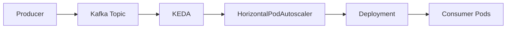

# 08 - Kafka Trigger

The **Kafka Trigger** enables KEDA to scale Kubernetes workloads according to **consumer lag** rather than CPU or memory utilization.

For event-streaming applications, consumer lag is often the most accurate indicator of workload demand.

Instead of asking:

> **How busy are the consumers?**

the Kafka Trigger asks:

> **How many messages are still waiting to be processed?**

This allows Kubernetes to react directly to the health of the streaming pipeline.

---

## Why Consumer Lag Matters

Kafka applications are typically built around producers and consumers.

```text
Producer
↓
Kafka Topic
↓
Consumer Group
↓
Worker Pods
```

Messages accumulate inside Kafka until they are processed.

The difference between:

- produced messages; and
- consumed messages

is known as **Consumer Lag**.

---

## What Is Consumer Lag?

Consumer lag represents the number of messages that have not yet been processed.

Example:

```text
Messages Produced
100,000
-------------------
Messages Consumed
95,000
```

Result:

```text
Consumer Lag
5,000 Messages
```

A growing lag usually indicates that consumers cannot keep up with incoming traffic.

---

## High-Level Architecture



KEDA continuously monitors consumer lag and exposes it as an external metric to the Horizontal Pod Autoscaler.

---

## Why Not Scale Using CPU?

Imagine a consumer application.

```text
Consumer Pods
↓
Waiting for Messages
↓
CPU
10%
```

Suddenly:

```text
Kafka Lag
50,000 Messages
```

CPU utilization remains low because only a small number of consumers are active.

The Horizontal Pod Autoscaler would likely make no scaling decision.

The Kafka Trigger reacts immediately because it monitors backlog rather than processor utilization.

---

## Basic Configuration

A simplified Kafka trigger might look like this.

```yaml
triggers:
- type: kafka
  metadata:
    bootstrapServers: kafka:9092
    consumerGroup: orders
    topic: orders
    lagThreshold: "100"
```

This configuration tells KEDA:

- monitor the **orders** topic;
- observe the **orders** consumer group;
- scale whenever consumer lag exceeds **100 messages**.

---

## Scaling Example

Suppose the application currently has:

```text
Pods
2
```

Current consumer lag:

```text
5,000 Messages
```

Threshold:

```text
100 Messages
```

Result:

```text
Consumer Lag
5,000
↓
ceil(5,000 / 100) = 50
↓
50 Pods (capped by maxReplicaCount and by the topic's partition count)
```

The additional consumers process partitions in parallel, reducing the backlog much more quickly.

---

## Scaling Down

As messages are processed:

```text
Consumer Lag
5,000
↓
1,000
↓
100
↓
0
```

KEDA updates the external metric continuously.

The HPA gradually reduces the number of consumer Pods.

If configured with:

```yaml
minReplicaCount: 0
```

the Deployment eventually scales to zero when no messages remain.

---

## Consumer Groups

The Kafka Trigger scales **consumer groups**, not individual consumers.

Example:

```text
Kafka Topic
↓
Consumer Group
↓
Consumer Pods
```

Each Pod joins the same consumer group and processes one or more partitions.

Adding Pods increases parallelism while preserving Kafka's consumer group semantics.

---

## The Partition Limit

By default, KEDA **never scales a consumer group beyond the number of partitions in the topic** (`allowIdleConsumers: false`).

A consumer beyond the partition count would receive no partition assignment and sit idle — so KEDA caps the replica count at the partition count, regardless of how large the lag becomes.

```text
Topic: 12 partitions
Lag suggests: 50 consumers
↓
KEDA caps at 12 Pods
```

Set `allowIdleConsumers: true` only when idle consumers are acceptable (for example, to speed up rebalancing after failures). The real fix for a partition-limited workload is increasing the topic's partition count.

---

## Typical Use Cases

The Kafka Trigger is commonly used for:

- Event-driven microservices
- Order processing
- Financial transaction processing
- Log processing
- IoT telemetry
- Real-time analytics
- Stream processing
- Data pipelines

These systems often process millions of events per day.

---

## Queue Length vs Consumer Lag

Although RabbitMQ and Kafka are both messaging systems, their scaling metrics differ.

| RabbitMQ | Kafka |
|----------|-------|
| Queue Length | Consumer Lag |
| Queue-based messaging | Event streaming |
| Messages waiting in queue | Messages waiting to be consumed |
| Typical for task processing | Typical for streaming platforms |

Both metrics measure pending work, but they reflect different messaging models.

---

## Best Practices

> [!tip]
> Scale according to consumer lag rather than CPU utilization. Lag provides a much more accurate representation of streaming workload.

> [!tip]
> Ensure Kafka topics have sufficient partitions to benefit from additional consumer Pods.

> [!tip]
> Monitor both consumer lag and processing throughput when tuning scaling thresholds.

> [!warning]
> Increasing the number of Pods cannot improve throughput if the Kafka topic has too few partitions. Consumer parallelism is ultimately limited by partition count.

> [!note]
> The Kafka Trigger monitors consumer lag for a specific consumer group. Different consumer groups processing the same topic may scale independently.

---

## Key Takeaways

- The Kafka Trigger scales workloads according to consumer lag.
- Consumer lag represents the amount of unprocessed work remaining in Kafka.
- Lag is a more meaningful scaling metric than CPU utilization for streaming applications.
- KEDA exposes consumer lag as an external metric used by the Horizontal Pod Autoscaler.
- Effective Kafka autoscaling depends on both lag thresholds and adequate topic partitioning.
- The Kafka Trigger is ideal for event-streaming and real-time data processing workloads.
