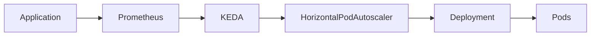
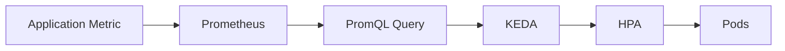

# 09 - Prometheus Trigger

The **Prometheus Trigger** enables KEDA to scale workloads using virtually **any metric collected by Prometheus**.

Unlike message queue triggers such as RabbitMQ or Kafka, which monitor a specific resource, the Prometheus Trigger allows scaling based on **custom monitoring data**.

This makes it one of the most flexible and powerful KEDA scalers.

If a metric exists in Prometheus, KEDA can potentially use it for autoscaling.

---

# Why Use Prometheus?

Some applications cannot be scaled using:

- CPU utilization;
- memory utilization;
- queue length;
- consumer lag.

Instead, they expose business-specific metrics.

Examples include:

- active users;
- HTTP requests per second;
- API latency;
- failed requests;
- transactions per second;
- active sessions.

Prometheus already collects these metrics.

KEDA simply transforms them into autoscaling signals.

---

# High-Level Architecture



Prometheus stores the metrics.

KEDA periodically executes a PromQL query and exposes the result to the Horizontal Pod Autoscaler.

---

# How It Works

The workflow is straightforward.



Instead of monitoring a queue or database, KEDA evaluates the result of a Prometheus query.

---

# Example Metric

Suppose an application exports:

```text
http_requests_total
```

Prometheus continuously collects this metric.

Using PromQL:

```promql
rate(http_requests_total[1m])
```

KEDA evaluates the query periodically.

Current result:

```text
250 Requests/sec
```

Threshold:

```text
100 Requests/sec
```

Result:

```text
250

>

100

↓

Scale Up
```

---

# Basic Configuration

A simplified Prometheus trigger might look like this.

```yaml
triggers:

- type: prometheus

  metadata:

    serverAddress: http://prometheus:9090

    metricName: http_requests

    query: |

      rate(http_requests_total[1m])

    threshold: "100"
```

This configuration tells KEDA:

- connect to Prometheus;
- execute the PromQL query;
- compare the result against the threshold;
- expose the metric to the Horizontal Pod Autoscaler.

---

# Scaling Example

Current application:

```text
Pods

3
```

Prometheus query result:

```text
Requests/sec

600
```

Threshold:

```text
100 Requests/sec
```

KEDA exposes the metric.

The HPA calculates:

```text
Desired Replicas

12
```

The Deployment creates additional Pods.

---

# Scaling Down

Traffic decreases.

```text
Requests/sec

600

↓

250

↓

80

↓

20
```

KEDA periodically re-executes the PromQL query.

The HPA gradually reduces the number of replicas.

If configured appropriately, the application may eventually scale back to its minimum replica count.

---

# Typical Use Cases

The Prometheus Trigger is suitable for workloads that expose meaningful business metrics.

Examples include:

- HTTP request rate
- Active users
- API latency
- Transactions per second
- Payment requests
- Active WebSocket connections
- Queue processing rate
- Custom application metrics

Almost any measurable business indicator can become a scaling metric.

---

# Why Prometheus Is So Powerful

Unlike most triggers, Prometheus does not define the metric.

It evaluates **queries**.

For example:

```promql
rate(http_requests_total[1m])
```

or

```promql
sum(active_sessions)
```

or

```promql
histogram_quantile(
  0.95,
  rate(http_request_duration_seconds_bucket[5m])
)
```

This means scaling decisions can be based on:

- simple metrics;
- aggregated metrics;
- calculated values;
- statistical functions.

The flexibility is almost unlimited.

---

# Prometheus vs Resource Metrics

The Horizontal Pod Autoscaler already supports CPU utilization.

Why use Prometheus instead?

| Resource Metrics | Prometheus |
|------------------|------------|
| CPU | Any metric |
| Memory | Business metrics |
| Infrastructure-focused | Application-focused |
| Limited flexibility | Extremely flexible |

Prometheus enables autoscaling based on metrics that truly represent application demand.

---

# Best Practices

> [!tip]
> Choose Prometheus metrics that directly reflect workload demand rather than low-level infrastructure statistics.

---

> [!tip]
> Keep PromQL queries efficient. Complex queries executed too frequently may increase the load on Prometheus.

---

> [!tip]
> Validate scaling thresholds using production monitoring before deploying them in critical environments.

---

> [!warning]
> Poorly designed PromQL queries can produce unstable scaling behaviour or place unnecessary load on the monitoring system.

---

> [!note]
> KEDA evaluates the **result of a PromQL query**, not the raw metric itself. Any valid Prometheus query can potentially become a scaling signal.

---

# Key Takeaways

- The Prometheus Trigger scales workloads using Prometheus metrics and PromQL queries.
- It enables autoscaling based on business-specific metrics rather than infrastructure utilization.
- KEDA periodically executes PromQL queries and exposes the results to the Horizontal Pod Autoscaler.
- Prometheus provides significantly greater flexibility than standard CPU or memory-based autoscaling.
- The Prometheus Trigger is ideal for applications that expose meaningful operational or business metrics.
- Well-designed PromQL queries are essential for reliable event-driven autoscaling.
