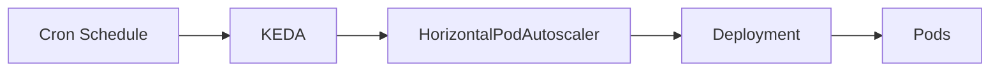

# 10 - Cron Trigger

Unlike most KEDA triggers, the **Cron Trigger** does not monitor an external system such as RabbitMQ or Kafka.

Instead, it scales workloads according to a predefined **schedule**.

This allows Kubernetes applications to increase or decrease capacity at known times of the day, week, or month.

The Cron Trigger is particularly useful for workloads whose demand follows predictable business patterns.

---

# Why Use a Cron Trigger?

Some applications experience highly predictable traffic.

For example:

- business applications become busy during office hours;
- e-commerce platforms receive increased traffic during promotional events;
- batch jobs execute overnight;
- reporting systems run every morning.

Waiting for CPU utilization or queue length to increase may introduce unnecessary delays.

Instead, Kubernetes can prepare capacity **before** demand arrives.

---

# High-Level Architecture



Unlike other KEDA triggers, no external messaging system or monitoring platform is required.

The schedule itself becomes the event source.

---

# How It Works

The Cron Trigger continuously evaluates the current time.

When the configured schedule is reached:

```text
Current Time

↓

Matches Schedule

↓

Scale Workload
```

Outside the scheduled window:

```text
Outside Schedule

↓

Return to Normal Replica Count
```

Scaling decisions are therefore completely deterministic.

---

# Basic Configuration

A simplified Cron Trigger might look like this.

```yaml
triggers:

- type: cron

  metadata:

    timezone: Europe/London

    start: "0 08 * * *"

    end: "0 18 * * *"

    desiredReplicas: "10"
```

This configuration means:

- use the **Europe/London** timezone;
- scale to **10 replicas** at **08:00**;
- maintain that replica count until **18:00**;
- return to the normal replica count after 18:00.

---

# Example

Suppose an internal business application is used only during office hours.

Normal state:

```text
Time

02:00

↓

Pods

0
```

At the start of the working day:

```text
08:00

↓

Pods

10
```

At the end of the working day:

```text
18:00

↓

Pods

0
```

The application automatically scales according to the business schedule.

---

# Daily Scaling Timeline

```text
Time

00:00

↓

0 Pods

--------------------

08:00

↓

10 Pods

--------------------

18:00

↓

0 Pods
```

No application traffic is required to trigger scaling.

---

# Typical Use Cases

The Cron Trigger is commonly used for:

- Office-hour business applications
- Scheduled batch processing
- Nightly reporting
- Backup operations
- Data synchronization
- Maintenance windows
- Development environments
- Demonstration platforms

Any workload with predictable operating hours is a good candidate.

---

# Cron vs Event-Based Scaling

The Cron Trigger differs fundamentally from other KEDA triggers.

| Event-Based Trigger | Cron Trigger |
|---------------------|--------------|
| Reacts to workload | Reacts to time |
| Queue length | Schedule |
| Consumer lag | Schedule |
| Prometheus metrics | Schedule |
| Business demand | Calendar |

The Cron Trigger is proactive rather than reactive.

---

# Combining Cron with Other Triggers

A ScaledObject may contain multiple triggers.

Example:

```yaml
triggers:

- type: cron

- type: prometheus
```

Conceptually:

```text
Office Hours

↓

Minimum Capacity

--------------------

High Traffic

↓

Additional Scaling
```

During office hours, the Cron Trigger guarantees baseline capacity.

If traffic increases further, the Prometheus Trigger can continue scaling the application.

This combination provides both predictability and elasticity.

---

# Time Zones

Cron schedules always use a configured timezone.

Example:

```yaml
timezone: Europe/London
```

or

```yaml
timezone: UTC
```

Choosing the correct timezone is particularly important for globally distributed applications and environments affected by daylight saving time.

---

# Advantages

## Predictable Scaling

Applications scale before users arrive.

---

## No Monitoring Required

The schedule itself determines scaling.

---

## Cost Optimization

Applications can automatically scale to zero outside business hours.

---

## Operational Simplicity

Cron expressions are well understood and widely used across many systems.

---

# Limitations

The Cron Trigger assumes that workload patterns are predictable.

Suppose traffic suddenly increases at:

```text
03:00
```

If the schedule specifies:

```text
08:00
```

the Cron Trigger will not react.

For unpredictable workloads, event-based triggers such as RabbitMQ, Kafka, or Prometheus are generally more appropriate.

---

# Best Practices

> [!tip]
> Use the Cron Trigger for workloads with predictable usage patterns, such as office-hour applications or scheduled maintenance tasks.

---

> [!tip]
> Configure the correct timezone to ensure scaling occurs at the expected local time.

---

> [!tip]
> Combine the Cron Trigger with event-based triggers when applications require both scheduled baseline capacity and dynamic autoscaling.

---

> [!warning]
> The Cron Trigger responds only to time-based schedules. Unexpected workload spikes outside the configured schedule require additional event-based triggers.

---

> [!note]
> The Cron Trigger scales workloads according to predefined schedules rather than application metrics or external events.

---

# Key Takeaways

- The Cron Trigger scales workloads according to a predefined schedule.
- It is ideal for applications with predictable usage patterns.
- Cron expressions determine when scaling begins and ends.
- The trigger can be combined with event-driven triggers for greater flexibility.
- Correct timezone configuration is essential for predictable behavior.
- The Cron Trigger complements event-driven autoscaling by enabling proactive capacity planning.
