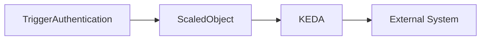
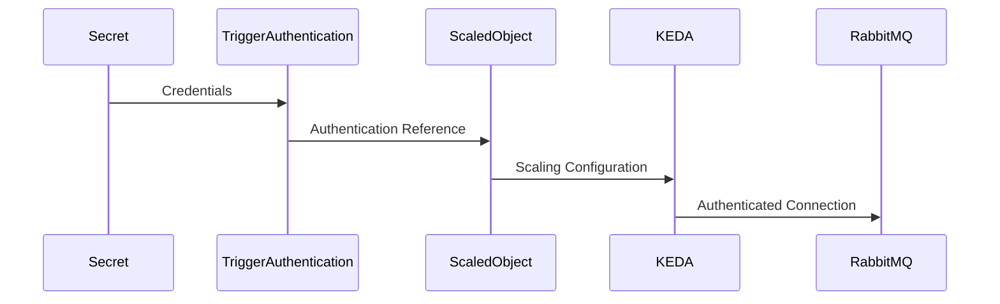

# 11 - Trigger Authentication

Most external systems require authentication before exposing metrics or workload information.

For example:

- RabbitMQ requires a username and password.
- Kafka may require SASL authentication.
- Azure Service Bus requires connection strings.
- AWS SQS requires IAM credentials.
- Prometheus may require authentication tokens.

Embedding these credentials directly inside every ScaledObject would be insecure and difficult to maintain.

To solve this problem, KEDA provides dedicated authentication resources.

---

# Why Separate Authentication?

Imagine several applications consuming messages from the same RabbitMQ server.

Without reusable authentication:

```text
ScaledObject A

↓

Username

Password

--------------------

ScaledObject B

↓

Username

Password

--------------------

ScaledObject C

↓

Username

Password
```

Credentials are duplicated throughout the cluster.

Updating a password requires modifying every ScaledObject.

Instead, KEDA separates authentication from scaling configuration.

---

# High-Level Architecture



The ScaledObject references an authentication resource rather than storing credentials directly.

---

# TriggerAuthentication

The most common authentication resource is **TriggerAuthentication**.

It exists within a single Kubernetes namespace.

Conceptually:

```text
Namespace

↓

TriggerAuthentication

↓

ScaledObject

↓

RabbitMQ
```

Only ScaledObjects in the same namespace can reference it.

---

# Basic Structure

A simplified TriggerAuthentication resource looks like this.

```yaml
apiVersion: keda.sh/v1alpha1

kind: TriggerAuthentication

metadata:

  name: rabbitmq-auth

spec:
```

The specification defines where KEDA should obtain the required credentials.

---

# Using Kubernetes Secrets

The most common approach is to store credentials in a Kubernetes Secret.

Example:

```yaml
spec:

  secretTargetRef:

  - parameter: host

    name: rabbitmq-secret

    key: host
```

Conceptually:

```text
Kubernetes Secret

↓

TriggerAuthentication

↓

ScaledObject

↓

RabbitMQ
```

The Secret remains the single source of truth.

---

# Referencing Authentication

A ScaledObject references the authentication resource.

Example:

```yaml
authenticationRef:

  name: rabbitmq-auth
```

Workflow:

```text
ScaledObject

↓

TriggerAuthentication

↓

Secret

↓

RabbitMQ
```

The ScaledObject itself contains no credentials.

---

# ClusterTriggerAuthentication

Sometimes multiple namespaces require the same credentials.

Creating identical TriggerAuthentication resources everywhere would introduce unnecessary duplication.

For these situations, KEDA provides **ClusterTriggerAuthentication**.

```text
Cluster

↓

ClusterTriggerAuthentication

↓

Namespace A

Namespace B

Namespace C
```

This resource is available across the entire Kubernetes cluster.

---

# TriggerAuthentication vs ClusterTriggerAuthentication

| TriggerAuthentication | ClusterTriggerAuthentication |
|------------------------|------------------------------|
| Namespace scoped | Cluster scoped |
| Used by one namespace | Shared across namespaces |
| Simpler security model | Centralized authentication |
| Most common option | Enterprise environments |

Most applications use **TriggerAuthentication**.

ClusterTriggerAuthentication is typically reserved for shared platform services.

---

# Supported Authentication Sources

KEDA supports several authentication methods.

| Source | Typical Usage |
|---------|---------------|
| Kubernetes Secrets | Username/password |
| Environment Variables | Existing application configuration |
| HashiCorp Vault | External secret management |
| Azure Managed Identity | Azure services |
| AWS IAM | AWS services |
| GCP Workload Identity | Google Cloud services |

This flexibility allows KEDA to integrate naturally with enterprise security practices.

---

# Example Workflow

Suppose an application consumes messages from RabbitMQ.

Authentication flow:



Credentials never appear inside the ScaledObject.

---

# Why This Design?

Separating authentication provides several advantages.

## Better Security

Secrets remain centralized.

Applications do not duplicate credentials.

---

## Easier Rotation

Changing a password requires updating only the Secret.

Every ScaledObject automatically uses the updated credentials.

---

## Improved Reusability

Multiple applications can share the same authentication resource.

---

## Better Separation of Responsibilities

Scaling configuration and authentication are managed independently.

This aligns with Kubernetes' declarative design philosophy.

---

# Best Practices

> [!tip]
> Store credentials in Kubernetes Secrets rather than embedding them directly inside ScaledObjects.

---

> [!tip]
> Reuse TriggerAuthentication resources whenever multiple ScaledObjects connect to the same external system.

---

> [!tip]
> Use ClusterTriggerAuthentication only when credentials genuinely need to be shared across multiple namespaces.

---

> [!warning]
> Avoid placing usernames, passwords, API keys, or connection strings directly inside ScaledObject definitions.

---

> [!note]
> TriggerAuthentication provides authentication only. It does not define scaling behavior—that remains the responsibility of the ScaledObject.

---

# Key Takeaways

- TriggerAuthentication securely stores connection information for external systems.
- ScaledObjects reference authentication resources instead of embedding credentials.
- Kubernetes Secrets are the most common source of authentication data.
- ClusterTriggerAuthentication allows credentials to be shared across multiple namespaces.
- Separating authentication from scaling configuration improves security, maintainability, and reusability.
- Authentication resources are an essential part of production-ready KEDA deployments.
