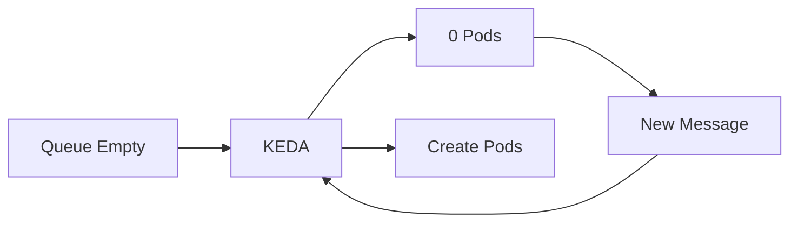
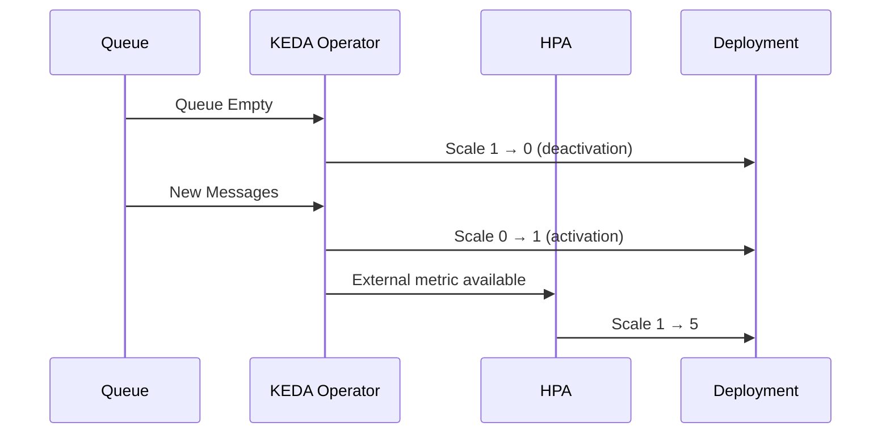

# 12 - Scale to Zero

One of KEDA's defining features is its ability to **scale workloads down to zero Pods**.

Unlike the standard Horizontal Pod Autoscaler (HPA), which normally requires at least one running replica, KEDA can completely stop an application when there is no work to process.

When new work arrives, KEDA automatically recreates the required Pods.

This behavior significantly reduces infrastructure costs for event-driven applications.

---

## Why Scale to Zero?

Many workloads spend most of their time idle.

Consider a background worker processing RabbitMQ messages.

During the day:

```text
Queue
↓
Thousands of Messages
↓
Workers Running
```

At night:

```text
Queue
↓
Empty
↓
Workers Waiting
```

Without Scale to Zero, Kubernetes would continue running idle Pods even though no work exists.

KEDA eliminates this unnecessary resource consumption.

---

## High-Level Workflow



Pods exist only while there is actual work to perform.

---

## Example

Suppose a message processing application starts with:

```text
Queue
0 Messages
↓
Pods
0
```

A producer sends:

```text
250 Messages
```

KEDA detects the event.

```text
Queue
250 Messages
↓
Pods
5
```

As messages are processed:

```text
Queue
250
↓
100
↓
20
↓
0
```

KEDA gradually reduces the replica count until:

```text
Pods
0
```

The application consumes no compute resources while idle.

---

## Who Performs the Scale to Zero?

An important architectural detail: the Horizontal Pod Autoscaler **cannot** scale to or from zero replicas. The work is therefore split between two components:

| Replica Range | Responsible Component |
|---|---|
| 0 ↔ 1 (activation / deactivation) | **KEDA Operator** — modifies the Deployment directly |
| 1 ↔ N (regular scaling) | **Horizontal Pod Autoscaler** |

The 0 → 1 transition is controlled by the trigger's `activationThreshold` (default `0` — any metric value above zero activates the workload). Once at least one replica exists, the HPA takes over using the regular threshold.

---

## Complete Lifecycle



The entire lifecycle is automatic.

---

## Traditional HPA vs KEDA

| Horizontal Pod Autoscaler | KEDA |
|---------------------------|------|
| Usually minimum of 1 Pod | Minimum of 0 Pods |
| Idle Pods continue running | Idle Pods removed |
| CPU and Memory metrics | External event sources |
| Continuous resource consumption | Zero resource consumption while idle |

Scale to Zero is one of the primary reasons organizations adopt KEDA.

---

## Cost Optimization

Imagine a background worker that is active for only two hours each day.

Without Scale to Zero:

```text
24 Hours
↓
Pods Running
```

With KEDA:

```text
2 Hours
↓
Pods Running
--------------------
22 Hours
↓
0 Pods
```

Infrastructure costs are reduced dramatically, especially in cloud environments where billing is based on resource usage.

---

## Startup Latency

Scale to Zero introduces an important trade-off.

When a new event arrives:

```text
Message Arrives
↓
Create Pod
↓
Pull Image
↓
Start Container
↓
Process Message
```

The application cannot begin processing immediately.

Container startup introduces a short delay before work begins.

This delay is usually acceptable for asynchronous workloads but may not be suitable for latency-sensitive applications.

---

## Ideal Workloads

Scale to Zero works particularly well for:

- Message consumers
- Event processors
- Scheduled jobs
- ETL pipelines
- Batch processing
- Background workers
- File processing
- Image conversion

These applications naturally tolerate short startup delays.

---

## Workloads That May Not Benefit

Some applications require immediate responsiveness.

Examples include:

- Public APIs
- Interactive web applications
- Real-time communication services
- Online gaming backends

These services often require one or more replicas to remain available at all times.

For such workloads, a minimum replica count greater than zero is usually more appropriate.

---

## Interaction with the Cluster Autoscaler

Scale to Zero can also reduce infrastructure costs.

Suppose every worker Pod scales to zero.

```text
Pods
0
↓
Worker Nodes Idle
↓
Cluster Autoscaler
↓
Remove Worker Nodes
```

Together, KEDA and the Cluster Autoscaler can eliminate both:

- idle application Pods;
- idle Worker Nodes.

This creates a fully elastic Kubernetes platform.

---

## Best Practices

> [!tip]
> Use Scale to Zero for event-driven workloads that spend long periods idle.

> [!tip]
> Measure container startup time to ensure it meets application requirements.

> [!tip]
> Combine KEDA with the Cluster Autoscaler to maximize infrastructure cost savings.

> [!warning]
> Scale to Zero introduces startup latency because Pods must be created before work can begin.

> [!note]
> Scale to Zero affects application replicas. If no Worker Nodes are available, the Cluster Autoscaler may also need to provision new infrastructure before Pods can start.

---

## Key Takeaways

- Scale to Zero allows KEDA-managed workloads to run with zero replicas when idle.
- The KEDA Operator performs the 0 ↔ 1 transitions directly — the HPA only scales between 1 and `maxReplicaCount`.
- New Pods are automatically created when external events occur.
- This capability significantly reduces infrastructure costs.
- Scale to Zero is best suited for asynchronous and event-driven applications.
- Startup latency is the primary trade-off and should be considered during application design.
- Combined with the Cluster Autoscaler, Scale to Zero enables fully elastic Kubernetes platforms.
