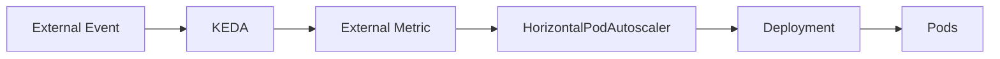
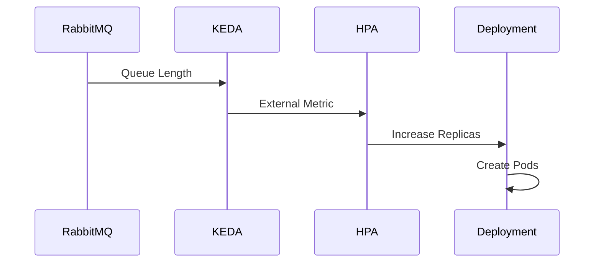
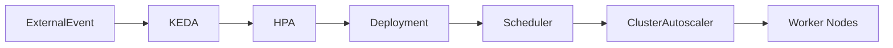

# 13 - HPA and KEDA Working Together

A common misconception is that **KEDA replaces the Horizontal Pod Autoscaler (HPA)**.

In reality, KEDA is built **on top of** the HPA.

KEDA does not scale Deployments directly.

Instead, it creates and manages a Horizontal Pod Autoscaler that uses **external metrics** instead of traditional CPU or memory metrics.

Understanding this relationship is essential for understanding how KEDA works internally.

---

# The Scaling Pipeline

The complete autoscaling pipeline is shown below.



KEDA is responsible for detecting workload demand.

The HPA remains responsible for calculating and applying the desired replica count.

---

# Responsibilities

The two components have clearly separated responsibilities.

| KEDA | Horizontal Pod Autoscaler |
|------|----------------------------|
| Reads external systems | Calculates desired replicas |
| Collects business metrics | Updates Deployment replicas |
| Creates and manages the HPA | Scales Pods |
| Supports Scale to Zero | Performs scaling decisions |

Each controller focuses on a single responsibility.

---

# Why Doesn't KEDA Scale Pods Directly?

At first glance, it might seem simpler for KEDA to modify Deployments itself.

Instead, KEDA deliberately delegates scaling to the HPA.

This provides several advantages:

- native Kubernetes integration;
- consistent scaling behavior;
- reuse of existing autoscaling logic;
- compatibility with Kubernetes APIs.

Rather than replacing Kubernetes functionality, KEDA extends it.

---

# Example Workflow

Suppose a RabbitMQ queue suddenly receives new messages.

```text
Queue

500 Messages
```

The sequence is:

```text
RabbitMQ

↓

KEDA

↓

External Metric

↓

HPA

↓

Deployment

↓

Pods
```

The HPA remains the component responsible for changing the Deployment replica count.

---

# HPA Creation

When a ScaledObject is created, KEDA automatically creates a corresponding Horizontal Pod Autoscaler.

Conceptually:

```text
ScaledObject

↓

KEDA

↓

Horizontal Pod Autoscaler
```

The HPA is managed automatically.

There is no need to create it manually.

---

# Automatic Synchronization

Whenever the ScaledObject changes:

```text
Update ScaledObject

↓

KEDA

↓

Update HPA
```

The HPA configuration is continuously synchronized with the ScaledObject.

Administrators typically interact only with the ScaledObject.

---

# Complete Scaling Example

The following sequence illustrates a complete event-driven scaling operation.



Each component performs exactly one task.

---

# Combining with Resource Metrics

KEDA is designed for **external metrics**.

The HPA traditionally uses **resource metrics** such as CPU and memory.

Modern Kubernetes platforms often combine both approaches.

Example:

```text
CPU

↓

HPA

--------------------

RabbitMQ

↓

KEDA

↓

HPA
```

Applications can therefore scale according to both infrastructure utilization and business demand.

---

# Interaction with the Cluster Autoscaler

Suppose KEDA increases the replica count from:

```text
2 Pods

↓

40 Pods
```

The Scheduler attempts to place the new Pods.

If cluster capacity is insufficient:

```text
Pending Pods

↓

Cluster Autoscaler

↓

New Worker Nodes
```

The complete autoscaling chain becomes:



This demonstrates how KEDA integrates with the broader Kubernetes autoscaling ecosystem.

---

# Why This Architecture Works

Separating responsibilities offers several advantages.

| Component | Responsibility |
|-----------|----------------|
| KEDA | Detect external demand |
| HPA | Calculate replica count |
| Scheduler | Place Pods |
| Cluster Autoscaler | Add Worker Nodes |

This modular approach follows Kubernetes' controller design philosophy, where each component is responsible for one specific task.

---

# Best Practices

> [!tip]
> Treat the ScaledObject as the primary configuration resource. Avoid manually modifying the Horizontal Pod Autoscaler created by KEDA.

---

> [!tip]
> Monitor both KEDA and the generated HPA to understand how scaling decisions are made.

---

> [!tip]
> Combine KEDA with the Cluster Autoscaler to achieve full application and infrastructure elasticity.

---

> [!warning]
> Manual changes to a KEDA-managed HPA may be overwritten during the next reconciliation cycle.

---

> [!note]
> KEDA extends the Horizontal Pod Autoscaler—it does not replace it. The HPA remains responsible for updating Deployment replica counts.

---

# Key Takeaways

- KEDA works alongside the Horizontal Pod Autoscaler rather than replacing it.
- KEDA detects external events and exposes them as metrics.
- The HPA performs the actual replica calculations and updates Deployments.
- KEDA automatically creates and manages the required HPA.
- The Scheduler and Cluster Autoscaler continue to operate normally after replica counts change.
- This layered architecture keeps Kubernetes modular, extensible, and easy to maintain.
