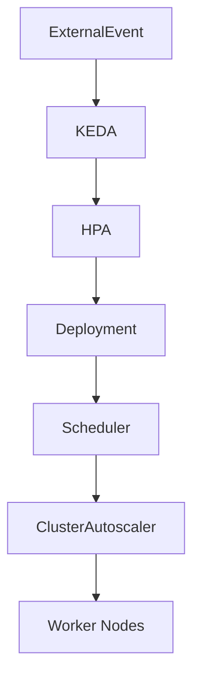

# 14 - KEDA Best Practices

KEDA makes it possible to build highly elastic, event-driven applications.

However, successful production deployments require more than simply configuring a trigger.

Choosing appropriate thresholds, authentication methods, polling intervals, and workload designs has a significant impact on performance, stability, and operational cost.

This chapter summarizes the most important recommendations for running KEDA in production.

---

## Choose the Right Trigger

The trigger should represent **business demand**, not infrastructure utilization.

For example:

| Good Trigger | Why |
|--------------|-----|
| RabbitMQ Queue Length | Represents pending work |
| Kafka Consumer Lag | Represents streaming backlog |
| HTTP Requests/sec | Represents application demand |
| Active Sessions | Represents user activity |

Avoid selecting metrics that only indirectly reflect workload.

For example, CPU utilization is usually better handled by the Horizontal Pod Autoscaler.

---

## Scale According to Workload

Different applications require different scaling strategies.

| Workload | Recommended Trigger |
|----------|---------------------|
| Message processing | RabbitMQ |
| Event streaming | Kafka |
| Custom metrics | Prometheus |
| Scheduled workloads | Cron |
| Batch processing | ScaledJob |

Choosing the correct trigger is often more important than tuning the scaling thresholds.

---

## Configure Sensible Thresholds

Thresholds determine when scaling begins.

Example:

```yaml
queueLength: "50"
```

Choosing thresholds requires balancing two competing goals:

- responsiveness;
- infrastructure cost.

Thresholds that are too low may cause frequent scaling.

Thresholds that are too high may delay workload processing.

Production thresholds should be based on observed workload behavior rather than arbitrary values.

---

## Tune Polling Intervals

KEDA periodically polls external systems.

Example:

```yaml
pollingInterval: 30
```

Short intervals:

- faster reaction;
- more external API calls.

Long intervals:

- lower overhead;
- slower scaling response.

Most production workloads perform well with polling intervals between **15 and 60 seconds**.

---

## Configure Cooldown Periods

Deactivating a workload immediately after the last event may create unnecessary oscillation between 0 and 1 replicas.

Example:

```yaml
cooldownPeriod: 300
```

The cooldown period delays only the **final scale-to-zero step** — temporary inactivity does not immediately deactivate the workload.

For scale-down between N and 1 replicas, tune the generated HPA instead, through `advanced.horizontalPodAutoscalerConfig` (stabilization window and scaling policies).

Also consider configuring `fallback` so that workloads keep a known-safe replica count when the external system cannot be reached.

---

## Use Scale to Zero Appropriately

Scale to Zero is one of KEDA's greatest strengths.

It is particularly effective for:

- background workers;
- asynchronous processing;
- scheduled jobs;
- batch workloads.

However, applications requiring immediate responses may benefit from maintaining a minimum replica count greater than zero.

Always consider startup latency when designing event-driven services.

---

## Secure Authentication

Never place credentials directly inside a ScaledObject.

Instead:

```text
Secret

↓

TriggerAuthentication

↓

ScaledObject
```

This approach improves:

- security;
- maintainability;
- credential rotation.

Authentication should remain independent from scaling configuration.

---

## Monitor the Right Metrics

Successful KEDA deployments require visibility into both application behavior and scaling decisions.

Useful metrics include:

- trigger values;
- replica count;
- polling frequency;
- scaling events;
- processing latency;
- queue length;
- consumer lag.

Monitoring these metrics makes it easier to tune scaling thresholds over time.

---

## Test Autoscaling Regularly

Do not assume scaling works correctly.

Validate it.

Typical test procedure:

1. Generate workload.
2. Verify trigger activation.
3. Confirm KEDA detects the event.
4. Verify HPA updates replica count.
5. Confirm Pods are created.
6. Remove workload.
7. Verify scale-down.

Regular testing builds confidence in production deployments.

---

## Combine with the Cluster Autoscaler

KEDA manages application replicas.

The Cluster Autoscaler manages infrastructure.

Together they provide complete elasticity.



Applications scale according to workload.

Infrastructure scales according to application demand.

---

## Keep Applications Stateless

Event-driven workloads benefit greatly from stateless design.

Stateless Pods:

- start quickly;
- stop safely;
- relocate easily;
- scale efficiently.

Long-lived application state should be stored externally in databases or object storage rather than inside application containers.

---

## Avoid Over-Scaling

Scaling is not free.

Each new Pod requires:

- scheduling;
- container startup;
- image pulling;
- application initialization.

Excessively aggressive scaling policies may increase resource consumption without improving throughput.

Scaling should always match the application's actual processing capacity.

---

## Production Checklist

Before deploying KEDA, verify:

- Appropriate trigger selected.
- Authentication configured securely.
- Polling interval tuned.
- Cooldown period configured.
- Scale to Zero evaluated.
- Replica limits configured.
- Monitoring dashboards available.
- Autoscaling tested.
- Cluster Autoscaler enabled (if required).
- Trigger thresholds validated using production metrics.

---

## Best Practices Summary

| Recommendation | Benefit |
|----------------|---------|
| Choose business-oriented triggers | Better scaling decisions |
| Configure realistic thresholds | Stable autoscaling |
| Tune polling and cooldown periods | Reduce unnecessary scaling |
| Store credentials securely | Improved security |
| Use Scale to Zero where appropriate | Lower infrastructure costs |
| Keep workloads stateless | Faster scaling |
| Test autoscaling regularly | Greater operational confidence |
| Combine with Cluster Autoscaler | End-to-end elasticity |

---

## Key Takeaways

- Effective autoscaling begins with selecting triggers that accurately represent business demand.
- Polling intervals, cooldown periods, and thresholds should be tuned using real production data.
- TriggerAuthentication should be used to manage credentials securely.
- Scale to Zero provides significant cost savings for event-driven workloads.
- Stateless applications scale more efficiently than stateful workloads.
- KEDA achieves the best results when combined with the Horizontal Pod Autoscaler and the Cluster Autoscaler.
