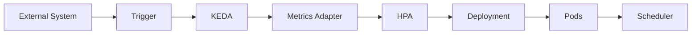
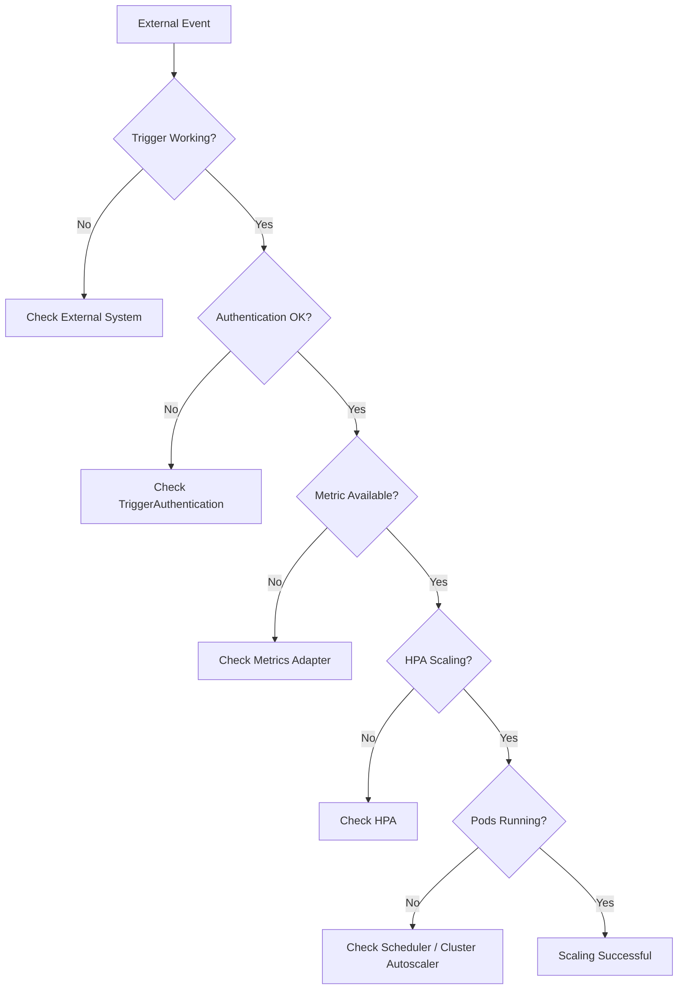

# 15 - KEDA Troubleshooting

Like any distributed system, KEDA depends on multiple components working together correctly.

A scaling issue may originate from:

- the external system;
- authentication;
- the KEDA Operator;
- the Metrics Adapter;
- the Horizontal Pod Autoscaler;
- the Deployment itself.

Understanding the complete scaling pipeline makes troubleshooting significantly easier.

---

## The Troubleshooting Pipeline

When a workload does not scale as expected, verify each stage of the process.



If any component in this chain fails, autoscaling may stop working.

---

## Problem 1 — Pods Never Scale Up

### Symptoms

- Queue grows continuously.
- Replica count never changes.
- Workload becomes overloaded.

### Possible Causes

- Trigger threshold not reached.
- Incorrect trigger configuration.
- Authentication failure.
- KEDA Operator unavailable.

### Verification

Check the ScaledObject.

```bash
kubectl get scaledobjects
```

Describe the resource.

```bash
kubectl describe scaledobject <name>
```

Look for:

- trigger status;
- authentication errors;
- reconciliation failures.

---

## Problem 2 — Pods Never Scale Down

### Symptoms

- Queue is empty.
- Workload remains fully scaled.
- Infrastructure costs remain high.

### Possible Causes

- Cooldown period still active.
- Minimum replica count greater than zero.
- Trigger continues reporting activity.

Verify the configuration.

```yaml
minReplicaCount: 0

cooldownPeriod: 300
```

Remember that KEDA intentionally delays scale-down to prevent oscillation.

---

## Problem 3 — HPA Not Created

Every ScaledObject should automatically create a Horizontal Pod Autoscaler.

Verify:

```bash
kubectl get hpa
```

If no HPA exists:

- verify the ScaledObject;
- check the Operator logs;
- ensure KEDA is running correctly.

The HPA is created automatically and should never need to be created manually.

---

## Problem 4 — Authentication Errors

Symptoms include:

- connection failures;
- authentication failures;
- trigger status showing errors.

Verify the referenced authentication resource.

```bash
kubectl get triggerauthentication
```

Check the Kubernetes Secret.

```bash
kubectl get secret
```

Common issues include:

- incorrect Secret name;
- missing key;
- expired credentials;
- invalid connection string.

---

## Problem 5 — External System Unavailable

KEDA depends on external services.

Suppose RabbitMQ becomes unavailable.

```text
RabbitMQ

↓

Unavailable

↓

No Queue Metrics

↓

No Scaling
```

Verify connectivity between:

- KEDA Operator;
- external service;
- authentication endpoint.

If a scaler outage is a realistic scenario for your environment, configure the ScaledObject's `fallback` section — after a configurable number of consecutive failures, KEDA applies a known-safe replica count instead of leaving the workload frozen at its last value.

---

## Problem 6 — Metrics Not Available

The Metrics Adapter exposes external metrics to Kubernetes.

Verify:

```bash
kubectl get apiservices
```

Also check:

```bash
kubectl logs deployment/keda-metrics-apiserver
```

If metrics cannot be exposed, the Horizontal Pod Autoscaler cannot calculate replica counts.

---

## Problem 7 — Pods Remain Pending

Sometimes KEDA successfully scales the Deployment.

The HPA creates additional replicas.

However:

```text
Pods

↓

Pending
```

This is no longer a KEDA problem.

The issue usually involves:

- insufficient Worker Nodes;
- scheduling constraints;
- resource requests;
- Cluster Autoscaler configuration.

Continue troubleshooting using normal Kubernetes scheduling diagnostics.

---

## Problem 8 — Scale to Zero Does Not Work

Symptoms:

```text
Queue

0

↓

Pods

1
```

Possible causes:

- `minReplicaCount` greater than zero;
- cooldown period still active;
- trigger still reporting activity.

Verify:

```yaml
minReplicaCount: 0
```

Also confirm that the external metric has actually reached zero.

---

## Useful Commands

Useful Kubernetes commands include:

```bash
kubectl get scaledobjects

kubectl describe scaledobject <name>

kubectl get hpa

kubectl describe hpa

kubectl get pods

kubectl describe pod <pod>

kubectl logs deployment/keda-operator

kubectl logs deployment/keda-metrics-apiserver
```

These commands identify the majority of production issues.

---

## A Systematic Troubleshooting Approach

When autoscaling fails, follow a consistent sequence.



This workflow helps isolate failures quickly and avoids troubleshooting multiple components simultaneously.

---

## Production Recommendations

When operating KEDA in production:

- monitor the KEDA Operator;
- monitor the Metrics Adapter;
- monitor external systems;
- monitor the generated HPAs;
- monitor Pending Pods;
- monitor Worker Node utilization.

Observability is essential for reliable autoscaling.

---

## Best Practices

> [!tip]
> Troubleshoot the autoscaling pipeline one component at a time, starting with the external trigger and ending with the running Pods.

---

> [!tip]
> Use `kubectl describe scaledobject` as the starting point for most KEDA-related issues.

---

> [!tip]
> Verify the generated Horizontal Pod Autoscaler before investigating Kubernetes scheduling problems.

---

> [!warning]
> Many apparent KEDA issues are actually caused by authentication failures, unavailable external systems, or insufficient cluster capacity.

---

> [!note]
> Once the HPA has increased the replica count, any remaining Pending Pods should be investigated using standard Kubernetes scheduling and Cluster Autoscaler diagnostics.

---

## Key Takeaways

- Troubleshooting KEDA requires understanding the complete autoscaling pipeline.
- Most scaling issues originate from trigger configuration, authentication, or unavailable external systems.
- The generated Horizontal Pod Autoscaler is a key diagnostic resource.
- Pending Pods usually indicate infrastructure or scheduling problems rather than KEDA failures.
- A structured troubleshooting process significantly reduces diagnosis time.
- Monitoring both KEDA and the surrounding Kubernetes components is essential for reliable production deployments.
